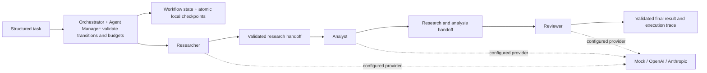
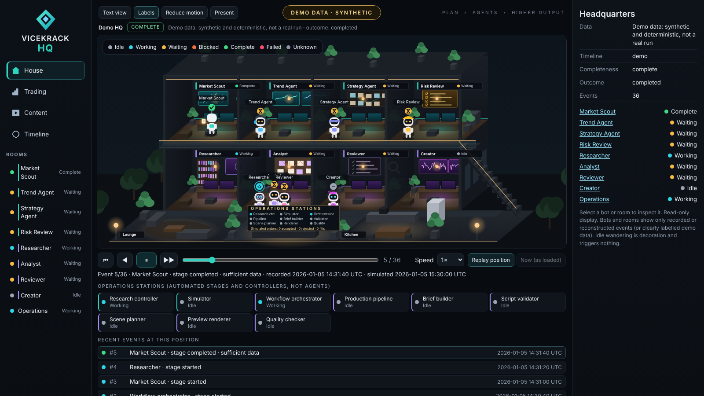
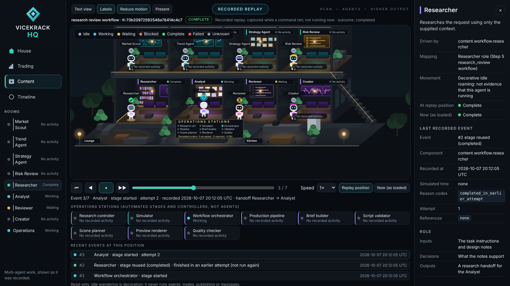
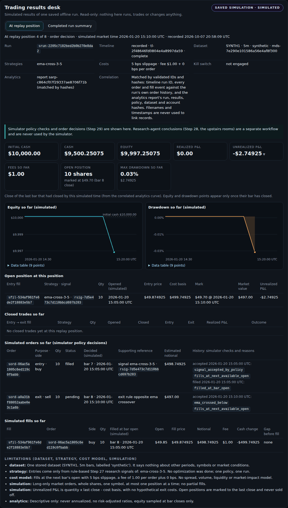

# Vicekrack Agent Network

A provider-neutral agent network with a controlled Researcher -> Analyst -> Reviewer
workflow. The orchestrator owns the sequence. Each role independently selects mock,
OpenAI, or Anthropic through its registry entry. The default demos stay offline.

## Architecture



All arrows represent orchestrator-controlled calls and explicit JSON data. Agent outputs
cannot choose another agent, alter the sequence, or trigger a retry. There are exactly
three possible stages, no background workers, autonomous loops, tools, or databases.

Researcher uses supplied notes. Analyst examines research for important findings,
inconsistencies, missing information, and conclusions. Reviewer inspects both for
completeness, unsupported claims, contradictions, and errors. A completed review means
execution succeeded, not that the work is factually approved. The final summary includes
review findings and limitations; all three stage results are retained for inspection.

## Setup and offline run

Python 3.11 or newer, from the repository root. No activation is needed.

Windows PowerShell:

```powershell
python -m venv .venv
.\.venv\Scripts\python.exe -m pip install -r requirements.txt
.\.venv\Scripts\python.exe -m vicekrack examples/workflow-task.json --registry config/agents.workflow.json
.\.venv\Scripts\python.exe -m unittest discover -s tests -v
.\.venv\Scripts\python.exe -m pip check
```

macOS/Linux:

```sh
python3 -m venv .venv
.venv/bin/python -m pip install -r requirements.txt
.venv/bin/python -m vicekrack examples/workflow-task.json --registry config/agents.workflow.json
.venv/bin/python -m unittest discover -s tests -v
.venv/bin/python -m pip check
```

Dependencies remain jsonschema and the two official provider SDKs. Tests mock external
requests and require no credentials or API credits. The mock workflow demonstrates
handoffs and lifecycle only; its analyst/reviewer summaries explicitly disclaim real
reasoning or factual approval.

The existing single-agent demo still works:

```powershell
.\.venv\Scripts\python.exe -m vicekrack examples/research-task.json
.\.venv\Scripts\python.exe -m vicekrack examples/unsupported-task.json
```

The second command intentionally exits 1 with unsupported_capability. Success exits 0.
The CLI accepts `-` for stdin and prints one JSON object. Rejected input uses an error
envelope; accepted tasks return completed or failed task envelopes.

## Provider selection and live runs

| Registry | Behavior |
| --- | --- |
| config/agents.json | Existing single-agent mock default |
| config/agents.openai.json | Existing single-agent OpenAI |
| config/agents.anthropic.json | Existing single-agent Claude |
| config/agents.workflow.json | Three-stage offline mock |
| config/agents.workflow-mixed.json | OpenAI researcher; Claude analyst and reviewer |

Each agent has its own `execution.adapter` and `execution.model`. Edit those entries to
choose another combination, without changing the task or orchestrator. Keep model null
for mock. Real providers require a model supporting structured JSON and account access.
The included models are gpt-4.1-mini and claude-sonnet-4-6.

`.env.example` contains only blank OPENAI_API_KEY and ANTHROPIC_API_KEY entries. The
application reads process environment variables; it does not load .env files. Never put
credentials into task JSON, registry entries, prompts, or source control.

PowerShell, explicit live mixed-provider run:

```powershell
$env:OPENAI_API_KEY = [System.Net.NetworkCredential]::new('', (Read-Host 'OpenAI API key' -AsSecureString)).Password
$env:ANTHROPIC_API_KEY = [System.Net.NetworkCredential]::new('', (Read-Host 'Anthropic API key' -AsSecureString)).Password
.\.venv\Scripts\python.exe -m vicekrack examples/workflow-task.json --registry config/agents.workflow-mixed.json
Remove-Item Env:OPENAI_API_KEY, Env:ANTHROPIC_API_KEY
```

Bash:

```bash
read -r -s -p 'OpenAI API key: ' OPENAI_API_KEY
export OPENAI_API_KEY
read -r -s -p 'Anthropic API key: ' ANTHROPIC_API_KEY
export ANTHROPIC_API_KEY
.venv/bin/python -m vicekrack examples/workflow-task.json --registry config/agents.workflow-mixed.json
unset OPENAI_API_KEY ANTHROPIC_API_KEY
```

This run makes up to three paid requests. The selected providers receive the original
request and notes plus prior stage results. No browsing or independent source verification
is performed. For single-agent live runs use the corresponding registry and research-task.
OPENAI_TIMEOUT_SECONDS and ANTHROPIC_TIMEOUT_SECONDS optionally set SDK operation
timeouts (default 30 seconds, greater than 0 and at most 300). These are not overall
workflow deadlines. Automatic retries are disabled; a timeout stops the workflow.

## Handoffs, safeguards, and trace

The task selects `context.workflow: "research_review"` and addresses `orchestrator`.
The registry declares `workflow.agents`, `workflow.max_steps`, and optional `workflow.max_retries`. The controller permits only
researcher, analyst, reviewer, in that order exactly once, with a hard ceiling of three.
A lower budget rejects the run before execution. Unknown/disabled agents, unsupported
adapters, reordered stages, duplicate stages, and recursive orchestrator stages are rejected.
Provider text is never interpreted as a routing instruction.

`schemas/handoff.schema.json` describes the handoff: parent task ID, stage task ID,
original instructions and notes, recipient, previous output, completion status, provider
used, step metadata, and prior stage results. Analyst and Reviewer validate IDs, order,
and consistency before calling their providers. Reviewer sees both prior results.

The task schema gains only an optional runtime-owned `execution_trace` field. Existing
input tasks remain valid. Older strict validators must use the updated schema to accept
workflow output. Caller-supplied traces are rejected. The input task is never mutated.

Example trace from a successful mock run:

```json
[
  {"step": 1, "agent": "researcher", "provider": "mock", "status": "completed"},
  {"step": 2, "agent": "analyst", "provider": "mock", "status": "completed"},
  {"step": 3, "agent": "reviewer", "provider": "mock", "status": "completed"}
]
```

Find the final review in `result.summary`, all stage outputs in `result.data.stages`,
and the compact trace at `execution_trace`. Saved runs also retain a timestamped attempt audit, which
contains only controlled metadata, never prompts, response bodies, credentials, or env.
Actual task results and handoffs contain user data and should be handled accordingly.

On failure, the parent is failed, the trace ends at the failed stage, and no subsequent
stage runs. Missing credentials, timeouts, provider errors, invalid responses, and malformed
handoffs propagate clear error codes. Raw provider error messages are excluded. Failed
runs have no success result. A new attempt needs a new task ID within the same runner;
legacy invocations remain ephemeral; use the saved-run commands below for persistence and resume.

## Implementation map

- `vicekrack/orchestrator.py`: existing routing, task validation, and workflow dispatch.
- `vicekrack/workflow.py`: bounded sequence, handoffs, trace, failure handling.
- `vicekrack/researcher.py`, `analyst.py`, `reviewer.py`: specialized role handlers.
- `vicekrack/handoff.py`: schema and semantic handoff checks.
- `vicekrack/providers.py`: protocol, mock, and provider registration.
- `vicekrack/openai_provider.py`, `anthropic_provider.py`: real adapters (Step 15 adds `generate_structured`).
- `agents/`: role definitions; `config/`: independent provider selections.
- `schemas/`: task and handoff contracts; `examples/`: runnable tasks.
- `tests/test_workflow.py`: sequence, mixed providers, errors, budgets, and trace tests.

The original provider and orchestration tests remain part of the complete suite.
See [architecture details](docs/architecture.md) and the [Steps 1–6 audit](docs/step-7-audit.md).


## Step 6: saved workflows and explicit recovery

The existing commands above stay ephemeral. The new `run` command saves workflow state
under `runtime/runs/` (already Git-ignored). There is no background execution. Use the
same registry/provider settings and process credentials as before. No new dependencies.

PowerShell, offline saved run:

```powershell
.\.venv\Scripts\python.exe -m vicekrack run examples/workflow-task.json --registry config/agents.workflow.json
.\.venv\Scripts\python.exe -m vicekrack list
.\.venv\Scripts\python.exe -m vicekrack inspect RUN_ID
.\.venv\Scripts\python.exe -m vicekrack resume RUN_ID
```

Replace RUN_ID with the returned 32-character `run_id`. On macOS/Linux replace the
executable with `.venv/bin/python`. `run -` accepts a task on stdin. `run` defaults to
the offline workflow registry; `resume` defaults to the registry saved with that run.
An optional `--registry` on resume must resolve to the same configuration and contract
snapshot. For explicit live execution use `--registry config/agents.workflow-mixed.json`
and set the required environment credentials as described above.

`run` and `resume` return run_id, saved status, and the terminal task. `inspect` returns
the saved JSON; `list` returns IDs/status/timestamps or errors for unreadable/locked runs.
A completed saved run cannot be resumed. Execution failure exits 1; successful execution
and successful list/inspect exit 0. Retain the run ID reported by storage errors.

### Recovery example

Suppose research completed, but the Analyst could not start because its credential was
missing. The run is `failed`, its research result is saved, and its trace ends at Analyst.
Set the missing credential in the process environment, then run:

```powershell
.\.venv\Scripts\python.exe -m vicekrack inspect RUN_ID
.\.venv\Scripts\python.exe -m vicekrack resume RUN_ID
```

Only Analyst and Reviewer run. Researcher is reused from its validated checkpoint and
is not billed again. Environment credentials are deliberately not part of the saved
configuration. Model, provider, role definition, schema, capability, enabled-state, or
workflow changes cause configuration_mismatch: restore the configuration or start a new
run. Do not hand-edit saved JSON to bypass checks.

If a request times out, the process is interrupted during a stage, or a result cannot be
saved after a request, its outcome is uncertain. `inspect` reports `uncertain`, and ordinary
resume returns `uncertain_stage` without another request. Only after deciding to retry:

```powershell
.\.venv\Scripts\python.exe -m vicekrack resume RUN_ID --retry-uncertain
```

That flag explicitly authorizes retrying the first incomplete stage, potentially incurring
another API charge. It does not rerun completed stages. This is **not exactly-once
execution**. Provider failures whose request outcome cannot safely be inferred are
conservatively treated as uncertain. There are no automatic retries. A saved `ready` run
can resume safely; if all three results were saved but finalization was interrupted,
resume only constructs the final output and makes no provider calls.

### Storage and concurrency

Each run JSON holds the original task, allowlisted configuration snapshot and contract
hashes, completed results, current execution trace, status, pending stage, and timestamps.
Before a stage, the intent is saved as running. After success, its validated result is
saved. A running marker found after acquiring a free lock is presented as uncertain.
The on-disk running marker is retained until an explicit recovery attempt.

Writes use a temporary file in the same directory, flush/fsync, then atomic replacement.
An interrupted write leaves the previous complete JSON; orphan .tmp files are ignored,
never automatically promoted. Atomic replacement reduces corruption risk but does not
promise power-loss durability on every filesystem. The directory must be on a local
filesystem with working OS locks and atomic rename; network/cloud concurrent access is
not supported. If this repository is synced by OneDrive, do not run it from two PCs or
restore/sync saved-run files while a local run is active.

A nonblocking OS lock covers validation, provider calls, and writes for one run ID.
Competing execution or inspection returns `run_locked`. Locks release when the process
exits, including crashes; harmless .lock files remain. Do not delete a lock file to bypass
an active process. Missing/corrupt state returns run_not_found/invalid_state. There is no
automatic corruption repair, cross-machine lock, or deletion command. Legacy valid Step 6 files remain readable.

The compact task trace records the latest attempt plus the completed prefix. The saved
`workflow_state.audit_trace` retains every Step 7 attempt, including failures and interruptions. Completed result IDs stay stable; a retried incomplete stage gets a new child ID.
The fixed three-stage plan and step budget remain enforced on every explicit resume.

Saved task content and outputs may contain sensitive user data and are not encrypted.
`runtime/` is ignored by Git. Never place secrets in tasks or outputs. Secret-named fields,
recognizable provider-key shapes, and active provider credential values are rejected
before saving; this is not a general-purpose sensitive-data detector. Credentials,
authentication headers, environment snapshots, and raw provider exceptions are never
intentionally captured. Inspection prints saved user content, so use it appropriately.

Tests in `tests/test_persistence.py` cover atomic replacement failures, interrupted
requests, uncertain retries, configuration mismatches, corrupt history, cross-process
locking, and resume without repeated completed stages. Run the full suite with the
existing unittest command. No live API requests are part of validation.

## Step 7: Agent Manager and bounded recovery

The Agent Manager owns the registered-agent inventory, capabilities, provider bindings,
availability/status, and permitted handoffs. `Orchestrator.manager.inventory()` exposes
that inventory. `Orchestrator.last_workflow_state` exposes the most recent ephemeral
workflow state; saved runs expose it under `workflow_state` through `inspect`.
The original task envelope and compact trace are unchanged.

State includes task ID, completed stages, current/next agent, per-agent attempt counts,
retry count, failures, and final status. Its schema and transition replay are validated
before resume. A stage can only start after its predecessor succeeds. Provider output
cannot modify routing. Each agent's provider remains selected by its registry entry.

Optional policy inside a workflow registry:

```json
"workflow": {
  "agents": ["researcher", "analyst", "reviewer"],
  "max_steps": 3,
  "max_retries": 1
}
```

`max_retries` defaults to 1, accepts integers 0–3, and counts additional attempts **per
stage across explicit resumes**. It does not enable automatic retries. `max_steps`
limits distinct stages to three; total stage attempts cannot exceed
`3 * (1 + max_retries)` (at most 12). Both SDKs still disable their own retries.
An exhausted stage leaves the saved run `failed`, with workflow state `exhausted`;
further resume returns `retry_exhausted` without any provider call. An uncertain remote
outcome remains unknown even if its local recovery budget is exhausted.

Start with `run`, inspect with `inspect`, and explicitly recover with `resume` using the
commands above. If Analyst fails once and succeeds on resume, the audit contains:

```text
stage agent       provider status     attempt
1     researcher  mock     running    1
1     researcher  mock     completed  1
2     analyst     mock     running    1
2     analyst     mock     failed     1  (missing_credentials)
2     analyst     mock     running    2
2     analyst     mock     completed  2
3     reviewer    mock     running    1
3     reviewer    mock     completed  1
```

Each real audit row also contains a UTC timestamp and an allowlisted error code or null.
It contains no prompts, output bodies, raw errors, model names, or environment values.
A failure is retained after recovery. Completed Researcher output is reused unchanged.
A second Analyst failure exhausts the default budget; Reviewer does not run.

Saved task IDs are unique within the local run directory, across processes and run IDs.
Submitting the same ID again returns `duplicate_task`: inspect/resume its existing run.
To start genuinely new work, use a new task ID. The ephemeral API retains its existing
per-Orchestrator-instance duplicate protection. Do not delete saved files to circumvent
recovery budgets. Concurrent starts use a task-ID lock as well as a run-ID lock.
Corrupt saved files block new starts until the local records are repaired/restored.

Legacy Step 6 files have no attempt audit. Resume imports their completed prefix and
counts one known incomplete attempt, using the saved timestamp. Earlier retries cannot
be reconstructed; the new budget applies to this imported minimum history. Changing
provider/model/contracts/policy still rejects resume. Local JSON consistency checks are
not tamper-proof signatures; anyone able to rewrite all saved data can rewrite history.

Run the location-only credential audit alongside tests:

```powershell
.\.venv\Scripts\python.exe scripts/audit_credentials.py
.\.venv\Scripts\python.exe -m unittest discover -s tests -v
.\.venv\Scripts\python.exe -m pip check
```

The scanner checks tracked files and all local Git blobs, including unreachable objects,
and searches accessible commit trees for committed environment files. It prints locations
only. Pattern scanning cannot establish that arbitrary opaque strings are not secrets.
Step 8, background execution, automatic retries, new providers, and external tools are
outside this implementation.

## Step 8: local CLI dashboard

Use these one-shot views from the repository root (PowerShell):

```powershell
.\.venv\Scripts\python.exe -m vicekrack dashboard
.\.venv\Scripts\python.exe -m vicekrack agents --registry config/agents.workflow-mixed.json
.\.venv\Scripts\python.exe -m vicekrack dashboard RUN_ID
.\.venv\Scripts\python.exe -m vicekrack dashboard RUN_ID --json
```

Replace RUN_ID with a saved run ID. On Linux/macOS use `.venv/bin/python`.
The overview shows registered agents, configured providers/capabilities, and saved-run
progress. The detail view shows timestamped attempt history, failures, remaining attempts
for the next incomplete stage, and recovery guidance. Legacy records show unknown budgets
rather than inventing historic attempts. Completed-stage budgets are not actionable.

These commands never call providers, start workflows, or resume runs. They show metadata
only, excluding task IDs, prompts, output bodies, models, raw errors, and environment
values. Agent availability means configured/enabled, not a live health check. A locked
run is shown as unavailable; a corrupt record does not prevent other rows from appearing.
Overview exits 1 if any record is unavailable; otherwise viewing failed runs exits 0.
A selected run can be viewed even if the default registry is broken. Overview/agents
require a valid selected registry. There is no automatic refresh or background process.

Recovery still uses `python -m vicekrack resume RUN_ID` and, only for a deliberately
approved uncertain retry, `--retry-uncertain`. The dashboard does not bypass configuration
validation, locks, duplicate protection, or retry limits. Viewing records leaves run JSON
unchanged; storage initialization and inspection may create local directories/lock files.
No dependencies or live API credentials are needed. Run the full unittest command above.

## Step 9: automatic repository checks

GitHub Actions runs `Project checks` on pushes, pull requests and manual dispatch.
The test matrix covers Windows/Linux with Python 3.11/3.12. Each job installs the existing
pinned requirements, checks dependency compatibility, runs all tests, compiles Python
sources and checks commit whitespace. An independent credential job scans tracked files
and fetched Git history, printing candidate locations only. No API secrets are supplied.
Official checkout/setup-python actions are pinned to full commit IDs; checkout retains
full history and does not persist its authentication credential. Workflow permissions
are read-only. There is no deployment, scheduling, or automatic merge.

Run the same guarded test suite locally:

```powershell
.\.venv\Scripts\python.exe scripts/run_tests.py
.\.venv\Scripts\python.exe scripts/audit_credentials.py
.\.venv\Scripts\python.exe -m pip check
```

The test runner blocks Python socket connection entry points during discovery/execution
and fails if discovery finds no tests. SDK transports remain mocked. This is an accidental
network-call safeguard, not an OS sandbox: subprocesses/native code are not isolated.
Dependency installation still needs internet access. Existing unittest commands still work.

Open the PR's Checks tab or the repository Actions tab to inspect results. Failed tests,
invalid dependencies or credential candidates leave a failing check; fix the problem
and push again. The scanner remains heuristic and is not a general secret detector.
These checks do not themselves block merging: repository branch protection/rulesets are
separate settings and have not been changed. No runtime/agent/provider behavior changes.

## Step 10: prepare your own workflow task

Create a task without writing JSON (PowerShell, from the repository root):

```powershell
.\.venv\Scripts\python.exe -m vicekrack create-task --instructions "Summarize these project notes and identify gaps" --note "The project has three sequential agents." --note "Each agent can use a different provider."
```

The response contains `task_file`, a new task ID, and the planned Researcher -> Analyst ->
Reviewer provider route. The UTF-8 task is saved under ignored `runtime/tasks/`. Every
creation gets a new UUID; existing files are never overwritten. Copy the returned path
into these commands:

```powershell
.\.venv\Scripts\python.exe -m vicekrack validate-task TASK_FILE
.\.venv\Scripts\python.exe -m vicekrack run TASK_FILE
.\.venv\Scripts\python.exe -m vicekrack dashboard RUN_ID
```

Replace TASK_FILE and RUN_ID with returned values; quote paths containing spaces.
The default registry uses mock providers, so this workflow needs no API keys.
For longer/private input, keep UTF-8 files in `runtime/` and use:

```powershell
.\.venv\Scripts\python.exe -m vicekrack create-task --instructions-file runtime/request.txt --notes-file runtime/notes.txt
```

Each nonblank line becomes one evidence note. Inline input may be saved by shell history;
file input avoids putting content in the command line. Never include credentials.
Existing sensitive-state checks reject recognized credentials before writing but cannot
detect all sensitive user data. Source notes and tasks remain unencrypted local content.
Keep them in ignored storage. On Linux/macOS use `.venv/bin/python`.

Both new commands accept `--registry config/agents.workflow-mixed.json` to check a mixed
OpenAI/Anthropic route. They do not open provider clients, check account access, run agents,
reserve task IDs or resume work. They validate queued workflow inputs, evidence notes,
shared routing/step-limit rules, provider selection and required model configuration.
Success does not guarantee a later API call succeeds. Credentials, timeouts and duplicate
saved IDs remain execution-time checks. Use the same `--registry` on the subsequent `run`
command. Live execution may incur API charges; preparation does not.

Task publication uses a flushed temporary file followed by an exclusive hard link, then
removes the temporary name. It requires a local filesystem supporting hard links; failure
leaves no partial final task. Orphan `.tmp` files after a crash are never executed
implicitly. These commands prepare only the existing three-stage research workflow;
earlier single-agent commands remain supported separately.

## Step 12: offline scene planning

Plan the four scenes of a Step 11 Short Script without creating media or calling APIs:

```powershell
.\.venv\Scripts\python.exe -m vicekrack validate-short-script examples/short-script-gta.json
.\.venv\Scripts\python.exe -m vicekrack plan-short examples/short-script-gta.json --draft
.\.venv\Scripts\python.exe -m vicekrack plan-short examples/short-script-cooking.json
```

Run from this checkout after the usual setup; on Linux/macOS use `.venv/bin/python`.
`validate-short-script --require-verified` and normal `plan-short` require declared
verified claims. The GTA example deliberately fails that gate unless explicitly planned
as a draft. Every draft is blocked_for_production. The cooking example is synthetic test
data, not an independently verified publishable script. No command verifies facts or rights.

The response gives a local JSON path under ignored `runtime/plans/`, deterministic plan
ID and mode. Plans preserve original script data and timings, frame dimensions, source
hash, chosen methods and skip reasons. They explicitly say assets_produced=false.
`--capabilities config/visual-capabilities.json` selects available methods; defaults are
local motion_graphics and text_card. Declaring a method available permits planning only.
No downloads, video generation, speech, rendering, uploads or extra providers are added.

Saved plans may contain sensitive user content and are not encrypted. Publication is
atomic and never overwrites an earlier plan, using a local filesystem with hard-link
support. See [scene-plan contract, commands and limits](docs/scene-plan.md).

## Step 13: local silent video previews

Install the optional rendering dependencies after the normal setup:

```powershell
.\.venv\Scripts\python.exe -m pip install -r requirements-render.txt
.\.venv\Scripts\python.exe -m vicekrack plan-short examples/short-script-cooking.json
.\.venv\Scripts\python.exe -m vicekrack render-preview PLAN_FILE
```

Replace `PLAN_FILE` with the returned plan path, quoted if it contains spaces. On Linux/macOS use `.venv/bin/python`. Pillow draws the cards; imageio-ffmpeg supplies a local FFmpeg executable on supported wheel platforms. No provider credentials are needed.

The command returns paths to an MP4 and JSON manifest under ignored `runtime/previews/`. Each package also contains four PNG scene posters. The video is 1080x1920, 24 fps, 15 seconds, H.264, and silent. Text cards are static; local motion graphics use fades. Narration is displayed as text regardless of caption settings. Word highlighting, voiceover, music, audio cues, external footage and generated media are not rendered. Every preview is visibly marked as non-publishable; the cooking fixture is synthetic test data.

For an explicitly marked draft:

```powershell
.\.venv\Scripts\python.exe -m vicekrack plan-short examples/short-script-gta.json --draft
.\.venv\Scripts\python.exe -m vicekrack render-preview DRAFT_PLAN_FILE --allow-draft-preview
```

This preserves the source production block. Plans selecting external methods are rejected; replan with the default local capabilities. English printable ASCII and common smart punctuation are supported; unsupported glyphs and overflowing text fail clearly instead of being silently omitted.

Run all tests, including the real local encoder integration (no API credits):

```powershell
$env:RUN_LOCAL_RENDER_TESTS='1'
.\.venv\Scripts\python.exe scripts/run_tests.py
Remove-Item Env:RUN_LOCAL_RENDER_TESTS
.\.venv\Scripts\python.exe -m pip check
```

Without the environment flag the optional encoder test is skipped; mocked renderer tests still run. CI includes separate Windows/Linux rendering jobs with the flag enabled. Local media contains your script text and is unencrypted: keep it out of Git and inspect it before sharing. See [preview architecture and limitations](docs/preview.md).

## Step 14: optional local narration

Previews stay silent by default. To add your own recorded narration, pass a local WAV file:

```
python -m vicekrack render-preview PLAN_FILE
python -m vicekrack render-preview PLAN_FILE --narration recording.wav
```

The first command is the unchanged silent preview. The second muxes `recording.wav` into the same watermarked 15-second video. Use your virtual environment's Python as in Step 13 (for example `.\.venv\Scripts\python.exe` on Windows), and quote paths that contain spaces. Drafts still require `--allow-draft-preview`.

Accepted input: uncompressed 16-bit PCM WAV, mono or stereo, 8–48 kHz, at most 15 seconds and 12 MB. Missing, corrupt, empty, compressed, 8/24/32-bit or float, multichannel, out-of-range or overlong files are rejected with a short error code such as `narration_too_long`; the path and file contents are never echoed. Audio longer than 15 seconds is never trimmed — shorten the recording instead. Shorter audio is padded with silence to 15 seconds.

All WAV metadata (title, artist, broadcast, cue and other chunks) is removed before encoding, and container metadata is dropped during muxing. The audio is encoded as AAC; the video stream is copied unchanged. The manifest records only `audio_present` and an `audio` object with the source duration, channels, sample rate, padded duration and SHA-256 of the normalized WAV — never the file name or path. Output remains `publishable: false`.

Nothing is sent to OpenAI, Anthropic or any other service, and no voice is generated: you are responsible for having rights and consent for any voice you record. The optional real-encoder test (`RUN_LOCAL_RENDER_TESTS=1`) now also checks that a narrated MP4 contains 15 seconds of audio and that no temporary files remain. See [preview architecture and limitations](docs/preview.md).

## Step 15: Creator — draft a Short Script from a Story Brief

Until now every Short Script was written by hand. The Creator writes one from a
**Story Brief**: a small JSON file with the topic, angle, sources and the only claims the
video may state. GTA is the first profile; the same commands work for any subject.

```powershell
.\.venv\Scripts\python.exe -m vicekrack validate-brief examples/story-brief-gta.json
.\.venv\Scripts\python.exe -m vicekrack draft-short examples/story-brief-cooking.json
.\.venv\Scripts\python.exe -m vicekrack plan-short SCRIPT_FILE
.\.venv\Scripts\python.exe -m vicekrack render-preview PLAN_FILE
```

Replace `SCRIPT_FILE` / `PLAN_FILE` with the returned paths. For the GTA brief, whose claims
are intentionally unverified, use `plan-short SCRIPT_FILE --draft` and
`render-preview PLAN_FILE --allow-draft-preview`; `draft-short` prints the right next command.
On Linux/macOS use `.venv/bin/python`.

The default `config/creator.json` uses an offline mock: no keys, no cost, and deliberately
plain wording. To have a model write the script, set the key as in "Provider selection and
live runs" above and add `--config config/creator.openai.json` or
`--config config/creator.anthropic.json`. That makes one paid request with no retries.

The Creator only writes beats, a title and a music mood. Sources and claims are copied
unchanged from the brief, so it cannot add facts or mark anything verified. Timing comes
from the format table. Brief disclosures and avoid lists are always applied. Output is
checked by the existing Short Script validator and saved to ignored `runtime/scripts/`.
Nothing is fetched, verified, generated as media, or published. See
[Creator stage details](docs/creator.md).

## Step 16: Scout — research intake from approved sources

The Scout collects *possible* stories from an explicit, reviewable list of feeds and saves
them as **Story Candidates** with full provenance. Every candidate is `unverified`, and
candidates are not Story Briefs, so nothing found online can reach the Creator without the
future Verification stage.

Offline (default; synthetic fixtures, no network or keys):

```powershell
.\.venv\Scripts\python.exe -m vicekrack scout-sources
.\.venv\Scripts\python.exe -m vicekrack scout
.\.venv\Scripts\python.exe -m vicekrack scout-list
```

GTA VI profile, live (explicit opt-in; no API keys needed):

```powershell
.\.venv\Scripts\python.exe -m vicekrack scout-sources --sources config/scout-sources.gta.json
.\.venv\Scripts\python.exe -m vicekrack scout --sources config/scout-sources.gta.json --live
```

On Linux/macOS use `.venv/bin/python`. Without `--live`, the GTA list is refused with
`live_fetch_not_enabled` and no request is made. The live list reads Take-Two's
news-release RSS, GameSpot and IGN. Rockstar Newswire is listed but disabled until a real
feed is confirmed.

Each run reads each enabled feed once: https only, no redirects or retries, with byte,
item, time and candidate caps. It keeps items whose link is on the source's approved
hosts and that mention a GTA VI keyword. It skips stories already collected (same cleaned
URL, or same headline from the same source). A broken source is reported by error code
and the run continues. Candidates and run reports go to ignored `runtime/scout/`; run
output shows counts only. There is no scheduling, crawling, model call, verification or
publishing. See [Scout details](docs/scout.md).

## Step 17: Verification — from Scout candidates to a verified Story Brief

The Verifier checks every Scout claim against all stored candidates and saves a
**Verification Record** with one explicit status per claim: `verified`, `corroborated`,
`disputed`, `insufficient_evidence` or `rejected`. Each status comes with the evidence,
source tiers, independent-origin count and rationale. Rules are fixed and offline: no
model, no network, no keys.

```powershell
.\.venv\Scripts\python.exe -m vicekrack scout
.\.venv\Scripts\python.exe -m vicekrack verify --all
.\.venv\Scripts\python.exe -m vicekrack verify-list --status verified
.\.venv\Scripts\python.exe -m vicekrack brief-from-verified RECORD_ID --topic "Your topic"
.\.venv\Scripts\python.exe -m vicekrack draft-short BRIEF_FILE
```

On Linux/macOS use `.venv/bin/python`. For GTA VI, run the live Scout first, then add
`--policy config/verification.gta.json` to the verification commands.

- **Verified** needs a first-hand statement from a primary source (Rockstar Games or
  Take-Two, on their official sites) that nothing primary contradicts.
- **Corroborated** needs at least 2 truly independent reputable press origins. It is
  draft-only.
- **Never enough on their own:** one page, many outlets repeating one report (including
  "according to Rockstar"), unnamed insiders, headlines, the Scout having collected it.
- **Untrusted text:** source text that tries to instruct an AI is excluded and flagged.
- **Brief handoff:** `brief-from-verified` copies only verified claims as verified, cites
  only their supporting sources, refuses records older than the policy allows, and links
  every claim to its record.
- **Story Brief change:** briefs gain an optional `verification` block, enforced by the
  validator when present. Existing briefs are unaffected.

See [Verification details](docs/verification.md).

## Step 18: Story Selection — which verified stories are worth making

The Story Selector ranks Verification Records and gives each story an explicit
**`select`**, **`hold`** or **`reject`** disposition with reasons. It also remembers what
was already made, so ViceKrack doesn't repeat itself.

```powershell
.\.venv\Scripts\python.exe -m vicekrack scout
.\.venv\Scripts\python.exe -m vicekrack verify --all
.\.venv\Scripts\python.exe -m vicekrack select-stories --all
.\.venv\Scripts\python.exe -m vicekrack brief-from-selection SELECTION_RUN_ID
.\.venv\Scripts\python.exe -m vicekrack draft-short BRIEF_FILE
```

On Linux/macOS use `.venv/bin/python`. For GTA VI add
`--policy config/verification.gta.json --profile config/editorial.gta.json`.

- **Hard gates first.** No verified claim, a contradiction or dispute, an unconfirmed
  rumor, irrelevance, staleness, a duplicate, or instruction-like text each block
  selection. Excitement can never outweigh weak evidence.
- **Then a 0–100 score** with fixed weights: confidence 35, authority 20,
  corroboration 10, recency 15, relevance 10, significance (topic priority) 10.
- **No popularity data.** None is available, so it is recorded as `unavailable` and never
  invented.
- **Story history** (bounded, fingerprints only) tells duplicates (reject),
  near-duplicates (hold) and genuine updates (a new verified claim with new facts:
  allowed) apart.
- **Brief handoff.** `brief-from-selection` re-checks the story against the current
  history, then builds the brief with the Step 17 builder (verified claims only). It adds
  an optional `editorial` block with the reasons and records the story in history.

See [Story Selection details](docs/selection.md).

## Step 19: official updates supersede older official statements

When the same official source (for example Rockstar Games) publishes a newer first-hand
statement that changes a fact, such as a release date, the newer statement now
**supersedes** the older one instead of leaving both claims disputed.

- **The new value becomes `verified`.** The old value stays `disputed`.
- **Nothing is lost.** Both statements are kept with their sources and dates, and the old
  one is marked `superseded_by` with the reason.
- **Strict conditions.** It only happens with:
  - the same official source
  - first-hand statements
  - the same fact with clearly different values
  - real publication dates at least 1 hour apart (never the collection time)
- **Otherwise unchanged.** Missing, equal or close dates, different official sources,
  press reports quoting officials, and unrelated statements all keep the existing
  disputed/hold behavior.
- **Selection.** A newly verified official change counts as an **update**, even if an
  older version of the story was already made. Duplicates and all other gates still apply.

Verification Records are now version 1.1; older 1.0 records stay valid. Re-run
`verify` to apply the new rules. No new commands. See
[Verification](docs/verification.md#step-19-dated-official-supersession) and
[Story Selection](docs/selection.md#step-19-official-updates).

## Step 20: bounded article fetching for richer evidence

Scout only stores short feed excerpts. Step 20 can fetch the article page behind a stored
candidate and give its text to the Verifier as **extra evidence**. It is never treated as
verified on its own.

```powershell
.\.venv\Scripts\python.exe -m vicekrack scout
.\.venv\Scripts\python.exe -m vicekrack fetch-articles --all
.\.venv\Scripts\python.exe -m vicekrack article-list
.\.venv\Scripts\python.exe -m vicekrack verify --all --with-articles
```

GTA VI, live (explicit opt-in, no API keys):

```powershell
.\.venv\Scripts\python.exe -m vicekrack scout --sources config/scout-sources.gta.json --live
.\.venv\Scripts\python.exe -m vicekrack fetch-articles --all --sources config/article-sources.gta.json --live
.\.venv\Scripts\python.exe -m vicekrack verify --all --with-articles --policy config/verification.gta.json
```

On Linux/macOS use `.venv/bin/python`.

- **Explicit opt-in.** The default policy uses offline fixtures. The GTA policy refuses
  to run without `--live`.
- **Only approved pages.** Only each candidate's own link is fetched, and only on approved
  HTTPS hosts and path prefixes (no query strings).
- **No private networks.** Private and local network addresses are blocked, and every
  redirect is re-checked (max 3).
- **Hard limits.** Timeouts, a byte cap and at most 10 articles per run (policy maximum
  20). No retries, cookies or auth headers.
- **Clean text.** Scripts, navigation, hidden text, headings and instruction-like
  sentences are dropped.
- **Provenance.** Each Article Evidence file records the requested/final URL, redirects,
  source, fetch time, content hash, and the publication date with its origin. It never
  uses the fetch time as the publication date. Files go to ignored `runtime/articles/`.
- **Same rules for evidence.** `verify --with-articles` adds article sentences under the
  same first-hand, contradiction and Step 19 supersession rules. Without the flag,
  verification is unchanged.

Limitations: live mode was only tested with simulated network connections; the GTA path
prefixes should be confirmed on the first live run; pages that need JavaScript, cookies
or compressed responses are not supported. See [Article fetching](docs/articles.md).

## Step 21: controlled production pipeline

One command turns a selected story into a local, watermarked preview by running the
existing stages in a fixed order:

**brief → Creator → script validation → scene plan → local preview**

```powershell
.\.venv\Scripts\python.exe -m vicekrack scout
.\.venv\Scripts\python.exe -m vicekrack verify --all
.\.venv\Scripts\python.exe -m vicekrack select-stories --all
.\.venv\Scripts\python.exe -m vicekrack produce SELECTION_RUN_ID RECORD_ID
.\.venv\Scripts\python.exe -m vicekrack production-list
.\.venv\Scripts\python.exe -m vicekrack production-inspect PRODUCTION_ID
.\.venv\Scripts\python.exe -m vicekrack production-resume PRODUCTION_ID
```

On Linux/macOS use `.venv/bin/python`. For GTA VI add
`--policy config/verification.gta.json --profile config/editorial.gta.json` to `produce`.
Optional flags:
- `--narration voice.wav`: local WAV narration (Step 14).
- `--creator-config config/creator.anthropic.json --allow-paid`: one paid Creator request,
  with explicit consent.

- **Safe defaults.** Before starting, it re-checks configuration, report and evidence
  freshness, and story eligibility. It defaults to the mock Creator and local rendering.
- **State.** Saved after every stage in ignored `runtime/productions/<id>/`: config file
  hashes (no credentials), stage status, artifact paths and hashes, timestamps, and error
  codes only.
- **Duplicates.** One production per story, plus an OS lock. A second `produce` for the
  same story returns `production_exists`.
- **Story history.** The story is `reserved` when the brief is made, and `produced` only
  after the preview is saved. A reservation never blocks the production's own resume.
- **Stop and resume.** It stops on failure. `production-resume` re-validates config,
  narration, evidence freshness and every artifact hash, then continues at the first
  incomplete stage without repeating completed ones.
- **Paid requests.** A paid request that may have completed needs
  `--retry-uncertain --allow-paid`.
- **Output.** The preview stays watermarked, `preview_only: true`, `publishable: false`.

**Recovery example.** If `produce` stops with `{"stage": "preview", "code":
"renderer_unavailable"}`:
1. Install `requirements-render.txt`.
2. Run `production-resume PRODUCTION_ID`. Only the preview stage runs.

See [Production pipeline](docs/production.md) for all codes, the paid-request example
and limitations.

## Step 22: production quality report

Check a finished production run and save a structured report:

```powershell
.\.venv\Scripts\python.exe -m vicekrack production-list
.\.venv\Scripts\python.exe -m vicekrack quality-report PRODUCTION_ID
.\.venv\Scripts\python.exe -m vicekrack quality-list
```

On Linux/macOS use `.venv/bin/python`. The result is `pass`, `needs_review` or `fail`,
with specific reason codes per check (exit code 0 only for `pass`). Ten read-only checks:
1. state and stage completion
2. artifact existence, hashes and validators
3. claim and source provenance against the verification record
4. evidence freshness
5. draft restrictions and watermark colour
6. scene timing
7. measured video (1080×1920, 24 fps, 15 s, 360 frames)
8. audio (only with narration, 15 s, matching the narration file)
9. manifest vs. actual media
10. story history

- **Can't verify means review.** Checks that cannot run, such as without the rendering
  dependencies, are reported as `unavailable` and prevent a `pass`.
- **Technical only.** A pass is never a fact check, rights clearance or permission to
  publish. Every report says so, and previews stay `publishable: false`.
- **Storage.** Reports go to ignored `runtime/quality/`, with IDs, codes and measurements
  only.
- **Read-only.** Nothing is repaired, retried or published.

See [Quality report](docs/quality.md).

## Step 23: trading subsystem foundation (paper only)

A separate subsystem in `vicekrack/trading/`. It is **simulated only**: no market feeds,
no broker, no live orders and no execution. Run the bounded offline demo with labelled
synthetic data:

```powershell
.\.venv\Scripts\python.exe -m vicekrack trading-config-check
.\.venv\Scripts\python.exe -m vicekrack trading-state init
.\.venv\Scripts\python.exe -m vicekrack trading-demo --scenario allowed
.\.venv\Scripts\python.exe -m vicekrack trading-demo --scenario exposure-breach
.\.venv\Scripts\python.exe -m vicekrack trading-journal
.\.venv\Scripts\python.exe -m vicekrack trading-journal RUN_ID
.\.venv\Scripts\python.exe -m vicekrack trading-kill-switch engage
.\.venv\Scripts\python.exe -m vicekrack trading-kill-switch release
```

On Linux/macOS use `.venv/bin/python`. The other scenarios are `daily-loss`,
`stale-data`, `invalid-money`, `duplicate-signal` and `pending-exposure`. Since Step 24
the demo needs an initialized paper account (see below).

- **Contracts:** versioned 1.0 JSON contracts in `schemas/trading/` cover market
  snapshots, signals, paper portfolio, risk decisions, paper order intents and journal
  events.
- **Exact money:** prices and money are decimal strings. Floats, exponents and excess
  precision are rejected.
- **Paper config:** `config/trading.paper.json` sets order, position, exposure-fraction,
  daily-loss, orders-per-day, quantity and freshness limits, plus a kill switch.
- **Fail-safe blocking:** missing or invalid inputs, an invalid config, or an unreadable
  kill-switch file block authorization.
- **Journal:** ignored `runtime/trading/journal/` is append-only with atomic writes,
  duplicate-ID rejection, credential rejection and sanitized errors. Every event records
  which agent acted, what it saw and why the risk checks allowed or blocked it.
- **Output label:** every result says `SIMULATED`, with `submitted: false` and
  `executed: false`.

Limitations: synthetic fixtures only and no dashboard. Step 24 added persistent paper
state. See [Trading](docs/trading.md) and
[Subsystem boundaries](docs/subsystems.md).

## Step 24: persistent paper risk state (paper only)

Paper accounts now remember what they have done across restarts. **Nothing is submitted
or executed.** An *authorized paper intent* is not a submitted order, not an executed
trade and not realized profit or loss. Every account shows `submitted_orders: 0`,
`executed_trades: 0` and `realized_pnl: null`.

```powershell
.\.venv\Scripts\python.exe -m vicekrack trading-state init
.\.venv\Scripts\python.exe -m vicekrack trading-demo --scenario allowed
.\.venv\Scripts\python.exe -m vicekrack trading-demo --scenario pending-exposure
.\.venv\Scripts\python.exe -m vicekrack trading-demo --scenario allowed
.\.venv\Scripts\python.exe -m vicekrack trading-state show
.\.venv\Scripts\python.exe -m vicekrack trading-state cancel INTENT_ID --reason operator_request --note "Demo cancel"
.\.venv\Scripts\python.exe -m vicekrack trading-state recover
.\.venv\Scripts\python.exe -m vicekrack trading-state list
```

On Linux/macOS use `.venv/bin/python`. Expected results:
1. The first `allowed` run authorizes a paper intent and reserves 10 SYNTH1.
2. `pending-exposure` is blocked with `position_exposure_exceeded`, because the 10 units
   still reserved push it over the limit.
3. A second `allowed` run is blocked with `duplicate_signal`.
4. `show` lists the intent (copy its `intent_id`). `cancel` releases its reservation and
   records your reason; the history is kept.

Use `--account NAME` on any command for a separate account, and `--timezone` on `init`
(the default is `America/New_York`).

- **Persistent state:** `runtime/trading/accounts/<account>/state.json` (ignored by git)
  holds processed signal IDs, authorized intents with their reservations, daily counters
  and past days. It is validated, self-hashed and revisioned.
- **One locked operation:** the duplicate check, risk checks and reservation run as one
  step while a shared OS lock on the account is held. Concurrent requests wait their
  turn, and pending reservations count toward exposure.
- **Trading day:** the trading day follows the account's timezone and rolls over at local
  midnight. Daily counters reset; processed signals and active reservations never do. A
  clock that goes backwards blocks authorization.
- **Fail safe:** authorization is blocked by:
  - a missing account (`state_not_initialized`, so use `init`);
  - a missing state file (`state_missing`);
  - a corrupted or tampered state (`state_corrupt`);
  - an unknown version (`state_incompatible`);
  - an unfinished operation (`state_recovery_required`).

### Recovery examples

Every change writes a pending-operation note (`pending.json`), then the journal, then the
state, and only then removes the note. If a crash or disk error interrupts it, the note
stays and every new authorization is refused:

```
{"error": {"code": "state_recovery_required", "message": "An unfinished paper account operation exists; run trading-state recover."}}
```

Run `trading-state recover`. It compares revisions and reports one of these:
- `committed`: the state was saved before the crash. The note is cleared and nothing is
  authorized twice.
- `rolled_back`: the state was not saved. The signal is still marked as processed (as
  `rolled_back`), so it can never be authorized later.
- `discarded_unreadable`: the note itself was damaged. Any intent that the journal
  recorded for this account but the state does not have is reconciled the same way.
- `clean`: nothing needed recovering.

Example after an interrupted authorization:

```
python -m vicekrack trading-state recover
{"status": "rolled_back", "account_id": "acct-paper-demo", "revision": 3, ...}
```

Recovery never repairs a corrupted `state.json`. That stays blocked, with `state_corrupt`
or `state_incompatible`. Because the paper state is disposable demo data, start a new
account with `trading-state init --account NAME`.

See [Trading](docs/trading.md) and the [Roadmap](docs/roadmap.md).

## Step 25: offline market data and replay (no live feeds)

Import OHLCV bars from labelled synthetic fixtures or your own local CSV file, validate
them, and replay them on a simulation clock. **An import is not proof that data is
authentic, current or licensed.** Every dataset records `not_verified`. Nothing here
connects to a feed, creates signals or trades, or touches paper accounts.

```powershell
.\.venv\Scripts\python.exe -m vicekrack market-import --adapter synthetic --fixture synth1-5m
.\.venv\Scripts\python.exe -m vicekrack market-import --adapter csv --file examples\trading\market\synthetic-synth2-5m.csv --symbol SYNTH2 --interval 5m --timezone America/New_York --label synthetic
.\.venv\Scripts\python.exe -m vicekrack market-list
.\.venv\Scripts\python.exe -m vicekrack market-inspect DATASET_ID --bars 5
.\.venv\Scripts\python.exe -m vicekrack market-replay DATASET_ID --show-steps
.\.venv\Scripts\python.exe -m vicekrack market-list --replays
```

On Linux/macOS use `.venv/bin/python` and `/`. Expected with `synth1-5m`: 12 bars and one
reported gap (the deliberately missing 10:00 bar). The replay has 14 simulated steps and
delivers 12 bars, and `future_probe` shows `refused: 14, leaked: 0`.

- **Contracts:** `ohlcv_bar` 1.0 (timezone-aware timestamp, close time, exact decimals,
  source, currency, label), `market_dataset` 1.0 (provenance with the source SHA-256 and
  import settings, explicit gaps) and `market_replay_report` 1.0.
- **Validation:** CSV structure, UTF-8, timezone-aware timestamps (and daylight-saving
  gaps and overlaps when `--naive-timezone` is used), OHLC relationships, non-negative
  volume, strict order, duplicates, interval alignment, and the size, row and field
  limits in `config/market-data.json`.
- **Gaps:** missing intervals are reported and never filled. No market calendar is
  applied.
- **Labels:** `synthetic`, `historical`, `delayed` or `unknown` (the CSV default). These
  are declared by you and never verified.
- **Storage:** ignored `runtime/trading/market/`, with atomic writes and no overwrite. The
  same source bytes for the same symbol and interval are always rejected as
  `dataset_exists`. Source files are never modified.
- **Replay:** bounded and deterministic. Consumers see only bars that have closed by the
  simulated time. Replay is separate from paper accounts (`account_access: false`), so
  old data can't bypass freshness checks.

See [Market data](docs/market-data.md) and the [Roadmap](docs/roadmap.md).

## Step 26: offline technical indicators (descriptive only)

Calculate EMA, Wilder RSI, rolling volume averages and session VWAP from a stored
dataset. The calculation is a bounded replay that only ever sees **closed** bars. The
results are descriptive values, **not signals**: no orders, no paper-account access.

```powershell
.\.venv\Scripts\python.exe -m vicekrack market-import --adapter synthetic --fixture synth1-5m
.\.venv\Scripts\python.exe -m vicekrack market-list
.\.venv\Scripts\python.exe -m vicekrack indicator-calc DATASET_ID --ema 3 --rsi 3 --volume-sma 2 --vwap --save
.\.venv\Scripts\python.exe -m vicekrack indicator-list
.\.venv\Scripts\python.exe -m vicekrack indicator-inspect RESULT_ID --key rsi_3 --points 12
```

On Linux/macOS use `.venv/bin/python`. With `synth1-5m`, the deliberately missing 10:00
bar is a gap. Under the default `--gap-policy reset`, EMA, RSI and the volume average
restart warm-up after it, and VWAP shows `session_gap` for the rest of that session.

- **Formulas:**
  - EMA is seeded with a simple average, then uses a = 2/(n+1).
  - Wilder RSI uses simple first averages, then (prev·(n−1)+x)/n.
  - The volume average is a simple mean.
  - VWAP is Σ(tp·volume)/Σ(volume), with tp = (high+low+close)/3, an approximation.

  All of them use exact decimals and are rounded half-even to 8 places.
- **Never zero by default:**
  - warm-up values are `unavailable` (`warming_up`);
  - RSI with flat prices is `unavailable` (`flat_prices`); RSI with no losses is `100`
    (`no_losses`);
  - VWAP with zero volume is `unavailable` (`zero_volume`).
- **Sessions:** VWAP sessions are an explicit timezone and clock window (default
  America/New_York 09:30–16:00) that reset each local date. **There is no exchange
  calendar.**
- **Gaps:** `reset` (the default) restarts warm-up; `continue` keeps going and flags
  values `gap_ignored`. Overnight breaks count as gaps.
- **Results:** `indicator_result` 1.0 includes settings, dataset provenance, per-bar
  timestamps, readiness and reason codes. Results are deterministic and saved atomically
  to ignored `runtime/trading/indicators/`.

See [Indicators](docs/indicators.md) and the [Roadmap](docs/roadmap.md).

## Step 27: rule-based research signals (research only)

Evaluate fixed rules on closed bars and indicators during a bounded offline replay. A
research signal is **not** advice, a profitability claim or an order. Every record says
`authorization_possible: false`, has no order proposal and never touches paper accounts.

```powershell
.\.venv\Scripts\python.exe -m vicekrack market-import --adapter synthetic --fixture synth1-5m
.\.venv\Scripts\python.exe -m vicekrack market-list
.\.venv\Scripts\python.exe -m vicekrack signal-list --strategies
.\.venv\Scripts\python.exe -m vicekrack signal-run DATASET_ID --strategy vwap-reclaim --strategy ema-cross-3-5 --strategy breakout-3 --save
.\.venv\Scripts\python.exe -m vicekrack signal-list --signals
.\.venv\Scripts\python.exe -m vicekrack signal-inspect RUN_ID --strategy breakout-3 --outcome not_ready
```

On Linux/macOS use `.venv/bin/python`. With `synth1-5m`, `vwap-reclaim` triggers on bar 3
and `breakout-3` on bar 11. Bars after the deliberately missing 10:00 bar are `not_ready`
while their inputs warm up again.

- **Rules:**
  - **VWAP reclaim:** close(t−1) ≤ VWAP(t−1) and close(t) > VWAP(t), in the same session.
  - **EMA crossover:** fast(t−1) ≤ slow(t−1) and fast(t) > slow(t).
  - **Breakout(N):** close(t) > the highest high of the previous N bars, and the previous
    close wasn't already above its own level. The optional volume filter needs
    volume(t) ≥ multiplier × the volume average up to t−1.

  Named configurations live in `config/research-signals.json`.
- **Outcomes:** every bar and strategy gets `triggered`, `not_triggered` or `not_ready`,
  with reason codes and the values compared. Missing, unavailable or gap-invalidated
  inputs are always `not_ready`, never a signal.
- **Transitions, cooldown and IDs:** signals fire only on the transition. Cooldown counts
  closed bars. The same strategy, configuration, dataset and bar always give the same
  `rsig-…` ID, and a signal is stored only once (`already_recorded`).
- **Storage:** atomic and never overwritten, in ignored `runtime/trading/signals/`.
  Records and runs carry hashes, and tampering is rejected.

See [Research signals](docs/research-signals.md) and the [Roadmap](docs/roadmap.md).

## Step 28: research-agent workflow (deterministic, research only)

Four local role handlers review the evidence available at a simulated time, in a fixed
order: Market Scout → Trend Agent → Strategy Agent → Risk Review. The final output
explains each role's conclusion and limitations. It says `research_only: true` and
`authorization_possible: false`. No AI provider, broker, risk engine, intent or paper
account is involved.

```powershell
.\.venv\Scripts\python.exe -m vicekrack market-import --adapter synthetic --fixture synth1-5m-reclaim
.\.venv\Scripts\python.exe -m vicekrack market-list
.\.venv\Scripts\python.exe -m vicekrack agent-run DATASET_ID --save
.\.venv\Scripts\python.exe -m vicekrack agent-run DATASET_ID --as-of 2026-01-20T15:00:00Z
.\.venv\Scripts\python.exe -m vicekrack agent-list
.\.venv\Scripts\python.exe -m vicekrack agent-inspect RUN_ID --role strategy_agent
```

On Linux/macOS use `.venv/bin/python`. With `synth1-5m-reclaim`, the default `--as-of`
(the last bar close) gives `sufficient_for_future_paper_evaluation`. `--as-of
2026-01-20T15:00:00Z` gives `insufficient_…`: six bars have closed and the trend is
assessed, but no research signal is active yet.

- **Evidence at T only:** the controller builds the evidence from replays that end at
  `--as-of`. Agents never see the dataset, so later bars are invisible to them. Expired
  research signals are listed as history and are never treated as active.
- **Strict handoffs:**
  - the stage order is fixed, with at most four stages;
  - each stage gets its own evidence slice and read-only copies of earlier handoffs;
  - outputs must match `research_agent_output` 1.0, with no next-stage, task or retry
    fields, and are size- and credential-checked.
- **Failure states:** an error, an invalid output or an exceeded time budget fails that
  stage. Later stages are `not_run` and the run is `failed`. Nothing retries
  automatically.
- **Records:** dataset and config hashes, an evidence hash, the simulated time, every
  handoff's input and output hashes, statuses and reason codes. Runs are deterministic and
  saved atomically in ignored `runtime/trading/agents/`. Tampered runs and datasets are
  rejected.
- **AI layer:** `AnalysisLayer` is an interface for future advisory-only commentary. Only
  `"none"` exists, and there are no provider calls.

See [Research agents](docs/research-agents.md) and the [Roadmap](docs/roadmap.md).

## Step 29: offline paper-execution simulation (SIMULATED)

Simulate what an explicit policy would have done with Step 27 research signals on stored
historical bars, in a separate in-run simulation account. **Everything is simulated**:
there is no broker, live order or Step 24 paper account, and no Step 28 verdict is
consulted. Research signals still grant no permission anywhere else.

```powershell
.\.venv\Scripts\python.exe -m vicekrack market-import --adapter synthetic --fixture synth1-5m-reclaim
.\.venv\Scripts\python.exe -m vicekrack market-list
.\.venv\Scripts\python.exe -m vicekrack sim-run DATASET_ID --save
.\.venv\Scripts\python.exe -m vicekrack sim-list
.\.venv\Scripts\python.exe -m vicekrack sim-inspect RUN_ID --section ledger
.\.venv\Scripts\python.exe -m vicekrack sim-kill-switch engage
.\.venv\Scripts\python.exe -m vicekrack sim-kill-switch release
```

On Linux/macOS use `.venv/bin/python`. With the shipped policy you should see:
- an EMA-crossover entry filled at the next bar's open;
- an opposite-crossover exit filled at the following open;
- a final entry left `pending_at_end_of_data`.

- **Policy (`config/simulation.paper.json`):** initial cash, the entry strategies,
  whole-share sizing, exits (opposite EMA crossover and/or maximum bars held),
  slippage and fees, order, position and order-count limits, and a kill switch. There is
  also a separate `sim-kill-switch` file.
- **Timing:**
  - signals fill no earlier than the next available bar's open;
  - exits are checked on closed bars and also fill at the next open;
  - expired signals, and entries across gaps, are rejected;
  - no intrabar prices are used.
- **Accounting:** exact decimals. The buy price is open × (1 + slippage), the sell price is
  open × (1 − slippage), and fees are a fixed amount plus a percentage, rounded to cents.
  - Buy fees go into the cost basis.
  - Realized P&L = proceeds − sell fee − cost basis.
  - Open positions are marked to the last close and never liquidated.
- **Explicit outcomes:** every order records why it was accepted, rejected, filled or left
  pending. Cash and exposure are checked again at the fill price, and orders are never
  resized.
- **Contracts and storage:** versioned `simulation_order`, `simulation_fill`,
  `simulation_position`, `cash_ledger_entry` and `simulation_run`, all `simulated: true`.
  Runs are deterministic, saved atomically in ignored `runtime/trading/simulation/`, and
  fully re-validated on read.

See [Simulation](docs/simulation.md) and the [Roadmap](docs/roadmap.md).

## Step 30: simulation analytics (read-only, SIMULATED)

Describe what one saved Step 29 simulation did: trades, P&L, equity and drawdown. Reports
are **descriptive only**: never annualized, not a prediction or advice, and they change
nothing (runs, datasets, paper accounts and kill switches are untouched).

```powershell
.\.venv\Scripts\python.exe -m vicekrack analytics-generate RUN_ID
.\.venv\Scripts\python.exe -m vicekrack analytics-generate RUN_ID --save
.\.venv\Scripts\python.exe -m vicekrack analytics-list
.\.venv\Scripts\python.exe -m vicekrack analytics-inspect REPORT_ID --section closed_trades
```

- **Closed trades:** count, wins, losses, breakeven, win rate, average net, win and loss,
  expectancy and profit factor. Open positions are reported separately and never counted
  as trades.
- **Account:** initial and ending equity, realized and unrealized P&L, fees, and net
  return in dollars and percent.
- **Equity curve:** rebuilt with a bounded replay from validated fills, cash, positions
  and only bars already closed at each time; maximum drawdown in dollars and percent.
- **Also:** holding periods, exposure, order outcomes (rejections by reason, orders still
  pending at the end) and per-strategy attribution. A run that mixes strategies is
  flagged `shared_account` with an explanation that it is not an independent comparison.
- **Undefined metrics** are `unavailable` with a reason, never zero or infinity.
- **Tamper checks:** the run and dataset are re-validated and must match by ID and hash.
  Reports are saved atomically in ignored `runtime/trading/analytics/` and re-validated on
  read.

See [Simulation analytics](docs/analytics.md) and the [Roadmap](docs/roadmap.md).

## Step 31: execution events and timeline replay (read-only display data)

Structured events for the future Command Center. Recording is optional and never changes
results; viewing and replaying only read saved files.

```powershell
.\.venv\Scripts\python.exe -m vicekrack sim-run DATASET_ID --save --record-events
.\.venv\Scripts\python.exe -m vicekrack agent-run DATASET_ID --record-events
.\.venv\Scripts\python.exe -m vicekrack events-list
.\.venv\Scripts\python.exe -m vicekrack events-inspect TIMELINE_OR_RUN_ID
.\.venv\Scripts\python.exe -m vicekrack events-replay TIMELINE_OR_RUN_ID --delay-ms 300
```

- **Event contract (`execution_event` 1.0):**
  - IDs: event, timeline, correlation and run;
  - where it happened: department, component and stage;
  - sequence number, simulated time, recorded time, status and reason codes;
  - references by ID only. There are never prompts, source text, credentials,
    environment values, raw errors or file paths.
- **Recorded vs reconstructed:**
  - *Recorded* timelines are captured while `agent-run` or `sim-run` runs. They hold
    stage start, completion, block and failure events, plus every simulated order
    decision and fill.
  - *Reconstructed* timelines are rebuilt from saved research-agent runs, simulation runs
    and content productions. Start times are never invented.
- **Display states:** idle, working, blocked, completed, failed and unknown, with fixed
  transition rules. `working` is shown only while the recording process is provably
  alive; old or interrupted results show `unknown`.
- **Storage:** atomic, one file per event in ignored `runtime/events/<department>/`.
  Duplicates are refused, there is one writer per timeline, and retention is bounded.
- **If saving events fails**, the command stops with an explicit error, saves nothing,
  and the timeline is never shown as complete.

See [Execution events](docs/events.md) and the [Roadmap](docs/roadmap.md).

## Step 32: ViceKrack Living HQ (local, read-only visual Command Center)

A two-floor headquarters where bots show recorded work:
- **upstairs:** the trading research stages;
- **downstairs:** the content production stages;
- **shared:** an operations lobby, lounge and kitchen.

It only reads the Step 31 timelines: it never runs agents, trades, publishes or sends
messages.



**Install and launch.** The HQ uses the normal install; there's nothing extra, and no
credentials or internet are needed.

```powershell
python -m venv .venv
.\.venv\Scripts\python.exe -m pip install -r requirements.txt
.\.venv\Scripts\python.exe -m vicekrack hq-serve
```

On Linux/macOS use `python3 -m venv .venv` and `.venv/bin/python`.
- Open **http://127.0.0.1:8765/**, and press Ctrl+C in the terminal to stop.
- Use `--port 9000` if 8765 is busy.
- The server listens on 127.0.0.1 only.

**Demo.** The page opens on a deterministic demo labelled **DEMO DATA · SYNTHETIC**, so
the house is explorable immediately without credentials or saved runs.

**Real timelines.** Create some, then choose them in the **Timeline** view:

```powershell
.\.venv\Scripts\python.exe -m vicekrack market-import --adapter synthetic --fixture synth1-5m-reclaim
.\.venv\Scripts\python.exe -m vicekrack market-list
.\.venv\Scripts\python.exe -m vicekrack agent-run DATASET_ID --save --record-events
.\.venv\Scripts\python.exe -m vicekrack sim-run DATASET_ID --save --record-events
.\.venv\Scripts\python.exe -m vicekrack hq-serve
```

- **Labels:** every timeline is labelled **Recorded replay**, **Reconstructed history**
  or **Live observed**, with its completeness (complete, partial, open or interrupted).
- **Live view:** a command still recording shows as Live observed. The page refreshes it
  every 2 seconds while the tab is open, up to 900 times.
- **Saved records:** research-agent runs, simulation runs and content productions also
  appear, as reconstructed history.
- **Status vs. animation:** status changes instantly with the replay; bot movement is only
  decoration. Rooms with nothing mapped in the timeline say **No recorded activity**.
- **Views and controls:** House, Trading, Content and Timeline views; a bot inspector;
  play, pause, scrub, restart and speed.
- **Accessibility:** presentation mode (P), reduced motion (M), a text view (V), and full
  keyboard control.

See [Living HQ](docs/hq.md) and the [Roadmap](docs/roadmap.md).

## Step 33: accurate agent activity in the Living HQ

Each room now shows activity only from its own role:
- **Researcher, Analyst and Reviewer** show the real Step 5 workflow roles.
- **Creator** shows the production Creator stage.
- **Automated stages** (brief builder, script validator, scene planner, preview renderer,
  quality checker) and the workflow controllers appear as clearly labelled **operations
  stations**.

```powershell
.\.venv\Scripts\python.exe -m vicekrack run examples/workflow-task.json --registry config/agents.workflow.json --record-events
.\.venv\Scripts\python.exe -m vicekrack resume RUN_ID --record-events
.\.venv\Scripts\python.exe -m vicekrack produce SELECTION_RUN_ID RECORD_ID --record-events
.\.venv\Scripts\python.exe -m vicekrack production-resume PRODUCTION_ID --record-events
.\.venv\Scripts\python.exe -m vicekrack quality-report PRODUCTION_ID --record-events
.\.venv\Scripts\python.exe -m vicekrack hq-serve
```

- **Recording is optional.** Without `--record-events`, outputs, saved runs and hashes are
  unchanged; provider selection, recovery and paid-call consent behave exactly as before.
- **Resumed runs are explicit.**
  - Each start or resume is its own timeline, and all attempts of a run share one run ID
    in the HQ.
  - Work finished earlier is shown as "stage reused" (not run again).
  - Retries show their attempt number and reason.
- **If events can't be saved,** the command stops before starting new work. Finished
  results stay saved, no further (paid) request is made, and the run can be resumed. It
  reports `event_persistence_failed`.
- **House behaviour:**
  - you can pick timelines from either department;
  - live, replay, reconstructed and demo stay distinct;
  - the inspector says when movement is decorative idle roaming rather than evidence of
    work;
  - idle bots claim separate spots.



See [Living HQ](docs/hq.md), [Execution events](docs/events.md) and the [Roadmap](docs/roadmap.md).

## Step 34: trading results desk in the Living HQ

The Living HQ now shows **simulated trading results**: a read-only desk that connects the
house to the Step 29 simulator and Step 30 analytics. Select the **Simulator** operations
station (or the **Results** view, or press **R**) to open the selected run's results.

```powershell
.\.venv\Scripts\python.exe -m vicekrack market-import --adapter synthetic --fixture synth1-5m-reclaim
.\.venv\Scripts\python.exe -m vicekrack sim-run DATASET_ID --save --record-events
.\.venv\Scripts\python.exe -m vicekrack analytics-generate RUN_ID --save
.\.venv\Scripts\python.exe -m vicekrack hq-serve
```

- **At replay position** shows the portfolio after the events up to the scrubber: cash,
  equity, realized and unrealized P&L, fees, the open position, orders with their
  acceptance or rejection reasons and supporting signal references, fills, and equity and
  drawdown charts. Nothing later is sent to the browser: no future fills, final P&L or
  end-of-run statistics.
- **Completed run summary** is a separate, clearly labelled view with the final account,
  closed-trade statistics (an `unavailable` metric stays unavailable, with its reason),
  drawdown, rejections by reason, strategy attribution and the limitations of the dataset,
  strategy, cost model and simulation.
- **Correlation is by validated IDs and hashes only.** The timeline must match the saved
  run event by event, and an analytics report counts only if its run, results, policy,
  dataset and account hashes match. Mismatched or tampered records are rejected and
  listed; missing analytics is shown as missing.
- **Read-only.** Opening the desk never runs a simulation, generates analytics, changes
  accounts or calls a provider. There are no trading controls.



See [Living HQ](docs/hq.md#trading-results-desk-step-34) and the [Roadmap](docs/roadmap.md).
