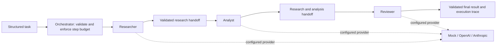

# Vicekrack Agent Network

A provider-neutral agent network with a controlled Researcher -> Analyst -> Reviewer
workflow. The orchestrator owns the sequence. Each role independently selects mock,
OpenAI, or Anthropic through its registry entry. The default demos stay offline.

## Architecture



All arrows represent orchestrator-controlled calls and explicit JSON data. Agent outputs
cannot choose another agent, alter the sequence, or trigger a retry. There are exactly
three possible stages, no background workers, autonomous loops, tools, or databases.

Researcher uses supplied notes. Analyst examines research for important findings,
inconsistencies, missing information, and conclusions. Reviewer inspects both for
completeness, unsupported claims, contradictions, and errors. A completed review means
execution succeeded, not that the work is factually approved. The final summary includes
review findings and limitations; all three stage results are retained for inspection.

## Setup and offline run

Python 3.11 or newer, from the repository root. No activation is needed.

Windows PowerShell:

```powershell
python -m venv .venv
.\.venv\Scripts\python.exe -m pip install -r requirements.txt
.\.venv\Scripts\python.exe -m vicekrack examples/workflow-task.json --registry config/agents.workflow.json
.\.venv\Scripts\python.exe -m unittest discover -s tests -v
.\.venv\Scripts\python.exe -m pip check
```

macOS/Linux:

```sh
python3 -m venv .venv
.venv/bin/python -m pip install -r requirements.txt
.venv/bin/python -m vicekrack examples/workflow-task.json --registry config/agents.workflow.json
.venv/bin/python -m unittest discover -s tests -v
.venv/bin/python -m pip check
```

Dependencies remain jsonschema and the two official provider SDKs. Tests mock external
requests and require no credentials or API credits. The mock workflow demonstrates
handoffs and lifecycle only; its analyst/reviewer summaries explicitly disclaim real
reasoning or factual approval.

The existing single-agent demo still works:

```powershell
.\.venv\Scripts\python.exe -m vicekrack examples/research-task.json
.\.venv\Scripts\python.exe -m vicekrack examples/unsupported-task.json
```

The second command intentionally exits 1 with unsupported_capability. Success exits 0.
The CLI accepts `-` for stdin and prints one JSON object. Rejected input uses an error
envelope; accepted tasks return completed or failed task envelopes.

## Provider selection and live runs

| Registry | Behavior |
| --- | --- |
| config/agents.json | Existing single-agent mock default |
| config/agents.openai.json | Existing single-agent OpenAI |
| config/agents.anthropic.json | Existing single-agent Claude |
| config/agents.workflow.json | Three-stage offline mock |
| config/agents.workflow-mixed.json | OpenAI researcher; Claude analyst and reviewer |

Each agent has its own `execution.adapter` and `execution.model`. Edit those entries to
choose another combination, without changing the task or orchestrator. Keep model null
for mock. Real providers require a model supporting structured JSON and account access.
The included models are gpt-4.1-mini and claude-sonnet-4-6.

`.env.example` contains only blank OPENAI_API_KEY and ANTHROPIC_API_KEY entries. The
application reads process environment variables; it does not load .env files. Never put
credentials into task JSON, registry entries, prompts, or source control.

PowerShell, explicit live mixed-provider run:

```powershell
$env:OPENAI_API_KEY = [System.Net.NetworkCredential]::new('', (Read-Host 'OpenAI API key' -AsSecureString)).Password
$env:ANTHROPIC_API_KEY = [System.Net.NetworkCredential]::new('', (Read-Host 'Anthropic API key' -AsSecureString)).Password
.\.venv\Scripts\python.exe -m vicekrack examples/workflow-task.json --registry config/agents.workflow-mixed.json
Remove-Item Env:OPENAI_API_KEY, Env:ANTHROPIC_API_KEY
```

Bash:

```bash
read -r -s -p 'OpenAI API key: ' OPENAI_API_KEY
export OPENAI_API_KEY
read -r -s -p 'Anthropic API key: ' ANTHROPIC_API_KEY
export ANTHROPIC_API_KEY
.venv/bin/python -m vicekrack examples/workflow-task.json --registry config/agents.workflow-mixed.json
unset OPENAI_API_KEY ANTHROPIC_API_KEY
```

This run makes up to three paid requests. The selected providers receive the original
request and notes plus prior stage results. No browsing or independent source verification
is performed. For single-agent live runs use the corresponding registry and research-task.
OPENAI_TIMEOUT_SECONDS and ANTHROPIC_TIMEOUT_SECONDS optionally set SDK operation
timeouts (default 30 seconds, greater than 0 and at most 300). These are not overall
workflow deadlines. Automatic retries are disabled; a timeout stops the workflow.

## Handoffs, safeguards, and trace

The task selects `context.workflow: "research_review"` and addresses `orchestrator`.
The registry declares `workflow.agents` and `workflow.max_steps`. Step 5 permits only
researcher, analyst, reviewer, in that order exactly once, with a hard ceiling of three.
A lower budget rejects the run before execution. Unknown/disabled agents, unsupported
adapters, reordered stages, duplicate stages, and recursive orchestrator stages are rejected.
Provider text is never interpreted as a routing instruction.

`schemas/handoff.schema.json` describes the handoff: parent task ID, stage task ID,
original instructions and notes, recipient, previous output, completion status, provider
used, step metadata, and prior stage results. Analyst and Reviewer validate IDs, order,
and consistency before calling their providers. Reviewer sees both prior results.

The task schema gains only an optional runtime-owned `execution_trace` field. Existing
input tasks remain valid. Older strict validators must use the updated schema to accept
workflow output. Caller-supplied traces are rejected. The input task is never mutated.

Example trace from a successful mock run:

```json
[
  {"step": 1, "agent": "researcher", "provider": "mock", "status": "completed"},
  {"step": 2, "agent": "analyst", "provider": "mock", "status": "completed"},
  {"step": 3, "agent": "reviewer", "provider": "mock", "status": "completed"}
]
```

Find the final review in `result.summary`, all stage outputs in `result.data.stages`,
and the trace at `execution_trace`. The trace is returned, not persisted or logged, and
contains only controlled metadata, never prompts, response bodies, credentials, or env.
Actual task results and handoffs contain user data and should be handled accordingly.

On failure, the parent is failed, the trace ends at the failed stage, and no subsequent
stage runs. Missing credentials, timeouts, provider errors, invalid responses, and malformed
handoffs propagate clear error codes. Raw provider error messages are excluded. Failed
runs have no success result. A new attempt needs a new task ID within the same runner;
there is no cross-process persistence or resume facility.

## Implementation map

- `vicekrack/orchestrator.py`: existing routing, task validation, and workflow dispatch.
- `vicekrack/workflow.py`: bounded sequence, handoffs, trace, failure handling.
- `vicekrack/researcher.py`, `analyst.py`, `reviewer.py`: specialized role handlers.
- `vicekrack/handoff.py`: schema and semantic handoff checks.
- `vicekrack/providers.py`: protocol, mock, and provider registration.
- `vicekrack/openai_provider.py`, `anthropic_provider.py`: unchanged real adapters.
- `agents/`: role definitions; `config/`: independent provider selections.
- `schemas/`: task and handoff contracts; `examples/`: runnable tasks.
- `tests/test_workflow.py`: sequence, mixed providers, errors, budgets, and trace tests.

The original provider and orchestration tests remain part of the complete suite.
See [architecture details](docs/architecture.md). Step 6 is not implemented.
