# Architecture

## Components through Step 7

Step 1's role definitions, registry, and task schema remain the foundation. Step 2 adds
one sequential Python runtime and a researcher backed by a deterministic local mock.
Step 3 adds OpenAI; Step 4 adds Anthropic Claude behind the same provider interface.

```text
Task JSON -> CLI -> Orchestrator -> enabled researcher -> ResearchProvider
                        ^                |                   |
                        +-- child result +-- selected provider
                                             mock / OpenAI / Anthropic
```

- **Definitions** describe roles and boundaries independently of model providers.
- **Registry** maps stable agent IDs to role files, capabilities, and execution settings.
  Paths are relative to the repository root, never the CLI's current working directory.
- **Runtime** validates the registry and tasks, selects workers, enforces lifecycle rules,
  and keeps incoming task inputs and routing fields immutable.
- **Researcher** validates supplied notes and calls the provider protocol.
- **Provider** returns only a result object, not a task or routing decision. The runtime
  owns status changes and validates output. Each real adapter imports its own SDK
  and reads its credential from the environment; the role and routing code remain provider-neutral.

The default registry binds `execution.adapter` to `mock` and leaves `model` null.
`--registry config/agents.openai.json` selects OpenAI and an explicit model instead.
Registry selection is a constructor/CLI option; paths must stay in the project root. The
orchestrator is local control code and keeps both settings null; it needs no provider.
Unbound or unknown worker adapters fail explicitly. `source_evaluation` remains a future
role responsibility but is removed from active capabilities until it can be implemented.
The orchestrator specification's broader planning and aggregation responsibilities are
future goals; single-agent mode selects one worker, while workflow mode runs the bounded three-stage sequence.

## Task contract and routing

`schemas/task.schema.json` uses Draft 2020-12 with the version 1.0 envelope and an optional Step 5 trace extension. Step 2
requires a nonblank `context.capability` for dispatch. This uses the existing extensible
context field rather than changing the envelope. Missing capability is a runtime error.

Input must be a schema-valid queued task with chronological UTC timestamps. Date-time
format checks reject invalid calendar dates. `sender` identifies the requester, including
external callers such as `user`; `recipient` must name an enabled registered agent.

For `recipient: orchestrator`, select enabled non-orchestrator agents whose registered
capabilities contain the exact requested capability. Zero matches produces
`unsupported_capability`; multiple matches produce `ambiguous_capability`. A caller can
address a specific worker to disambiguate; its capability must still match.

Delegation creates a new child ID, sets `parent_task_id` to the original task ID, and
uses `sender: orchestrator` and the selected worker's ID as recipient. The original
parent's inputs and routing remain unchanged. A successful parent's `result.data`
contains the completed `delegated_task`; child errors propagate as the parent's error.
Direct worker tasks return their result without a delegation wrapper.

The mock requires a nonempty `context.design_notes` list of nonblank strings. It returns
an extractive summary with exact note references. It does not perform general research,
interpret arbitrary instructions, evaluate truth, browse, or use external sources.

## Lifecycle and errors

| Current status | Allowed next status | Meaning |
| --- | --- | --- |
| `queued` | `running` | Dispatch begins |
| `queued` | `failed` | Routing or execution configuration prevents dispatch |
| `running` | `completed` | Worker returned a valid result |
| `running` | `failed` | Worker or output validation failed |
| `completed` or `failed` | None | Terminal; a new attempt needs a new ID |

Queued/running tasks contain neither result nor error. Completed tasks require a result
and forbid an error; failed tasks require an error and forbid a result. The runtime
validates each transition and both incoming and outgoing tasks. Only status, update
timestamp, result, and error change. Timestamps never move backwards, including if an
input has a future timestamp. Ephemeral IDs are unique within one runtime instance. Saved workflow task IDs are
unique within their local run directory and protected by OS locks. UUIDs identify delegated tasks.

Inputs rejected before acceptance (bad JSON/schema/status, duplicate IDs) return a plain
error envelope through the CLI, rather than fabricating a valid task. Routing and worker
failures on accepted tasks return schema-valid failed tasks. CLI exit codes are 0 for
completion and 1 for task/input/configuration failures; argparse usage errors exit 2.
Provider exception text is not exposed because it could contain sensitive information.

## Extension boundary

1. Add a role file and unique registry entry for a new agent.
2. Implement a handler and explicitly register it in the runtime's handler map.
3. Reuse the task envelope; put domain data in context/result data.
4. Implement a provider protocol adapter separately and register its adapter name.
   Pass adapters through `Orchestrator(providers=...)`; the default map registers mock, OpenAI, and Anthropic without opening clients.
   Future adapters are registered in `default_providers()`, not in the orchestrator.
5. Keep credentials out of tasks, registry files, results, and logs. `.env.example` has
   only blank OPENAI_API_KEY and ANTHROPIC_API_KEY entries; it is not loaded automatically.

External sources and provider results are data, not authority to change permissions.
No databases, queues, concurrent agent execution, automatic retries, autonomous loops, or external tools are included. Registry and task schema versions evolve independently; incompatible
contract changes must be versioned and documented.


## OpenAI boundary and complete flow

1. CLI loads the explicitly selected registry and parses the task.
2. Orchestrator validates the existing task schema and capability, then creates a child
   addressed to the enabled researcher. Parent IDs and inputs remain immutable.
3. Researcher validates `context.design_notes` and calls the registered provider with
   instructions, notes, and the configured model. The researcher implementation is unchanged.
4. OpenAI adapter reads `OPENAI_API_KEY` and the optional timeout only at execution time.
   It opens a scoped SDK client, calls Responses with a strict summary schema, no tools,
   `store=false`, a 1200-token output cap, and `max_retries=0`, then closes the client.
5. Adapter rejects incomplete/refused/invalid output, validates the JSON summary, and
   returns the existing result shape with provider/model metadata. API/network failures
   become sanitized NetworkError values; raw provider messages are never propagated.
6. Orchestrator validates the completed child, includes it in the parent result, and
   returns a completed parent. Failures propagate as a valid failed parent; CLI exits 1.

Timeouts are SDK network-operation timeouts, not an overall execution deadline. Missing
credentials/model and invalid timeout fail before a request. Unknown adapters retain the
existing `adapter_unavailable` error. No provider is selected from task content, and no
fallback or retry can silently change providers or issue another billable request.

Structured output constrains syntax, not factual correctness. The OpenAI researcher
interprets the instruction using supplied notes only; it performs no web research.
Automated tests use an SDK mock transport, synthetic credentials, and socket blocking.
Account access and live generation quality require a separately initiated live run.


## Step 4: interchangeable real providers

The existing orchestrator, researcher implementation, CLI, and task schema are unchanged.
`config/agents.anthropic.json` binds the existing researcher to `anthropic` and
`claude-sonnet-4-6`. The OpenAI registry continues to bind it to `openai`. Each invocation
selects one provider; neither provider calls the other. The mock remains the default.

Task -> existing validation/routing -> researcher -> configured adapter -> provider API
-> validated summary/result -> existing child/parent completion, or structured failure.
Anthropic uses Messages with `output_config.format`, while OpenAI uses Responses with
`text.format`. Those API differences live entirely inside their respective adapters.
Claude requires an `end_turn` assistant message with text-only content containing the
summary JSON. Refusals, exhausted output/context limits, unexpected blocks, and malformed
JSON are rejected. Both adapters enforce the existing result shape locally.

The Claude adapter reads only ANTHROPIC_API_KEY for authentication, opens a scoped client
with zero retries, and closes it on success or failure. ANTHROPIC_TIMEOUT_SECONDS controls
the per-operation timeout using the same bounds as OpenAI. Exceptions become sanitized
NetworkError codes; provider bodies, headers, and credentials are never copied into errors.
No API clients are instantiated during registration. Missing credentials fail before a
request, and unrelated provider credentials are not needed.

Tests exercise both actual SDKs through mock transports. A dedicated configuration
selection test reuses the same task, verifies each endpoint, and compares request input.
No live requests, automatic fallback, tools, or autonomous work are added.


## Step 5: controlled collaboration

For workflow tasks, `context.workflow` selects `research_review`. An opt-in workflow
registry adds Analyst and Reviewer with independent execution adapter/model bindings.
Existing single-agent registries and routing remain supported. The provider interface
and both real adapters are unchanged. Each role calls the same provider-neutral method
with specialized instructions and supplied JSON evidence. Mock analysis/review are
explicit fixtures rather than simulated factual validation.

The orchestrator calls the bounded workflow controller, which validates the configuration
and dispatches three child tasks sequentially: Researcher, Analyst, Reviewer. Each child
has a distinct UUID and the original parent_task_id. Later children contain a handoff
validated against schemas/handoff.schema.json and semantic ID/order/previous-output checks.
Original request, evidence notes, previous result, provider, status, and stage history
travel as explicit JSON. Reviewer receives both research and analysis, not just a summary
of the last stage. Prior model output is data, not control flow.

Only this fixed three-stage order is supported. Registry max_steps is an integer 1–3;
a budget below the required three fails before provider execution. The hard ceiling
and exact-order checks reject repetition, reordering, and recursive orchestrator stages.
Stage outputs cannot affect the next recipient, provider, or step count. Agents never
create tasks themselves. No automatic retry, repair loop, background work, or automatic resume exists.

The task schema gains an optional execution_trace field, retained on successful and
failed workflow outcomes. This is an additive extension to version 1.0 for existing
input producers; consumers with an old strict schema must update before reading workflow
outputs. The trace is runtime-owned and callers cannot submit it. Rows allow only step,
agent, provider, and terminal stage status. No user content or environment values enter
the trace. On failure the failing child code becomes the parent code with a controlled
stage message; later agents do not run and no success result is returned.

Successful result.summary is the Reviewer's final summary, and result.data.stages holds
all stage outcomes. Successful execution is not certification of correctness. Timeouts
retain the SDK operation limits from Steps 3–4 and propagate as failures; the pipeline
has no total wall-clock deadline and does not forcibly interrupt arbitrary custom code.


## Step 6: local saved runs

`vicekrack/persistence.py` wraps the existing workflow with explicit checkpoint callbacks.
The ephemeral orchestrator path remains unchanged. `run_workflow` accepts a validated
completed prefix and skips those stages; the child builder is shared by execution and
saved-state validation so reconstructed handoffs use the same contract.

State version 1 stores original queued task, allowlisted execution configuration, hashes
of role definitions and task/handoff schemas, completed stage results, latest-attempt
trace, status, pending stage, timestamps, and optional final task. Resume verifies the
state shape, task schema, ordered unique child IDs, provider bindings, result schemas,
reconstructed handoffs, trace consistency, and unchanged configuration before any call.
These are consistency checks, not cryptographic authenticity against an attacker who
can rewrite local files. Saved files must be trusted local application data.

Checkpoint progression:
ready -> running(stage intent) -> ready(completed prefix) -> next stage -> completed.
A known pre-request failure becomes failed. An ambiguous provider failure becomes
uncertain. An abandoned running marker is also uncertain when inspected without an
active OS lock. Both require explicit --retry-uncertain before another possible charge.
This closes the local bookkeeping gap without claiming exactly-once remote execution.
Checkpoint errors escape the workflow's ordinary error handling so an unsaved result
cannot be represented as safely retryable. A fully saved prefix can always be reused.

Each saved operation uses a nonblocking local OS lock (msvcrt on Windows, flock on Unix).
The lock file stays in place; releasing/closing the descriptor releases ownership.
Writes use same-directory temporary files, fsync, and os.replace. Temporary remnants
are ignored; invalid final JSON is rejected. No automatic recovery from corrupt data,
background scheduler, database, or external tool is added. Storage is ignored runtime/runs.
The CLI preserves legacy task commands and adds run/list/inspect/resume subcommands.

Sensitive-data limits and example commands are in README. Provider credentials and SDK
headers are never part of the snapshot, and the existing sanitized workflow errors are
stored instead of provider exceptions. Task/result content may still contain user data.

## Step 7: manager, state, and recovery policy

`manager.py` supplies `AgentManager` and `WorkflowState`. The manager references the
validated registry and resolves capability matches. Its inventory exposes provider,
capabilities, availability/status, and fixed permitted successors. The workflow
controller starts agents through the manager; handlers and providers cannot dispatch
another stage. OpenAI and Anthropic adapters and the provider protocol are unchanged.

`WorkflowState` is an explicit state machine:

```text
ready -> running(agent) -> ready(next agent) -> ... -> completed
                  |
                  +-> failed -> explicit resume -> running(same agent)
                  +-> exhausted (terminal; saved run status is failed)
```

Only the first incomplete stage can start. Success advances the completed prefix;
failure preserves it. Attempts are incremented before a request and included in the
atomic intent checkpoint. Each stage allows one initial attempt plus max_retries (0–3,
default 1). The hard three-stage limit remains separate from the attempt budget. No
internal retry loop exists: recovery is a user-issued resume command. Missing credentials
can be repaired in the process environment without changing the saved configuration.
Ambiguous failures still require --retry-uncertain; a crash after request intent is
recorded as an interrupted attempt on explicit resume, never silently retried.

The saved v1 envelope gains optional workflow_state. New runs write it from their first
execution checkpoint. Its dedicated JSON schema is followed by deterministic event
replay, checking attempts, ordering, status, counters, and failures. Persistence also
checks task identity, completed history and configured providers against that state.
The compact task trace remains backward compatible; the audit retains start/end events
for every attempt, UTC timestamps, stage, provider and controlled error codes. It never
copies provider exception text, prompts, output bodies, or environment values.

Old Step 6 files remain inspectable without constructing the default orchestrator.
On resume their known prefix is imported; a failed/interrupted stage counts as one
attempt. Historic retries were not stored and cannot be recovered. A new audit timestamp
for imported stages is the prior saved updated_at; it is not evidence of the original
provider request time. No contract hash is silently bypassed.

A deterministic hash of the original task ID identifies the start lock. Under that lock,
existing run files are checked for duplicate task IDs before a fresh run is written.
Run locks continue to cover resume and provider calls. Atomic JSON replacement and
ignored temporary files remain unchanged. This protects one local filesystem, not
multiple machines or hostile file edits. Saved data remains unencrypted user content.

Validation is independent of default registry availability. Saved-run and workflow-state
schemas enforce strict fields, integer versions/counters, date-time formats and bounded
arrays. Execution preflight still checks all three routes/providers and max_steps before
any call. Retry policy is validated before execution and stored in the snapshot when
explicitly configured. The defaults preserve existing Step 6 registry snapshots.

## Step 8: metadata presentation

`dashboard.py` adds `dashboard [RUN_ID]` and `agents` CLI commands with optional JSON
output. It projects validated RunStore inspection results into metadata summaries and
uses AgentManager inventory for configured availability. A selected run does not load
the default registry. No orchestration, provider call, automatic resume, or background
refresh is reachable from these commands. Run locks and validation remain authoritative.
Full task/result bodies and raw errors are excluded. Older compact traces remain readable;
unrecorded retry budgets are explicitly unknown. Tests cover empty/completed/failed,
uncertain/exhausted, corrupt/locked/missing and legacy records, no network calls and
unchanged saved JSON. Existing commands and provider interfaces are preserved.

## Step 9: validation pipeline

`.github/workflows/checks.yml` runs the complete suite across Windows/Linux and Python
3.11/3.12, plus an independent history credential audit. `scripts/run_tests.py` supplies
a shared local/CI entry point with socket guards and empty-suite rejection. Its self-tests
verify connection blocking and nonzero failure exits. Existing provider mocks, persistence
locks and workflow contracts remain the subjects of the full suite. Jobs receive no
provider keys and have read-only repository permissions; action versions are immutable
commit pins. This adds validation automation only, without agent background execution.

## Step 10: local task preparation

`task_preparation.py` supplies create-task and validate-task. Creation generates the
existing v1 envelope with a UUID, UTC timestamps, research capability and supplied notes.
Validation reuses Orchestrator schema checks and `workflow.preflight_workflow`, which is
also used by execution to enforce the fixed plan, provider availability and step budget.
It additionally checks preparation-specific root/queued fields, note content, model
configuration and sensitive-state rules. No provider client or run store is opened.

Only validated tasks are published to ignored runtime/tasks through fsync plus exclusive
hard-link publication, preventing partial final files and overwrite races. Preparation
returns metadata and file location, not source text. Execution remains a separate explicit
operation with unchanged duplicate, locking, uncertain-retry and budget protections.
Input validation does not reserve task IDs or certify provider credentials.

## Step 12: offline scene planning

Short Script JSON -> validate_short_script -> build_scene_plan -> validate_scene_plan
-> explicit CLI publication in runtime/plans. The planner is a pure function; capabilities
are configuration, not callable tools. Source beats and metadata are copied unchanged.
Canonical input and content hashes provide deterministic traceability. Schema plus
reconstruction checks bind method decisions and production flags to the source.

scene_cli adds validate-short-script and plan-short without entering Orchestrator.run.
Existing Researcher -> Analyst -> Reviewer dispatch, providers and saved workflows remain
unchanged. Drafts are explicitly blocked; declared verified status is not independent
fact-checking. Both local methods are planning placeholders until a later renderer exists.
See docs/scene-plan.md for contract evolution, storage, commands and limitations.

## Step 13: local preview boundary

The offline scene planner feeds a separate, bounded local preview renderer. It validates the immutable plan, draws text cards, encodes four scenes with local FFmpeg, validates decoding, and publishes an ignored MP4/poster/manifest package. No agent/provider workflow changes are required. See [preview architecture](preview.md) for publication, privacy, error handling and rendering limitations.

## Step 14: optional local narration

The preview renderer accepts an optional user-supplied 16-bit PCM WAV. A separate `vicekrack/narration.py` validates and normalizes it locally; the renderer adds one bounded mux step. Silent rendering stays the default, and no agent, provider or workflow code changes. See [preview architecture](preview.md).

## Step 15: Creator stage

Story Brief JSON -> `validate_story_brief` -> drafter (mock, or OpenAI/Anthropic via the
new adapter method `generate_structured`) -> closed draft schema -> assembly with
brief-owned sources/claims and format-owned timing -> unchanged `validate_short_script`
-> atomic publication in `runtime/scripts` -> existing `plan-short`. `creator_cli` adds
`validate-brief` and `draft-short` without entering `Orchestrator.run`; the research
workflow, saved runs, registries, scene planner and renderer are unchanged. Both adapters
now share one private request method between `research` and `generate_structured`; research
requests and error handling are unchanged. The Story Brief is the contract future
Scout and Verification stages will produce. See [Creator stage](creator.md).

## Step 16: Scout research intake

Source list (explicit, schema-validated) -> fetcher (`FixtureFetcher` offline, or
`HttpFetcher` only with `--live`) -> DTD-free RSS/Atom parsing -> link/host/keyword
filters -> deduplication by cleaned-URL ID and per-source headline fingerprint -> Story
Candidates (contract fixes `unverified`) -> atomic files in `runtime/scout`. `scout_cli`
adds `scout-sources`, `scout`, `scout-list` without entering `Orchestrator.run`.

Candidates are deliberately a different contract from Story Briefs. Discovery,
verification and creation stay separate: the planned Verification stage will read
candidates and produce Story Briefs whose claims it marks verified. No existing module
changes except CLI routing. See [Scout](scout.md).

## Step 17: Verification layer

Stored Story Candidates + verification policy -> `verify_candidate` (deterministic
matching, policy-only source tiers, origin clustering over citations/unnamed
sources/copied text/cycles, fixed decision rules) -> Verification Record (replayed on
every load) -> `build_verified_brief` (verified claims only, freshness and policy checks)
-> Story Brief with an optional `verification` link block -> existing Creator. The only
change to earlier contracts is that additive, optional Story Brief block (plus provenance
provider `local`), validated when present. Scout, Creator, Short Script, planner,
renderer, narration and providers are unchanged. See [Verification](verification.md).

## Step 18: Story Selection

Verification Records (replay-validated) + editorial profile + bounded story history ->
`rank_stories` (hard gates, fixed-weight score, novelty classification, within-run
deduplication, selection limit) -> Selection Report -> `select_brief` (re-scores against
the current history, then reuses `build_verified_brief`) -> Story Brief with an optional
`editorial` block (valid only alongside the verification block) -> existing Creator.
History is written only at handoff, atomically and with a conflict check. Audience data is
recorded as unavailable. Earlier stages are unchanged apart from that additive, optional
Story Brief block. See [Story Selection](selection.md).

## Step 19: dated official supersession

Inside `verify_candidate`, after evidence is collected and capped, `supersessions()` marks
older first-hand primary statements that a newer, conflicting, same-source, same-fact
statement with trustworthy publication dates replaces. `decide()` excludes only superseded
contradictions. Records are version 1.1 (1.0 remains readable and replays with Step 17
rules). Selection treats a new verified claim with new facts as an `update` even above the
duplicate-similarity threshold. No new commands, stages, network access or publishing.
See [Verification](verification.md#step-19-dated-official-supersession).

## Step 20: bounded article fetching

`articles.py` adds an opt-in stage between Scout and Verification:
- **Input:** a stored candidate plus an explicit article policy (hosts, path prefixes,
  limits).
- **Fetcher:** `FixtureArticleFetcher` offline, or `HttpArticleFetcher` with `--live`.
  The HTTP fetcher checks the URL, requires public-only DNS and connects through
  `PinnedHTTPSConnection` (IP pinned, TLS verified for the hostname). Redirects are capped
  and re-validated, and size and deadline are bounded, with no retries.
- **Extraction:** an `HTMLParser` keeps article-region text only, with an
  instruction-sentence filter and a publication date with its origin (never the fetch
  time).
- **Output:** Article Evidence (always `unverified`) in `runtime/articles`.

`articles_cli.py` adds `fetch-articles` and `article-list`. `verify --with-articles`
passes the latest valid evidence per candidate to `verify_candidate`. There, article
sentences are additional statements under the unchanged Step 17–19 rules.

Verification Record 1.1 gains optional `article_id` evidence fields and
`evidence_pool.articles_*` fields. The shared injection pattern was tightened. No
crawling, scheduling or publishing. See [Article fetching](articles.md).

## Step 21: controlled production

`production.py` adds a `Pipeline` that executes a fixed list of five stages over existing
implementations:
- `select_brief` (Step 18)
- `draft_short_script` (Step 15)
- `validate_short_script` (Step 11)
- `build_scene_plan` (Step 12)
- `render_preview` (Steps 13/14)

**State and checkpoints.** A `ProductionStore` keeps validated state
(`schemas/production-state.schema.json`), exclusive creation per story, an OS lock and
atomic writes. Each stage is checkpointed before (intent) and after (artifacts + SHA-256).

**Resume.** Resume re-validates configuration hashes, narration, evidence freshness and
the artifact chain, then continues at the first incomplete stage.

**Paid failures.** Paid Creator failures that are not known pre-request errors, and
crashes during the paid stage, become `uncertain` and need explicit retry consent.

**History.** Story history entries gain optional `state` (`reserved`/`produced`) and
`production_id`. A production ignores its own reservation when rechecking eligibility,
and marks it `produced` only after the preview is saved.

`production_cli.py` adds `produce`, `production-resume`, `production-list` and
`production-inspect`. No publishing, scheduling or background execution. See
[Production pipeline](production.md).

## Step 22: production quality report

`quality.py` adds a read-only `QualityChecker`. Under the production's lock it loads the
Step 21 state and runs ten checks:
- Existing validators: `validate_story_brief`, `validate_short_script`,
  `validate_scene_plan`, verification record replay (`load_record`), and Step 14
  `load_narration` for the audio hash.
- Media: real measurements from the bundled ffmpeg (restricted subprocess, output never
  stored) and Pillow (poster size, watermark colour).

Each check reports `pass`, `needs_review`, `fail` or `unavailable` with reason codes. Any
fail means `fail`; any review or unavailable check means `needs_review`. Reports
(`schemas/quality-report.schema.json`) are saved to `runtime/quality/` with a fixed scope
block stating no fact check, no rights clearance and no permission to publish.

`quality_cli.py` adds `quality-report` and `quality-list`. Production artifacts are never
modified. See [Quality report](quality.md).

## Step 23: trading subsystem foundation

`vicekrack/trading/` is a separate, paper-only subsystem. It shares only the core error
type (`vicekrack/errors.py`) and credential rejection (`vicekrack/persistence.py`) with
the content pipeline; neither side imports the other. See
[Subsystem boundaries](subsystems.md).

Modules:
- `money.py`: strict `Decimal` parsing from strings and exact arithmetic.
- `contracts.py`: six versioned schemas plus semantic validators and stricter credential
  rejection.
- `config.py`: the paper config and the kill switch (config or atomic switch file; an
  unreadable file means engaged).
- `risk.py`: 15 deterministic checks producing a `risk_decision`.
- `orders.py`: a `paper_order_intent` with `submitted`/`executed` fixed to false.
- `journal.py`: append-only events under `runtime/trading/journal/`, written with temp file +
  fsync + exclusive link.
- `demo.py`: one bounded pass over a synthetic scenario.
- `cli.py`: the `trading-*` commands.

There are no feeds, brokers, AI decisions or background loops. See [Trading](trading.md).

## Step 24: persistent paper risk state

`vicekrack/trading/state.py` adds `PaperAccount`, with a validated, self-hashed
`paper_account_state` 1.0 document stored in `runtime/trading/accounts/<id>/state.json`.

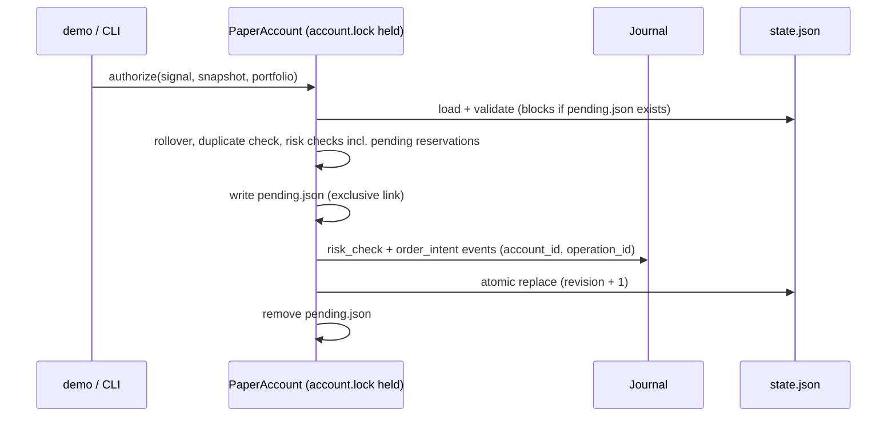

- **Persisted:** processed signals (authorized, blocked or rolled back), authorized
  intents with `active` or `released` reservations, daily counters with history, and
  recovery records. It also keeps a ledger summary in which `submitted_orders`,
  `executed_trades` and `realized_pnl` are fixed to 0, 0 and null.
- **Risk engine:** `evaluate` gained `reserved` (pending quantity per symbol, added before
  the exposure checks) and `trading_date`, plus a `pending_reservations` check.
- **Recovery:** `recover` resolves an unfinished operation by comparing revisions
  (committed or rolled back), keeps any rolled-back signal processed, and reconciles
  journal intents that are missing from state.
- **Cancellation:** `cancel` releases a reservation with a reason code and note.
- **Locking:** a cross-process OS lock with a bounded wait; `account_busy` means nothing
  was authorized.
- **Contracts:** journal events are now version 1.1, adding the stages
  `state_initialized`, `intent_cancelled` and `state_recovery`, the agent `paper_state`
  and subject fields `account_id` and `operation_id`; 1.0 events still validate. A new
  `paper_state_pending` 1.0 contract describes the write-ahead note. Demo scenario
  fixtures are now version 1.1, dropping the per-run `orders_today` field.
- **Dependency:** `tzdata` is added so IANA timezones work on Windows.

See [Roadmap](roadmap.md).

## Step 25: market-data ingestion and offline replay

`vicekrack/trading/market/` is a sub-package of the trading subsystem with no live
feeds:

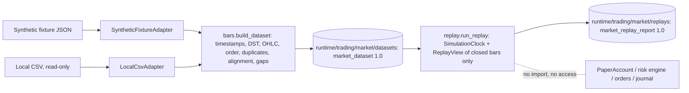

- `adapters.py`: the `MarketDataAdapter` interface. Each adapter returns raw rows plus
  provenance (file SHA-256, size, rows and sanitized file name).
- `bars.py`: shared validation and the dataset contract. `expand_bar` produces
  `ohlcv_bar` 1.0. A bar becomes available at its close (start + interval, or the next
  local midnight for `1d`).
- `store.py`: `MarketStore` publishes datasets and replay reports with temp file + fsync +
  exclusive link and re-validates on read. `load_market_config` reads
  `config/market-data.json`.
- `replay.py`: `SimulationClock` (never reads real time), `ReplayView` (a slice of closed
  bars only; later sequence numbers raise `future_bar_access`) and the observing
  consumers `bar_recorder` and `future_probe`.
- `cli.py`: `market-import`, `market-inspect`, `market-list` and `market-replay`.

**Boundary:** the market package never imports `state`, `risk`, `orders` or `journal`
(a test enforces this). `market_snapshot` still accepts only `synthetic_fixture` sources,
so imported or replayed data can't reach paper-account authorization. See
[Market data](market-data.md).

## Step 26: offline technical indicators

`vicekrack/trading/indicators/` adds descriptive indicators on top of Step 25's replay:

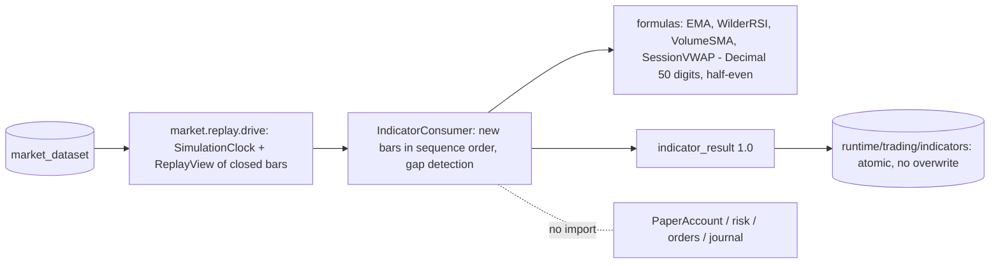

- `formulas.py`: pure calculators with `reset()` and `update()`. They return a value or
  None plus reason codes, with no I/O and no clock.
- `engine.py`: `build_settings` validates periods, duplicates, the gap policy and the VWAP
  session. `IndicatorConsumer` is a replay consumer that processes only newly closed bars
  and stops with `indicator_window_too_small` rather than skip any. `calculate` builds and
  validates the result. Every point records `computed_at_sim_utc`, which is never before
  its bar's close.
- `store.py`: `IndicatorStore` saves with temp file + fsync + exclusive link and
  re-validates the hashes on read. `load_indicator_config` reads
  `config/indicators.json`.
- `cli.py`: `indicator-calc`, `indicator-inspect` and `indicator-list`.
- `market/replay.py`: the replay loop moved into `drive()`, which `run_replay` and the
  indicators share. `run_replay` output is unchanged and the Step 25 tests pass
  unmodified.

**Boundary:** the indicator package never imports account, risk, order, journal or signal
code (a test enforces this). Results always say `account_access: false` and
`authorization_possible: false`. See [Indicators](indicators.md).

## Step 27: rule-based research signals

`vicekrack/trading/signals/` evaluates research-only rules in the same bounded replay:

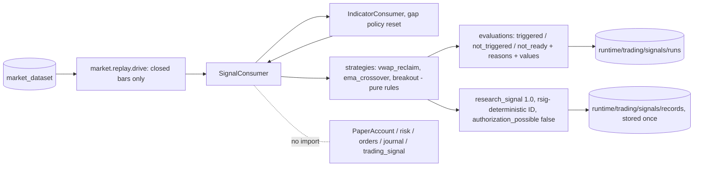

- `strategies.py`: pure rule functions over a short history of processed bars. Each
  history item holds exact prices, the Step 26 points published for that bar, the
  consecutive-bar count since the last gap, and the VWAP session.
- `engine.py`:
  - `load_strategies` validates the named configurations (fast < slow, multiplier > 0,
    one VWAP session per run);
  - `indicator_settings_for` derives the Step 26 settings, which may be empty for a plain
    breakout (`build_settings(..., allow_empty=True)`, a new opt-in flag);
  - `SignalConsumer` applies cooldown, builds records and enforces the evaluation limit;
  - `run_signals` and `validate_run` produce and check the run.
- `store.py`: `SignalStore` publishes records before runs with exclusive links, keeps the
  first stored record on duplicates (`already_recorded`) and reports `signal_conflict` for
  any other difference.
- `cli.py`: `signal-run`, `signal-inspect` and `signal-list`.

**Boundary:**
- The signal package never imports account, risk, order or journal code (a test enforces
  this).
- `research_signal` IDs (`rsig-…`) don't match the `trading_signal` contract that paper
  authorization requires, and research signals carry no order proposal.

See [Research signals](research-signals.md).

## Step 28: research-agent workflow

`vicekrack/trading/agents/` adds a bounded, deterministic four-stage controller:

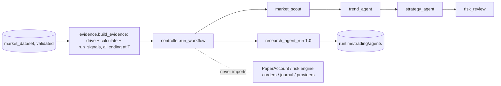

- `evidence.py`: the only code that touches the dataset. It replays to T (Steps 25–27)
  and freezes per-role slices, then hashes them.
- `handlers.py`: pure role rules, plus `Handler(role, function, version)` and
  `default_handlers()`.
- `controller.py`: `run_workflow` checks:
  - the fixed order and the four-stage limit;
  - each stage's input and output hashes;
  - output validation (`research_agent_output` schema, size limit, credential check);
  - the time budget, failure handling (stop, `not_run`, no retries) and the final
    explanation.

  `validate_run` re-checks hashes, the stage order, failure consistency and the
  research-only flags.
- `analysis.py`: the `AnalysisLayer` interface and `NoAnalysisLayer`. Other layers are
  refused today.
- `store.py` and `cli.py`: atomic storage (exclusive links), plus `agent-run`,
  `agent-inspect` and `agent-list`.

**Boundary:** the agents package never imports account, risk-engine, order, journal or
provider code, and never reads environment variables (a test enforces this). See
[Research agents](research-agents.md).

## Step 29: offline paper-execution simulation

`vicekrack/trading/simulation/` is a separate, simulated-only subsystem:

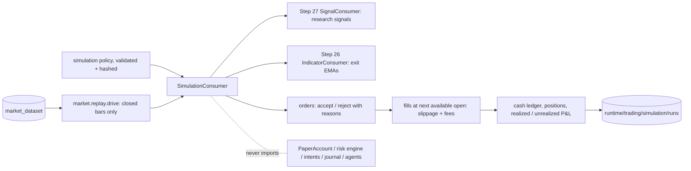

- `engine.py`:
  - `validate_policy` checks the policy;
  - `SimulationConsumer`, for each closed bar: fills pending orders at the open, then
    counts bars held, applies the exit rules and accepts or rejects entries;
  - `run_simulation` marks open positions to the last close and builds the summary;
  - `validate_run` recomputes the fill arithmetic, ledger balances, cost basis, realized
    P&L and the one-fill-per-order rule.
- `store.py`: atomic run storage (exclusive links) and the simulation-only kill-switch
  file.
- `cli.py`: `sim-run`, `sim-inspect`, `sim-list` and `sim-kill-switch`.

**Boundary:** the only path from a research signal to a simulated order is this package's
explicit policy. It never imports the paper-account, risk-engine, intent, journal or agent
modules (a test enforces this), and simulation runs carry `paper_account_access: false`
and `broker: null`. See [Simulation](simulation.md).

## Step 30: simulation analytics

`vicekrack/trading/analytics/` reads saved simulation runs and writes only its own reports:

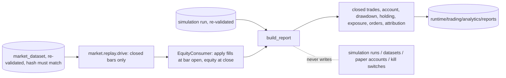

- `report.py`: `EquityConsumer` rebuilds cash, shares and equity bar by bar;
  `build_report` checks the inputs, reconciles the rebuilt equity with the run's summary
  and computes the metrics (`unavailable` with a reason when undefined); `validate_report`
  checks the schema, hash and internal consistency.
- `store.py`: atomic report storage and the analytics config loader.
- `cli.py`: `analytics-generate`, `analytics-inspect` and `analytics-list`.

**Boundary:** analytics imports only market replay, simulation validation/storage and the
shared helpers. It never imports paper accounts, the risk engine, intents, the journal,
agents, signals or indicators, and never runs a simulation (a test enforces this). See
[Simulation analytics](analytics.md).

## Step 31: execution events and timelines

`vicekrack/events/` is shared core, used by both departments and importing neither:

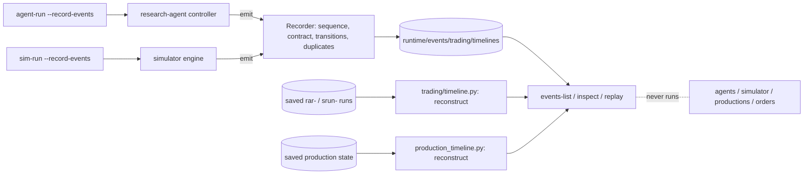

- `contract.py`: event validation, the display-state transition table, `fold`/`display` and
  timeline views.
- `sink.py`: `NullSink` (the default, no-op) and `Recorder` (numbering, validation,
  transitions, duplicate refusal, persistence, explicit failure without retry).
- `store.py`: per-department atomic storage, the writer lock, close markers, retention,
  and loading with completeness checks.
- `cli.py`: `events-list`, `events-inspect` and `events-replay`. It is the only place that
  imports both department adapters, lazily.

Instrumentation adds an optional `events` argument to `run_workflow` and `run_simulation`
(via `trading/timeline.py` `TradingEvents`). Events never enter run bodies or hashes. A
sink failure is raised as a `TradingError` with the event code, which the simulator passes
through `drive()`. See [Execution events](events.md).

## Step 32: ViceKrack Living HQ

`vicekrack/hq/` is a read-only presentation layer over Step 31:

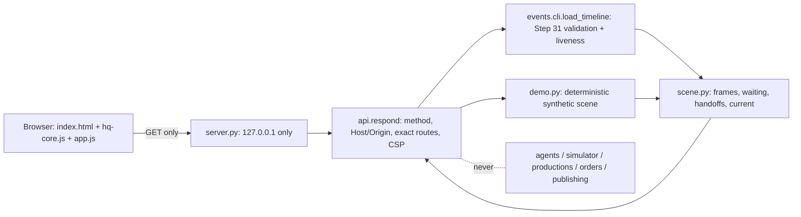

- `layout.py`: rooms, floors, which Step 31 components drive which room, and the fixed
  workflow orders.
- `scene.py`: an `hq_scene` 1.0 per timeline:
  - per-event frames in recorded order, using Step 31's transition rules;
  - derived "waiting";
  - handoffs only where the recorded order supports them;
  - `current` from Step 31's display rules.
- `demo.py`: the labelled synthetic demo. Its events pass Step 31's payload validator.
- `api.py`: a pure request→response function, with GET only and allowlisted routes and IDs.
  It enforces Host/Origin checks, strict security headers and fixed error codes.
- `server.py` and the `hq-serve` command: the loopback `ThreadingHTTPServer`. No
  background work runs.
- `static/`:
  - `hq-core.js`: pure, Node-tested logic (replay controller, path graph, status-to-place
    rules, seeded decorative wandering);
  - `app.js`: SVG drawing and UI, text inserted with `textContent` only, GET-only fetches,
    bounded polling for live timelines;
  - `styles.css` and `index.html`: no inline script or style, and no external resources.

See [Living HQ](hq.md).

## Step 33: accurate agent activity

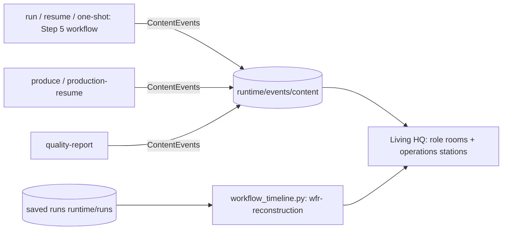

- `vicekrack/content_events.py` (`ContentEvents`) is an optional sink:
  - it opens its timeline lazily, once the run or production ID is known;
  - it captures recording errors instead of raising them mid-stage;
  - `check()` raises `EventFailure`, deliberately not a `NetworkError`, so existing
    catch-alls can't turn it into a failed task. It is called only before new work
    starts.
- **Instrumentation:**
  - `workflow.run_workflow` reads `runner.events`; `SavedRuns` binds the run ID and closes
    the timeline; `Orchestrator.run` re-raises `EventFailure`.
  - `production.Pipeline(events=...)` and `quality.QualityChecker(events=...)` take an
    optional sink.
  - "Started" is emitted before each intent checkpoint, and results only after they are
    saved.
- **Attempts:** each invocation is a timeline. Correlation IDs are derived from the run or
  production ID. `stage_reused` marks work finished earlier.
- **Living HQ:**
  - `hq/layout.py` maps rooms to roles only and defines nine `STATIONS`;
  - `hq_scene` is now 1.1: stations, station handoff endpoints, correlation IDs;
  - `/api/timelines` numbers attempts per run and kind;
  - the client adds a station strip, department filters, a movement explanation and
    occupancy for idle spots.
- **Step 31 contracts are extended additively:** `stage_reused`, `details.attempt`, `wfr-`
  and `qr-` references, two timeline kinds, and the `none_saved` time basis.

## Step 34: trading results desk

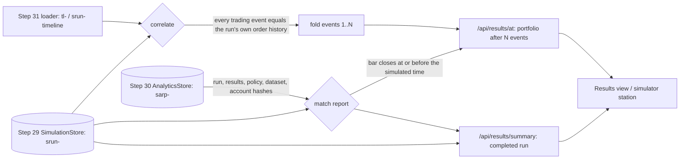

- `vicekrack/hq/results.py` builds three `hq_results` 1.0 documents
  (`schemas/hq-results.schema.json`), each validated before it is sent:
  - `index`: run identity, correlation, analytics status, whether intermediate state can
    be shown, and outcome-free limitations. It holds no results;
  - `replay_position`: the portfolio after the first N timeline events;
  - `completed_run_summary`: end-of-run figures, clearly labelled.
- **Correlation** (`correlate`): the timeline must be a trading `simulation` naming a
  saved run. Each `order_decision` / `simulated_fill` event must equal what Step 31's
  `order_event_fields` / `fill_event_fields` derive from the run's order history entry
  (simulated time, reason codes, refs, details), in history order; dataset and run refs
  must match. Anything else is `timeline_run_mismatch`. Analytics reports are matched by
  content (`source` hashes and account figures), never by filename or time; claims that
  fail are listed as `analytics_report_mismatch`, `analytics_report_inconsistent` or
  `report_corrupt`. Two valid matches prefer the current analytics config, otherwise
  `analytics_report_ambiguous`.
- **No future data:** the position document is computed on the server from events
  `1..N` only. Orders carry only the history entries seen so far (`pending` until their
  fill event), and equity points only bars closed by that event's simulated time. Marks
  are the last closed bar's close. Seeking is stateless.
- **Unavailable instead of invented:** intermediate state needs a complete timeline with
  no issues, every order history entry exactly once, non-decreasing simulated times, and
  a fold that reproduces the run's ending cash, fees and realized P&L.
- **Demo:** `hq/results_demo.py` is a small synthetic run matching the demo house's
  simulator events (correlated with the same rules), clearly labelled.
- **API:** `/api/results`, `/api/results/at` and `/api/results/summary` are GET-only,
  exact-match routes with a strict query allowlist, fixed error codes and messages, and
  the existing Host/Origin and CSP rules. They only load re-validated saved records.
- **Client:** a Results view (charts drawn as inline SVG at their real width, data tables,
  tile KPIs), opened from the simulator station, the trading inspector or **R**. It
  requests only the latest replay position and ignores stale responses.

## Step 35: content results desk

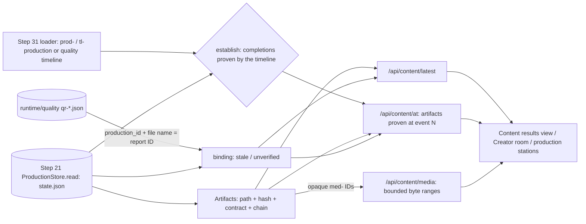

- `vicekrack/hq/content.py` builds `hq_content` 1.0 documents
  (`schemas/hq-content.schema.json`), validated before they are sent:
  - `at_position`: stages folded from events `1..N` and only the proven artifacts;
  - `latest`: the saved state, recorded attempts (matched by run and correlation ID), all
    artifacts and every matching quality report.
- **Reads only.** `ProductionStore.read` (no lock: `inspect_production` would create a lock
  file), artifact files, the verification record (with the production's own policy hash),
  quality reports and event timelines. Nothing is written, locked, drafted, rendered,
  probed or checked.
- **`Artifacts`** re-implements the resume-time checks of Step 21 without raising:
  - `safe_file` refuses absolute paths, `..`, backslashes and any symbolic link on the
    way;
  - files are size-bounded, then checked by SHA-256 against the state and by contract
    validator;
  - the chain is checked by IDs, embedded copies and hashes.
  The first failure marks later artifacts `unavailable`.
- **`establish`** decides at which event each saved artifact is proven to exist:
  - reconstructed productions use their own trace;
  - recorded attempts compare saved finish times with the attempt's window;
  - quality timelines compare finish times with the check's start.
  Any doubt makes historical viewing unavailable.
- **Quality binding:** the Step 22 contract has no artifact hashes, so a report is `stale`
  (it predates the artifacts or saw another status) or `unverified`, never current.
  Step 36 replaced this for new 1.1 reports with a hash binding (see below).
- **Demo:** `hq/content_demo.py` loads a committed fixture (`content_demo.json`: a brief,
  mock script and plan made once offline) and re-validates it on load. The demo house's
  quality event now names its synthetic report.
- **API:** two JSON routes and a media route, exact-match with strict query allowlists and
  fixed error codes. Media uses opaque IDs, one read per request (the bytes that are
  hashed are the bytes served), and single bounded ranges. The CSP adds
  `media-src 'self'`. The server ignores a cancelled range write.
- **Client:** a Content results view with tables for every section, poster grid and video
  player. It keeps one `<video>` element across replay steps, so stepping doesn't reset
  playback. Text is inserted with `textContent`. Links open only through `window.open`
  with `noopener,noreferrer` after a click.
- **CI:** a `browser` job installs `requirements-browser.txt` (render requirements +
  pinned Playwright) and Chromium, then runs the whole network-blocked suite with
  `RUN_LOCAL_RENDER_TESTS=1` and `RUN_LOCAL_BROWSER_TESTS=1`.

## Step 36: verifiable content artifacts

- **One implementation** in `vicekrack/artifact_binding.py`, used by the renderer, the
  production pipeline, the quality report and the Living HQ:
  - `safe_file` (relative paths only, Windows separators normalised, no `.`/`..`, no
    symbolic link in any component, regular files, size limits);
  - `validate_manifest` / `check_package` for preview manifests 1.0 and 1.1;
  - `Snapshot` (read once, keep bytes for JSON, re-hash afterwards);
  - `verify_binding` (read-only re-check of a saved report).
- **Renderer → manifest 1.1:** poster and video hashes and sizes; the package is checked
  before the atomic rename, so a bad package is never published.
- **Quality report 1.1:** all inputs come from one snapshot taken under the production lock;
  the re-hash after the checks decides `bound` vs `changed_during_inspection`. The
  binding lists artifacts and configuration by role, safe reference and hash.
- **Direction of hashing:** state → artifacts → manifest → video/posters; report →
  everything it read. Nothing points back at a report, so there is no cycle.
- **Compatibility:** schemas accept 1.0 and 1.1 (`oneOf` / `if-then`); a 1.0 report must
  not carry a binding and a 1.1 report must. Legacy data is labelled, never upgraded.
- **Living HQ:** `report_row` calls `verify_binding` on every load (`matching`, `changed`,
  `legacy_unverified`, `unavailable`); posters from a 1.1 manifest are verified on load
  and again when served. The desk never runs a check. The CLI `quality-binding` uses the
  same function.
- **Integrity is not truth:** binding, technical result and evidence freshness are separate
  fields everywhere; none grants permission to publish.

## Step 37: human review decisions

- **Module:** `vicekrack/review.py` (records, gates, history), `vicekrack/review_cli.py`
  (`review-record`, `review-list`, `review-inspect`), schema
  `schemas/content-review.schema.json` (`content_review` 1.0).
- **Inputs to a decision:**
  - one saved Step 36 report (1.1), loaded by ID and hashed as file bytes;
  - `verify_binding` must be `matching`;
  - the binding digest is SHA-256 over the report's canonical `binding` JSON, which the
    reviewer confirms.
  `assess()` derives the conditions (technical result, unavailable checks, draft flag from
  the saved validate stage, evidence freshness at check and now) and the acknowledgments
  that apply.
- **Write path (`ReviewRecorder.record`):**
  1. take the production lock (the same lock as resume and quality checks);
  2. read the history (refused if corrupted) and check `supersedes` equals the latest;
  3. evaluate the gates and build the record, with secrets rejected and the schema
     validated;
  4. re-evaluate everything (report hash, binding, digest, condition statuses, history);
  5. publish `<sequence>-<review_id>.json` with temp file + fsync + exclusive hard link.

  Any difference at step 4 refuses the decision.
- **Read path (`history`):** validates every record and the sequence/supersedes chain, then
  computes per record: `superseded_by`, `applicability`, `artifact_binding_now` and
  `current_preview_approval`. It re-hashes the report and calls `verify_binding`, and
  evidence freshness is evaluated separately. Nothing is cached or written.
- **Living HQ:** `reviews_latest` uses `history`; `reviews_at` shows only records whose
  `recorded_at` is not after the event at the position in a recorded timeline, with
  applicability `not_evaluated_at_position`. The client renders notes with `textContent`
  (`C.noteText` keeps line breaks, removes other control characters and is bounded). No
  route or control writes reviews.
- **Trust model:** local and self-declared. Labels are not identities, and records are not
  signed.

## Step 38: portable preview packages

- **Modules and schemas:**
  - `vicekrack/export.py` (`PreviewExporter`, `render_page`, `verify_package`);
  - `vicekrack/export_cli.py` (`export-preview`, `export-verify`);
  - schemas `content-preview-package` (manifest), `content-review-summary` and
    `content-provenance-summary` (both derived, `derived: true`).
- **Inputs:** the same production lock as resume, quality checks and reviews. Each source
  is read once through `safe_file` (inside its folder, no `..`, no links), and the bound
  rows of the report's `binding` are compared with those bytes. Gates reuse
  `verify_binding` and Step 37 `history`.
- **Payload:** original bytes for the video, posters, script and quality report. Derived
  JSON summaries keep source IDs and hashes. The page is rendered with `html.escape`
  everywhere and inline CSS only; it has a restrictive CSP and no script.
- **Publication:**
  1. write to a staging directory with exclusive creates and fsync;
  2. re-hash the staged files;
  3. re-read the sources and the review history (a test seam `_between_checks` sits here);
  4. rename to a fresh `pkg-<id>`, never over an existing one.
- **Hash direction:** manifest → payload files. Nothing in the payload names the manifest's
  hash, and the manifest does not list itself.
- **Verification:** works on the package alone. It checks the inventory with `os.walk`
  (no links), sizes and hashes, then the schemas. It also cross-checks the references:
  - report ID, hash and binding digest against the manifest;
  - payload files against the report's bound rows;
  - the review summary against the purpose and privacy flags.

  The page is checked with an HTML parser for scripts, handlers, active elements and
  references outside the package.
- **Trust model:** consistency only, no signatures. Snapshots are dated by `exported_at`.
