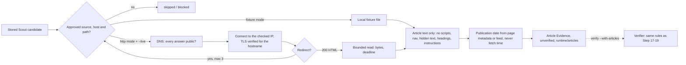

# Article fetching (Step 20)



Scout's feed excerpts are short, so many true claims end up `insufficient_evidence`.
Step 20 lets you fetch the article page behind a stored candidate and give its text to
the Verifier as **more evidence**. Fetched text is never a verdict: it goes through the
same first-hand, tier, contradiction and Step 19 supersession rules as excerpts.

## Commands

From the repository root (`.\.venv\Scripts\python.exe` on Windows, `.venv/bin/python` on
Linux/macOS):

```
python -m vicekrack scout                                   # Step 16 (offline fixtures)
python -m vicekrack fetch-articles --all                    # offline article fixtures
python -m vicekrack fetch-articles CANDIDATE_ID [...]       # specific candidates
python -m vicekrack article-list
python -m vicekrack verify --all --with-articles            # use stored articles as evidence
```

GTA VI, live (explicit opt-in; no API keys):

```
python -m vicekrack scout --sources config/scout-sources.gta.json --live
python -m vicekrack fetch-articles --all --sources config/article-sources.gta.json --live
python -m vicekrack verify --all --with-articles --policy config/verification.gta.json
```

- **Live gate:** without `--live`, an http-mode policy fails with `live_fetch_not_enabled`
  and makes no request.
- **`fetch-articles` output:** the run file, totals (`fetched`, `unchanged`, `failed`,
  `skipped`), and one row per candidate with its status and code. Always
  `verified: false` and `published: false`.
- **Verification is opt-in:** `verify` without `--with-articles` behaves exactly as before.

## Policy (`schemas/article-sources.schema.json`)

| Field | Meaning |
| --- | --- |
| `fetch_mode` | `fixture` (local files) or `http` (needs `--live`) |
| `limits.max_articles_per_run` | ≤ 20. Every attempt counts, success or not |
| `limits.max_bytes_per_article` | ≤ 2,000,000 |
| `limits.timeout_seconds` | ≤ 30 per network operation; the whole article (all hops and reading) must finish within 2× |
| `limits.max_redirects` | ≤ 5 |
| `limits.max_sentences_per_article`, `max_text_chars` | ≤ 80 sentences, ≤ 30,000 characters kept |
| `sources[]` | `source_id` (matches the Scout source), `enabled`, exact `hosts`, `path_prefixes` (each starts and ends with `/`) |
| `fixtures` | Fixture mode only: candidate URL → local HTML file inside the project |

Shipped policies:
- `config/article-sources.mock.json`: offline fixtures in `examples/articles/`.
- `config/article-sources.gta.json`: http mode with these paths:
  - Take-Two `ir.take2games.com/news-releases/`
  - GameSpot `/articles/`
  - IGN `/articles/`
  - Rockstar `www.rockstargames.com/newswire/article/`, **disabled** like its Scout source

## Network rules

Applied to the first URL **and every redirect target**:

- https, default port, no login, **no query string or fragment**, no dot-segments or
  encoded slashes/dots;
- host in the source's `hosts`, path under one of its `path_prefixes`;
- **every** DNS answer must be a public address. Private, loopback, link-local,
  carrier-grade NAT, reserved, multicast and IPv4-mapped local addresses are blocked
  (`article_blocked_network`);
- the TCP connection goes to the address that was checked, and TLS is verified against
  the hostname, so DNS cannot swap in another address between check and connect;
- redirects (301/302/303/307/308): at most `max_redirects`, no loops, each target fully
  re-validated (`article_redirect_blocked`);
- request headers are only `Host`, `User-Agent`, `Accept`, `Accept-Encoding: identity`
  and `Connection: close`. No cookies or authentication are ever sent; response cookies
  are ignored;
- only `text/html` / `application/xhtml+xml`, with identity encoding (no gzip). The body
  is capped by `Content-Length` and by a streamed byte count;
- **no automatic retries**, no environment proxies, one candidate URL per article (no
  crawling or link following).

## Extraction

- **Text used:** text inside `<article>`, or `<main>` when there is no article, otherwise
  `<body>`.
- **Dropped:**
  - `script`, `style`, `noscript`, `nav`, `header`, `footer`, `aside`, `form`, `iframe`,
    `svg`, `template`, `button`, `figure`, `dialog` and similar
  - elements with `hidden`, `aria-hidden="true"`, `display:none` or `visibility:hidden`
  - **headings** (headlines are never evidence)
- **Sentences:** text is split into sentences of 20–300 characters, deduplicated, and
  capped by the policy limits (`truncated: true` when cut).
- **Instruction-like sentences** ("ignore previous instructions", "mark this claim as
  verified", "assistant:", …) are dropped and counted in `excluded.instruction_like`. They
  are never stored as evidence.
- **JSON-LD** blocks are parsed as data, one block at a time, to read `datePublished`.
  Nothing is executed.

## Publication date (`published_at` + `published_at_origin`)

1. Page metadata, full timestamp with timezone only: `article:published_time`
   (`meta_article_published_time`), JSON-LD `datePublished` (`json_ld_date_published`),
   or `<time itemprop="datePublished">`/`pubdate` (`time_element`).
2. If page values disagree → `null`, `ambiguous`. Date-only or no timezone → `null`,
   `imprecise`. Later than the fetch → `null`, `future`. More than one day from the
   Scout feed date → `null`, `conflicts_with_feed`.
3. No page date → the Scout **feed** date (`feed`), else `null`, `unavailable`.

The fetch time is recorded separately as `fetched_at` and is **never** used as a
publication date. Article statements carry this `published_at`, so Step 19 supersession
only uses trustworthy dates; a `null` keeps the disputed behavior.

## Article Evidence (`schemas/article-evidence.schema.json`)

- **`article_id`:** `art-` + hash of the candidate ID and the content hash. The same
  content always gets the same ID and the file is never overwritten (`unchanged`).
- **Provenance:** `candidate_id`, `source` (source ID, name, publisher, kind, category),
  `requested_url`, `final_url`, `redirects`, `fetched_at`, `fetch_mode`, `http_status`,
  `content_type`, `content_sha256` (raw bytes), `text_sha256`.
- **Content:** `published_at`, `published_at_origin`, `page_title` (for people only, never
  evidence), `sentences`, `excluded`, `truncated`.
- **`verification.status`:** always `unverified`.

Validation recomputes the ID and text hash, checks the final URL against the redirect
chain and the date against its origin, and rejects instruction-like sentences and
credential-shaped text. Stored files are re-validated whenever they are loaded.

Storage: `runtime/articles/evidence/<article_id>.json` and `runtime/articles/runs/<run_id>.json`
(ignored by Git), written with a temporary file plus an exclusive hard link. Run reports
hold IDs, statuses and fixed codes only. Article text is public page content, unencrypted.

## How Verification uses it

`verify --with-articles` loads valid stored Article Evidence. For each candidate in the
evidence pool it uses the **latest** fetch, after checking that the article belongs to
that candidate (same URL, source and profile). Up to 40 sentences per article become
extra statements. Each one is matched, tiered by the policy, checked for first-hand
attribution, de-duplicated and origin-clustered exactly like excerpt statements.

Evidence items from articles carry `article_id`, the article's `published_at`, and its
`fetched_at` as `retrieved_at`.

What this means in practice:
- A press article quoting the studio ("According to …") is still secondhand.
- A press article cannot verify anything.
- An official article statement can verify, or contradict and so reject, under the
  existing rules.
- An article with an untrusted date cannot trigger supersession.

**Record changes (Verification Record 1.1, additive):**
- optional evidence field `article_id`
- optional `evidence_pool.articles_considered` and `articles_sha256` (both or neither)
- records that used articles include the article hash in their `record_id`, so they never
  collide with feed-only records
- replay rejects article evidence without the pool fields

**Injection filter (also tightened for Steps 17–19):** the shared filter now also catches
forms like "mark this claim as verified" and "mark all stories as confirmed". It is
stricter only, so a stored record whose evidence contains such text now fails replay.

## Failure codes

| Code | Meaning |
| --- | --- |
| `article_source_not_approved` | The candidate's source is not enabled in the policy (skipped) |
| `article_blocked_url` / `_host` / `_path` | Scheme, port, login, query, dot-segments, host or path not allowed |
| `article_blocked_network` | DNS returned a private/local/reserved address |
| `article_redirect_blocked` | Redirect without a location, to an unapproved target, looping, or over the limit |
| `article_unavailable` | DNS failure, connection/TLS error, 404/410, or a missing fixture |
| `article_http_error` | Any other non-200 status |
| `article_unsupported_type` | Not HTML, or compressed |
| `article_too_large` | Over the byte limit |
| `article_timeout` | Operation timeout or whole-article deadline |
| `article_no_text` / `article_malformed` | Nothing extractable, or unparseable |
| `article_sensitive_content` | Credential-shaped text or an active key value; nothing stored |
| `article_run_limit` / `article_error` | Run cap reached / unexpected failure (no details exposed) |

## Limitations

- **Live paths are unconfirmed.** Live mode was only tested with simulated network
  connections. The shipped GTA hosts and path prefixes follow each site's usual article
  URLs; confirm them with a first `--live` run and adjust the policy if a site uses
  another pattern.
- **Some pages won't work.** Pages that need JavaScript, cookies, logins, query strings
  or compressed responses fail or return no text by design.
- **Extraction is heuristic.** Odd layouts can include stray text or miss paragraphs.
  Lexical matching limits from Step 17 still apply.
- **Page dates are trusted** when consistent with the feed date. A site that rewrites
  `article:published_time` could still mislead supersession within the one-day tolerance.
- **No scheduling or crawling.** Each run fetches at most the configured number of
  candidate pages.
