# Creator stage (Step 15)

```mermaid
flowchart LR
    Brief[Story Brief JSON] --> Check[validate_story_brief]
    Check --> Request[Writer request: topic, angle, tone, avoid, beat budgets, claim text]
    Request --> Drafter{Configured drafter}
    Drafter -->|mock, default| Mock[Deterministic offline fixture]
    Drafter -->|openai / anthropic| Provider[One structured-output request]
    Mock --> Draft[Draft: title, music mood, 4 beats]
    Provider --> Draft
    Draft --> Assemble[Assemble: brief facts + format timing + draft beats]
    Assemble --> Validate[Unchanged Short Script validator]
    Validate --> Save[runtime/scripts/*.json]
    Save --> Plan[Existing plan-short] --> Preview[Existing render-preview]
```



The Creator turns a **Story Brief** into a **Short Script** draft. It is the first stage that
writes content, and it connects the input side of ViceKrack to the existing Step 12–14
scene planner and preview renderer. Before Step 15, every script had to be written by hand.

## Story Brief contract (version 1.0)

- Schema: `schemas/story-brief.schema.json`
- Validator: `vicekrack/story_brief.py` (`validate_story_brief`)
- Examples: `examples/story-brief-gta.json`, `examples/story-brief-cooking.json`

| Field | Purpose |
| --- | --- |
| `contract`, `version` | Always `story_brief` and `1.0` |
| `brief_id` | Stable ID (max 100 characters); the script ID starts with it |
| `parent_task_id` | Optional ID of the task that produced the brief; copied to the script |
| `content_profile` | Subject label, for example `gta` |
| `format` | A Short Script format; currently `vertical_short_15s` |
| `language` | For example `en` or `en-US` |
| `topic`, `angle` | What the video is about and the one-line angle |
| `sources` | Same shape and rules as Short Script sources |
| `claims` | 1–8 claims, same shape and rules as Short Script claims. These are the **only** facts a script may state |
| `constraints.avoid` | Up to 5 things visuals must not include; applied to every beat |
| `constraints.disclosures` | Up to 4 viewer-facing notes; copied to the script |
| `constraints.tone` | Optional style hint, or null |
| `provenance` | Who made the brief (`human` today; Scout/Verification later) |

Rules match the Short Script contract: unique IDs, known source references, a `verified`
claim must cite a source, https URLs without embedded logins, real UTC timestamps, and
credential-shaped values are rejected before any diagnostic. `--require-verified` (the
production gate) rejects unverified claims. Error codes: `invalid_story_brief`,
`unverified_claims`, `sensitive_state`. Messages never repeat brief content.

## What the Creator may and may not decide

| Comes from | Fields |
| --- | --- |
| Brief, copied unchanged | `sources`, `claims` (including status), `angle`, `language`, `content_profile`, `parent_task_id`, disclosures, avoid list |
| Format table | `aspect_ratio`, `duration_seconds`, every beat's start/end seconds |
| Drafter | `title`, `audio.music_mood`, and per beat: narration, on-screen text, cited `claim_ids`, sound cue, visual plan |
| Runtime | `script_id`, provenance, captions (`phrase` mode), voiceover flag, an AI-imagery disclosure when `ai_video_clip` or `generated_image` is planned |

So a drafter **cannot** add a fact, edit a claim, mark a claim verified, change timing, or
drop the brief's avoid list or disclosures. Drafter output must match a closed JSON
schema (`DRAFT_SCHEMA`; unknown fields such as `claims` are rejected), and the assembled
script must pass the unchanged Short Script validator: four beats in order, word budgets
(10/14/17/10), every claim cited, key_info cites a claim, final visual fallback is local,
generative methods have prompts, `sourced_media` cites a brief source. A final check
confirms claims and sources still equal the brief exactly.

`script_id` is `<brief_id>-<12 hex>`, where the hex is a SHA-256 of the brief, draft,
adapter and model, so the same inputs give the same ID. `provenance.created_at` is the
drafting time.

## Drafters

| Config | Drafter | Cost / keys |
| --- | --- | --- |
| `config/creator.json` (default) | `MockScriptDrafter`: deterministic offline fixture | None |
| `config/creator.openai.json` | OpenAI Responses, `gpt-4.1-mini` | `OPENAI_API_KEY`, one paid request |
| `config/creator.anthropic.json` | Anthropic Messages, `claude-sonnet-4-6` | `ANTHROPIC_API_KEY`, one paid request |

The **mock** does not write creatively: hook = topic, context = angle, key_info = the
claims' text (cut to 17 words if longer) citing every claim, payoff = "Follow for more.",
all visuals local. Truncation can cut a sentence short. It exists so the full pipeline runs
without credentials; its scripts are not meant for publishing.

The **real providers** reuse the existing adapters through a new
`generate_structured(instructions, payload, schema, schema_name, model)` method. The
existing `research` method now shares the same private request code, with unchanged
requests, timeouts, zero retries, no tools, `store=false` (OpenAI), scoped clients, and
sanitized error codes. The Creator owns its instructions (`CREATOR_INSTRUCTIONS`) and
schema; adapters only handle the SDK. The request contains topic, angle, tone, avoid list,
beat windows with word budgets, source titles and claim text/status. It contains no
URLs, provenance, credentials or environment values. Brief text is described to the model
as untrusted data. Structured output guarantees JSON shape, not quality or truth.

Each config file has exactly `config_version`, `agent: creator`, `definition` (a file
inside the project) and `execution.adapter/model`. Mock requires a null model; real
providers require a model. Paths outside the project are rejected.

## Commands

Run from the repository root; on Windows use `.\.venv\Scripts\python.exe`, on Linux/macOS
`.venv/bin/python`.

```
python -m vicekrack validate-brief examples/story-brief-gta.json
python -m vicekrack validate-brief examples/story-brief-gta.json --require-verified
python -m vicekrack draft-short examples/story-brief-cooking.json
python -m vicekrack draft-short examples/story-brief-gta.json --config config/creator.anthropic.json
```

The second command deliberately exits 1 with `unverified_claims`. `draft-short` prints the
saved `script_file`, `script_id`, provider, model, claim counts, `production_gate`
(`declared_verified` or `blocked_unverified_claims`), the next command to run, and
`assets_produced: false`, `published: false`. It never prints brief or script text.

Continue with the existing commands:

```
python -m vicekrack plan-short SCRIPT_FILE            # declared-verified briefs
python -m vicekrack plan-short SCRIPT_FILE --draft    # briefs with unverified claims
python -m vicekrack render-preview PLAN_FILE [--allow-draft-preview]
```

Exit codes: 0 success; 1 input, configuration, provider or storage error (printed as
`{"error": {"code": ...}}`); 2 usage error.

## Storage, privacy and limits

Scripts are saved to ignored `runtime/scripts/` using a flushed temporary file and an
exclusive hard link, so a file is never partially written or overwritten. Saved scripts
contain your brief content unencrypted; keep them out of Git. A live run sends the
writer request to the selected provider.

Not included: fetching or checking sources, marking claims verified, choosing between
stories, generating images/video/voice, background work, automatic retries or publishing.
The Creator is a separate explicit command, like the scene planner and renderer; it is not
part of the Researcher → Analyst → Reviewer workflow or saved runs.

## Tests

`tests/test_creator.py` covers brief validation and credential rejection; mock drafting,
immutability, determinism and constraint handling; end-to-end planning of drafted scripts;
rejection of 20+ malformed drafter outputs; sanitized drafter failures; both real SDKs
through in-memory transports (request shape, schema/semantic rejection, error codes, no
retries, missing credentials before client creation); and CLI output, storage and config
validation. No test uses the network or credentials.

## Briefs from the Verification stage (Step 17)

`brief-from-verified` produces Story Briefs whose verified claims each link to a
Verification Record through an optional `verification` block; the brief validator rejects
any status that disagrees with its link. The Creator copies claims and statuses unchanged,
so it cannot upgrade a verification decision. See [Verification](verification.md).
