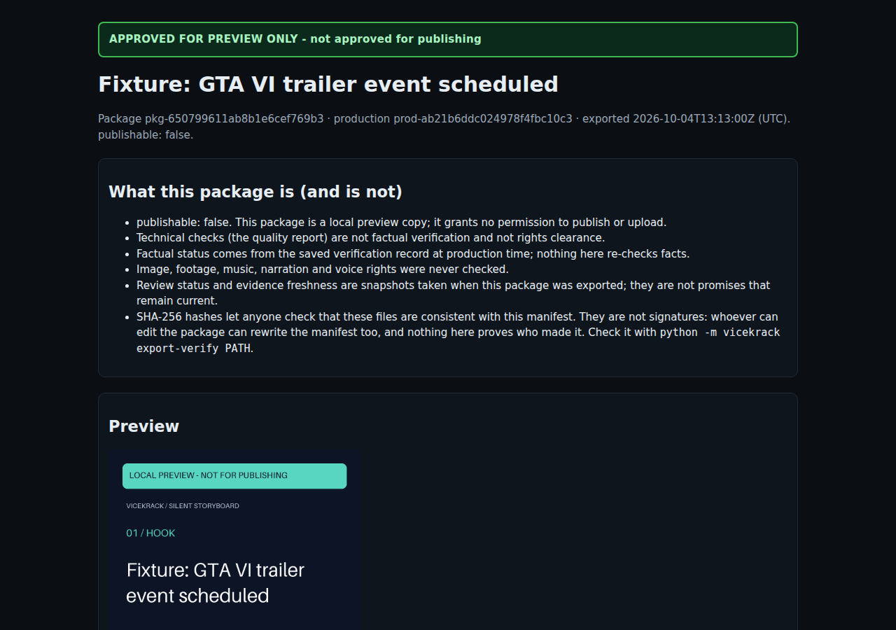
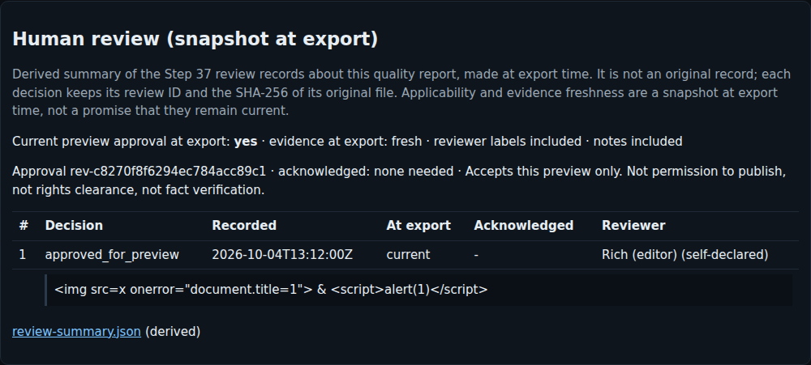

# Portable preview packages (Step 38)

`export-preview` copies one completed production into a self-contained directory you can
open offline, move to another folder or computer, and check with `export-verify`. It
never uploads or publishes anything.

## Commands

From the repository root (`.\.venv\Scripts\python.exe` on Windows, `.venv/bin/python` on
Linux/macOS):

```
python -m vicekrack export-preview PRODUCTION_ID --report REPORT_ID --purpose review_copy
python -m vicekrack export-preview PRODUCTION_ID --report REPORT_ID --purpose approved_preview \
    [--include-reviewer-labels] [--include-review-notes]
python -m vicekrack export-verify runtime/exports/pkg-...      # or any copy of the package
```

- **`export-preview`** writes `runtime/exports/<package_id>/` (ignored by Git) and prints
  its path. Exit code 0 only when a package was created.
- **`export-verify`** is read-only and needs only the package directory. It prints
  `consistent` or `inconsistent` with problem codes. Exit code 0 only for `consistent`.

## Purposes

| Purpose | Requires | Page banner |
|---|---|---|
| `review_copy` | a bound quality report that is `pass` or `needs_review` | **FOR REVIEW - not approved, not for publishing** |
| `approved_preview` | additionally, a **current** Step 37 approval of this exact report and binding digest | **APPROVED FOR PREVIEW ONLY - not approved for publishing** |

A current approval means all of these are true:
- the latest decision is `approved_for_preview`;
- it is not superseded;
- the report and files still match;
- the evidence is fresh, or its staleness was acknowledged.

The approval's acknowledgments and limitations are kept in the package.

Neither purpose grants permission to publish:
- `publishable: false` is in the manifest and on the page;
- draft productions keep the "DRAFT - NOT FOR PRODUCTION" marking;
- technical checks, factual verification and rights clearance are stated as separate
  things.

## Gates

Export is refused (and nothing is written) when any of these hold:
- the production is not completed;
- the report is legacy or unbound (`report_not_bound`), or no longer matches the current
  files (`binding_not_matching`);
- the technical result is `fail`;
- the review history is corrupted;
- a required artifact is missing, changed or reached through a symbolic link;
- the export storage is not a real directory;
- for `approved_preview`, there is no current approval.

## Package contents

| Path | Role | Original or derived |
|---|---|---|
| `package.json` | package manifest (`content_preview_package` 1.0) | — |
| `index.html` | static review page | derived |
| `media/preview.mp4` | the preview as rendered (any narration already mixed in) | original bytes |
| `media/scene-N.png` | scene posters | original bytes |
| `content/script.json` | the script | original bytes |
| `content/provenance.json` | readable brief, claims, sources and verification summary | **derived** (brief and verification record IDs and hashes kept) |
| `quality/quality-report.json` | the Step 36 bound quality report | original bytes |
| `review/review-summary.json` | Step 37 decisions about this report, snapshot at export | **derived** (each decision keeps its review ID and the SHA-256 of its original file) |

The manifest lists every payload file with relative path, role, size, SHA-256 and whether
it is derived. It also records:
- the source report ID and hash, the binding digest and the preview manifest hash;
- the export time, and a snapshot taken at that time of the technical result, review
  status and evidence freshness;
- the restrictions, statements, privacy flags and integrity note.

**No circularity:** the manifest does not list itself, and no payload file contains the
manifest's hash.

**Snapshot, not a promise:** review applicability and evidence freshness are recorded as
they were at `exported_at`. They can change afterwards; the package is not updated.

## The review page

`index.html` is plain HTML with inline CSS. It has:
- no JavaScript;
- no fonts, trackers or remote resources;
- a Content-Security-Policy that blocks everything except the package's own images and
  video.

All text is HTML-escaped. Every link and media reference is a relative path to a file in
the package. Source URLs are shown as text, not links. The page shows the banner, any
draft marking, the export time, the preview player and posters, the script, the
provenance summary, the quality checks and the review snapshot.





## Privacy

Only allowlisted files are exported. Never exported:
- production state and internal configuration;
- credentials and environment data;
- raw exceptions;
- original narration files (narration already mixed into the preview is kept);
- original review records;
- verification, selection and Scout files.

**Reviewer labels and notes are excluded by default.** `--include-reviewer-labels` and
`--include-review-notes` add them to the derived review summary and the page. The manifest
records which were included.

Packages contain your script text, media and, if you include them, review notes. Any of
these may be sensitive. Packages are unencrypted; keep them out of Git and check them
before sharing.

## How export stays consistent

1. Take the production lock, so no resume, quality check or review decision can write
   meanwhile.
2. Read every source file once (state, report, brief, script, plan, preview manifest,
   video, posters, review records). Each file is reached only inside its folder, with
   no `..` and no symbolic links.
3. Check every bound source against the report's binding, and evaluate the gates.
4. Write the payload from those bytes into `runtime/exports/.staging-<id>/` using
   exclusive creates and fsync.
5. Re-read every staged file and compare its size and hash with the manifest.
6. Re-read every source file and the review history. Any difference refuses the export.
7. Rename the staging directory to a new `pkg-<id>` (an existing package is never
   overwritten).

Any failure removes the staging directory. A crash can leave a `.staging-*` directory, which
is never verified or treated as a package and can be deleted.

## Verification

`export-verify` checks:
- the exact file inventory: nothing missing, nothing extra, no links or special files;
- each file's size and SHA-256;
- the schemas of the manifest, the quality report and both derived summaries;
- that the report's ID, hash and binding digest match the manifest;
- that every exported video, poster and script matches the report's binding;
- that the review summary matches the purpose and approval;
- that the privacy flags match the content;
- that the page has no script, event handler, external or active element, and that every
  reference points to a listed file.

**Hashes are consistency checks, not signatures.** Anyone who can edit a package can also
rewrite its manifest consistently, and nothing proves who made it. A consistent result
means the files agree with each other, not that they are authentic or still current.

## Not built

Uploads, publishing, archive (zip) import or extraction, dashboard write controls,
automatic revisions and signatures.
