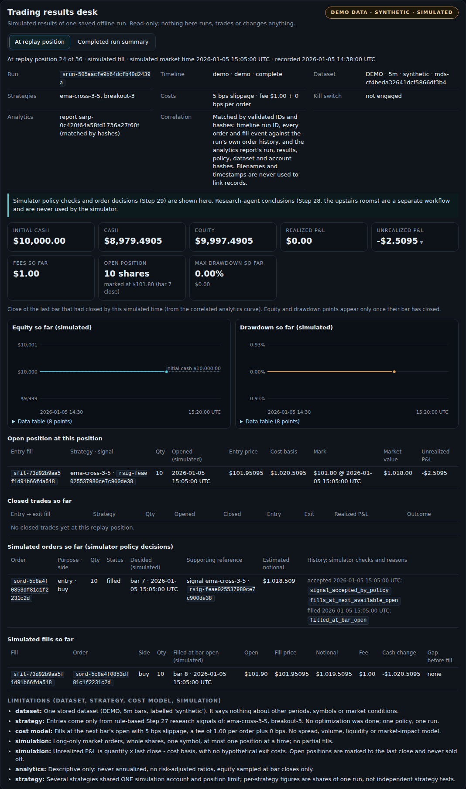
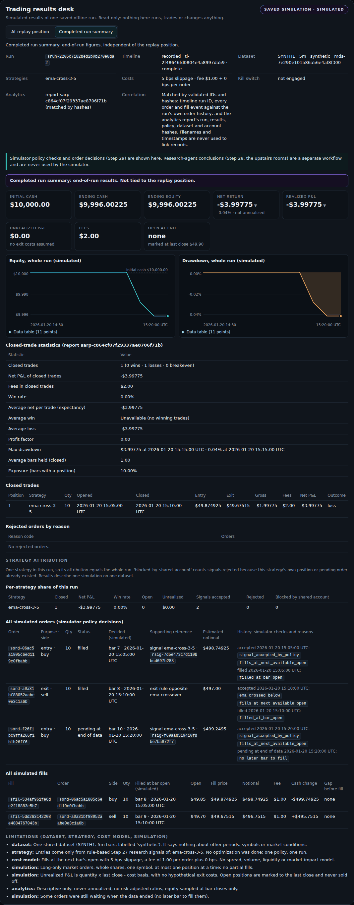
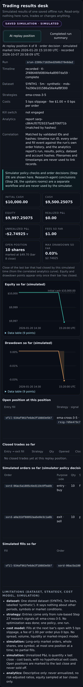
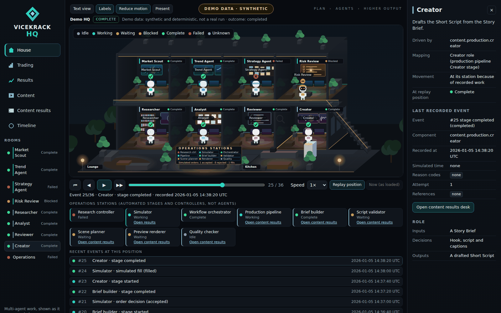
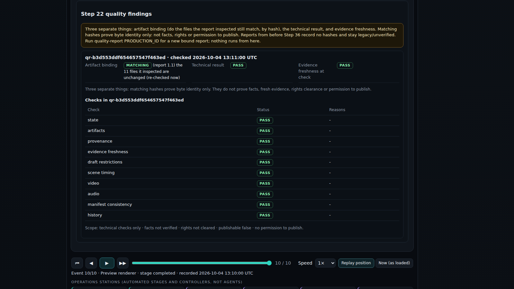
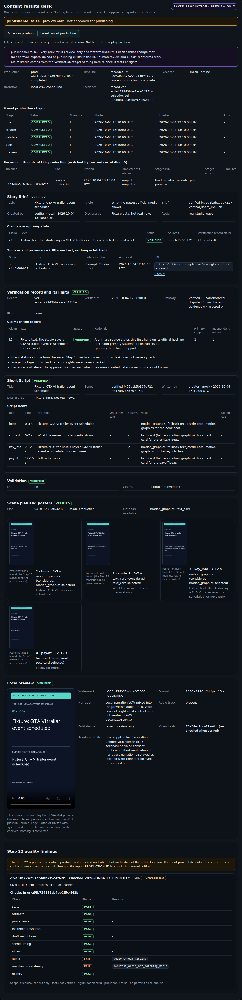
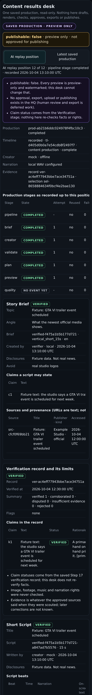
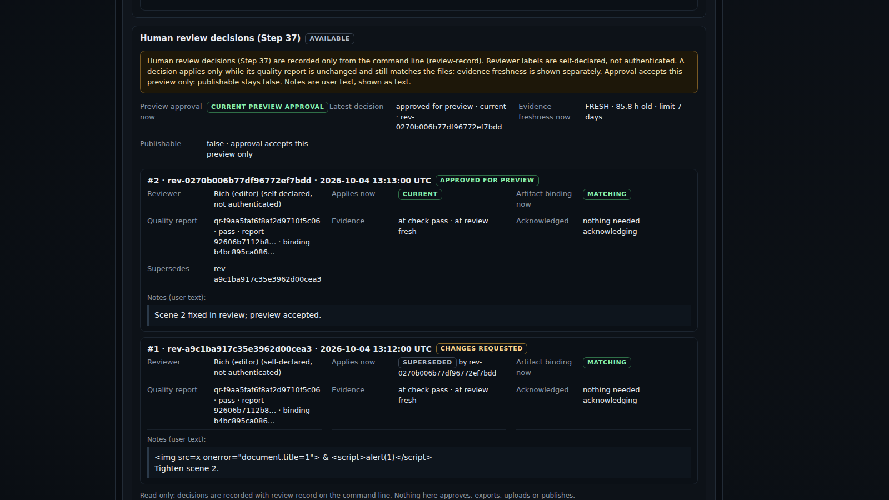

# ViceKrack Living HQ (Steps 32–35)

> **A read-only window, not a control panel.** The Living HQ draws the Step 31 execution
> timelines as a two-floor headquarters with bots.
> - It never runs agents, simulations or productions.
> - It never places orders, publishes or sends messages, and it has no buttons that could.
> - Idle bots wander for decoration only.


## Install and launch

The HQ needs nothing beyond the project's normal install: no extra packages, no
credentials, no internet.

Windows (PowerShell):

```powershell
python -m venv .venv
.\.venv\Scripts\python.exe -m pip install -r requirements.txt
.\.venv\Scripts\python.exe -m vicekrack hq-serve
```

Linux/macOS:

```bash
python3 -m venv .venv
.venv/bin/python -m pip install -r requirements.txt
.venv/bin/python -m vicekrack hq-serve
```

Then open **http://127.0.0.1:8765/** in a browser.
- The server only runs while that command is running. Press **Ctrl+C** to stop it.
- Use `--port 9000` (any port from 1024 to 65535) if 8765 is busy.
- It listens on 127.0.0.1 only, so other computers can't reach it.

## Demo

The page opens on a **deterministic demo**, so the house is explorable straight away.
The demo is clearly labelled **DEMO DATA · SYNTHETIC**. It:
- follows the real workflow orders and passes the same payload checks as real events;
- shows every state: working, waiting, completed, a failed research stage that blocks the
  next one, a failed script validation that is resumed, an interrupted scene plan, and a
  few simulated orders;
- loops, and is never saved.

## Real timelines

Record or save something first, then pick it in the **Timeline** view:

```powershell
.\.venv\Scripts\python.exe -m vicekrack market-import --adapter synthetic --fixture synth1-5m-reclaim
.\.venv\Scripts\python.exe -m vicekrack market-list
.\.venv\Scripts\python.exe -m vicekrack agent-run DATASET_ID --save --record-events
.\.venv\Scripts\python.exe -m vicekrack sim-run DATASET_ID --save --record-events
.\.venv\Scripts\python.exe -m vicekrack run examples/workflow-task.json --registry config/agents.workflow.json --record-events
.\.venv\Scripts\python.exe -m vicekrack produce SELECTION_RUN_ID RECORD_ID --record-events
.\.venv\Scripts\python.exe -m vicekrack quality-report PRODUCTION_ID --record-events
.\.venv\Scripts\python.exe -m vicekrack hq-serve
```

The content commands (Step 33) also accept `--record-events` on `resume RUN_ID` and
`production-resume PRODUCTION_ID`. The one-shot `python -m vicekrack TASK.json --registry
config/agents.workflow.json --record-events` prints `{"task": ..., "events": ...}`.

The Timeline view lists four kinds of entry:
- the demo;
- **recorded** timelines (`tl-…`), captured while a command ran with `--record-events`;
- **reconstructable** saved records: research-agent runs (`rar-…`), simulation runs
  (`srun-…`), content productions (`prod-…`, from `produce`) and saved Step 5 workflow runs
  (`wfr-…`, from `run`);
- an open recorded timeline, which appears as **LIVE OBSERVED** while its command is
  still running.

| Badge | Meaning |
|---|---|
| DEMO DATA · SYNTHETIC | the built-in demo; not a real run |
| RECORDED REPLAY | events captured while a command ran; nothing is running now |
| RECONSTRUCTED HISTORY | rebuilt from a saved record; no times invented (trading runs have simulated times only) |
| LIVE OBSERVED | the recording process still holds its lock right now; the page refreshes every 2 s while it is open and visible (at most 900 times) |

**Completeness** is shown next to the badge: complete, partial, open or interrupted,
following Step 31's rules. Issues such as `missing_events` are listed.

**Attempts (Step 33).** Each start or resume of a run is its own recorded timeline.
- All timelines of one run share a correlation ID, shown as "run xxxxxxxx".
- Timelines of the same command on the same run are numbered "attempt k of n". A quality
  check is not counted as an attempt of its production.
- In a resumed attempt, roles and stages finished earlier appear as **stage reused**
  ("finished in an earlier attempt (not run again)"). They are never drawn as running
  again.
- A retried stage shows its attempt number and reason.

Use the **All / Trading / Content** filter to pick timelines from either department. The
Trading and Content views also list that department's timelines in the inspector.

## The house

| Floor | Rooms | Driven by |
|---|---|---|
| Upstairs (teal) | Market Scout, Trend Agent, Strategy Agent, Risk Review | the four Step 28 research stages (`trading.research.*`) |
| Downstairs (violet) | Researcher, Analyst, Reviewer | the actual Step 5 workflow roles (`content.workflow.researcher/analyst/reviewer`) |
| Downstairs (violet) | Creator | the production pipeline's Creator stage, i.e. the Creator role (`content.production.creator`) |
| Shared | Operations lobby | labelled **operations stations** (below), with simulated order and fill counters |
| Shared | Lounge, kitchen, corridors, stairs | decoration only |

**Operations stations** are automated stages and workflow controllers, not agents:

| Station | Component |
|---|---|
| Research controller | `trading.research.controller` |
| Simulator | `trading.simulation.engine` (select it to open the [trading results desk](#trading-results-desk-step-34)) |
| Workflow orchestrator | `content.workflow.orchestrator` |
| Production pipeline | `content.production.pipeline` |
| Brief builder | `content.production.brief` |
| Script validator | `content.production.validate` |
| Scene planner | `content.production.plan` |
| Preview renderer | `content.production.preview` |
| Quality checker | `content.production.quality` |

**Attribution.** Until Step 32, the brief, plan and validate stages were drawn in the
Researcher, Analyst and Reviewer rooms. They are automated stages, not those roles, so Step
33 shows them only as stations.
- An older saved production therefore lights only the Creator room and its stations. Its
  events keep their honest stage labels, such as "Scene planner · stage completed".
- A room or station without events in the selected timeline shows **No recorded
  activity**.
- The station strip under the replay bar lists every station's status in text. The
  inspector for Operations shows each station's last event.

## States and what bots do

| State | Indicator | Bot goes to |
|---|---|---|
| Idle | grey dash | wanders (decoration) |
| Working | cyan pulsing ring | its station, facing the screens |
| Waiting | amber hourglass | a seat in its room |
| Blocked | orange bar | its room's door |
| Complete | green check | stays at its station briefly, then wanders |
| Failed | red ✕ | its station |
| Unknown | grey ? with a dashed ring | stays where it is, dimmed |

Every state also has a text label: in the room sign, the sidebar, the inspector, the
Text view and the legend.

**Movement is not evidence.** A bot walking to the kitchen or sitting in the lounge is
decorative idle roaming, and the inspector's **Movement** row says so ("Decorative idle
roaming: not evidence that this agent is running"). Only the status label, which comes
from recorded events, says whether work happened. Idle bots claim separate spots (one bot
per sofa, stool or counter place, plus their own seat and nook), so they don't pile up.

**"Waiting"** is derived only inside the fixed workflow orders. It is an idle stage while
its workflow is actively working: the research controller is working, or an earlier stage
has started while a stage is working.

**Status first, animation second.** A room's status changes the moment the replay reaches
an event. Walking is cosmetic and can never delay or override a status.

**Handoffs:** a glowing document travels between rooms only when the recorded order
supports it:
- stage B starts right after the previous stage A was recorded complete;
- the controller hands to the first research stage;
- the last stage hands back to Operations.

## Controls

- **Views:**
  - **House**: the whole building;
  - **Trading**: upstairs;
  - **Content**: downstairs and terrace;
  - **Results** (Step 34): the [trading results desk](#trading-results-desk-step-34);
  - **Content results** (Step 35): the [content results desk](#content-results-desk-step-35);
  - **Timeline**: the timeline picker and a full event table with "Go" buttons.
- **Replay:**
  - play, pause, previous and next event, restart, scrub;
  - speed 0.5× to 8×;
  - **Replay position** shows the historical state at the scrubber; **Now (as loaded)**
    shows Step 31's current display.
- **Inspector:** select a bot, a room or a sidebar entry to see:
  - its role and mapping;
  - its status at the replay position and now;
  - its last recorded event: recorded and simulated times, reason codes, details, and ID
    references (marked "(demo)" in the demo).
- **Text view (V):** a table of every room's status, the readable alternative to the
  drawing. The "Recent events" feed under the replay bar is always visible.
- **Presentation mode (P):** hides the navigation for screen recording. The data badge and
  completeness chip stay visible. Keys 1–8 focus a room, 0 shows the whole house, L
  toggles labels, Esc exits.
- **Keyboard:** Space plays or pauses, ←/→ step, Home restarts, End jumps to the last
  event, R opens or closes the trading results desk, C the content results desk. All controls are buttons, so they are
  reachable with Tab.
- **Reduce motion (M):** bots stop wandering and go straight to their places. Pulses and
  camera moves are off. The system's reduced-motion setting is followed automatically.

## Local data boundary

`vicekrack/hq/api.py` turns each request into a response with one pure function.
`vicekrack/hq/server.py` only binds it to `127.0.0.1`.

| Route (GET only) | Returns |
|---|---|
| `/` and `/static/{styles.css, hq-core.js, app.js}` | the bundled page; an exact allowlist, so no path is ever joined with user input |
| `/api/status` | `{"read_only": true}` |
| `/api/timelines` | demo + recorded + reconstructable timelines (at most 200) |
| `/api/scene?timeline=ID` | one `hq_scene` 1.1 document; `ID` must be `demo`, `tl-`/`rar-`/`srun-`/`prod-` + 24 hex or `wfr-` + 32 hex |
| `/api/results?timeline=ID` | Step 34 results index for a simulation timeline (no results) |
| `/api/results/at?timeline=ID&position=N` | the portfolio after the first N events (`N` is 0 to the event count) |
| `/api/results/summary?timeline=ID` | the completed run summary |
| `/api/content/at?timeline=ID&position=N` | Step 35: what a content timeline proves existed after N events |
| `/api/content/latest?timeline=ID` | Step 35: the latest saved production, every artifact re-verified |
| `/api/content/media?production=PROD&id=MED` | Step 35: one validated preview video or poster; single `bytes=` ranges of at most 4 MiB |

**Request rules:**
- Every other method returns 405.
- The `Host` header must be this loopback server, and any `Origin` must be its own page;
  cross-site fetches are refused (403). This blocks other websites and DNS-rebinding
  pages.
- Traversal, encoded paths and unknown routes get a 404.

**Responses:**
- Every response carries a strict Content-Security-Policy (scripts, styles and data only
  from the server itself; no inline script; no frames), `nosniff`, `no-referrer`,
  `no-store` and no CORS headers.
- Errors carry fixed codes and generic messages: never exception text, paths or
  environment values.
- Malformed requests get a fixed JSON body with no reflected input.

**Data:**
- Data comes only through the Step 31 loaders, which re-validate saved runs and timelines
  and apply the liveness and partial rules. It is then shaped into the `hq_scene` contract
  (`schemas/hq-scene.schema.json`).
- The browser only ever sees controlled codes, IDs, counts and times. All text is
  inserted as plain text (`textContent`), never as HTML.
- The page loads no external fonts, CDNs or trackers.

**Scene frames** (`vicekrack/hq/scene.py`) hold, for each event in recorded order:
- the component and room states, using Step 31's own transition rules (frames stop at an
  invalid transition and report it);
- the derived "waiting" state;
- any supported handoff.

`current` is Step 31's honest display of the timeline as loaded.

## Trading results desk (Step 34)

> **SIMULATED and read-only.** The desk displays saved Step 29 simulation runs and Step 30
> analytics reports. Opening it never runs a simulation, generates analytics, changes an
> account or kill switch, or calls a provider. There are no trading controls.



**Opening it:** select the **Simulator** operations station (in the station strip, the
operations board or the Operations inspector), the **Results** view, the "Open trading
results desk" button in the Trading inspector, or press **R**. It shows the timeline you
selected:
- a reconstructed simulation run (`srun-…`), or a recorded `sim-run --record-events`
  timeline (`tl-…`) whose run was saved with `--save`;
- the demo, whose simulator events match a small synthetic run labelled
  **DEMO DATA · SYNTHETIC · SIMULATED**. Saved runs are labelled **SAVED SIMULATION ·
  SIMULATED**.

Other timelines (research agents, content) say they are not simulations and list the
simulation timelines you can pick.

```powershell
.\.venv\Scripts\python.exe -m vicekrack market-import --adapter synthetic --fixture synth1-5m-reclaim
.\.venv\Scripts\python.exe -m vicekrack sim-run DATASET_ID --save --record-events
.\.venv\Scripts\python.exe -m vicekrack analytics-generate RUN_ID --save
.\.venv\Scripts\python.exe -m vicekrack hq-serve
```

### At replay position

The portfolio after the events up to the replay scrubber:
- initial cash, cash, equity, realized and unrealized P&L, fees so far, the open position
  and the largest drawdown so far;
- orders decided so far, with every history entry seen so far and its reason codes
  (the simulator's own policy checks), the supporting research signal or exit rule, and
  the estimated notional;
- fills so far (bar, open price, fill price, notional, fee, cash change, gaps);
- closed trades so far, and equity and drawdown charts drawn only up to the last bar
  that had closed (the time axis spans the whole replay window, so the line grows).

The header line separates **simulated market time** (the event's simulated time) from
**recorded at** (when the event was written; "not recorded" for reconstructed timelines).

**No future data.** The server folds only the first N events and sends nothing later. An
order is "pending" until its fill event, without its fill ID; equity points appear only
once their bar has closed; final P&L and end-of-run statistics are not in this view.
Marks use the close of the last bar that had closed by that simulated time.

**Unavailable rather than invented.** The portfolio is shown only if the timeline is
complete with no issues, contains every order history entry exactly once, has simulated
times that never go backwards, and folds to the saved run's ending cash, fees and
realized P&L. Otherwise the view says it is unavailable and why. Without a matching
analytics report, equity and unrealized P&L of an open position and the charts are
unavailable (the bar closes come from the report), while cash, fees, orders and fills are
still shown.

### Completed run summary

A separate tab, labelled "end-of-run results, not tied to the replay position":
- final cash, equity, net return (not annualized), realized and unrealized P&L, fees and
  the position still open at the end;
- whole-run equity and drawdown charts;
- closed-trade statistics. A metric Step 30 marks `unavailable` is shown as
  "Unavailable (no closed trades)" and so on, never as zero;
- rejections by reason code, strategy attribution with the shared-account explanation,
  every order and fill.



### How records are linked

Only by validated IDs and hashes, never by filenames or timestamps:
- **Timeline ↔ run:** the timeline names the run; every order decision and fill event must
  equal what the run's own order history implies (simulated time, reason codes, IDs,
  details), in order. Otherwise `timeline_run_mismatch`, and nothing is combined.
- **Run ↔ analytics report:** the report's run ID, run results hash, policy hash, dataset ID,
  bars hash and simulation account ID must equal the run's, and its account figures must
  equal the run summary. Reports that claim the run but fail are listed with
  `analytics_report_mismatch`, `analytics_report_inconsistent` or `report_corrupt`. If two
  valid reports match, the one made with the current analytics config is used; otherwise
  the result is `analytics_report_ambiguous`.
- A tampered run gives `sim_run_corrupt`; a recorded timeline whose run was never saved
  gives `sim_run_not_found`.

**Separation.** The desk shows the simulator's policy checks and order decisions. The
research agents upstairs (Step 28) are a separate workflow; their conclusions are never
used by the simulator, and the desk says so.

**Presentation mode (P)** keeps the desk full-screen under the data badge, with larger
figures, for recording an explanation; ←/→ still step the replay.



## Content results desk (Step 35)

> **Preview only and read-only.** `publishable: false` is shown on every view. The desk
> displays saved Step 21 productions and Step 22 quality reports. Opening it never runs
> agents, drafts scripts, renders media, runs quality checks, contacts providers, publishes
> or changes production files. There is no export or upload, and review decisions (Step 37) are
> recorded only from the command line.



**Opening it:** select the **Creator** room ("Open content results desk"), any production
station (pipeline, brief builder, script validator, scene planner, preview renderer,
quality checker) in the station strip or on the operations board, the Content inspector's
button, the **Content results** view, or press **C**. It works for:
- a reconstructed production (`prod-…`);
- a recorded `produce` / `production-resume` attempt or `quality-report` check (`tl-…`)
  that names the production;
- the demo, a synthetic production that matches the demo house's events, labelled
  **DEMO DATA · SYNTHETIC · PREVIEW ONLY**. It has no media files, and says so.

What it shows:
- **stages:** status, attempt numbers, failures with reason codes, and stages reused from
  an earlier attempt; in the latest view, also every recorded attempt of the production;
- **Story Brief:** topic, angle, the only claims a script may state, sources with
  publisher, kind and access time, and provenance;
- **verification record:** claim statuses, rationale, flags and the limits of
  verification;
- **script beats:** timing, narration, on-screen text, claims, visual method and sound cue;
- **scene plan:** methods and the four scene posters;
- **local preview:** a video player with its watermark, format and optional narration (the
  narration WAV is mixed into the MP4's audio track);
- **Step 22 quality findings:** every check with pass, needs_review, fail or unavailable.

**Text and links.** All script and source text is inserted as text, never as HTML. Source
URLs are shown as text. A link is clickable only when both the server and the page find a
plain `http(s)` URL with a host and no credentials; it opens in a new tab without opener or
referrer, and only when you click it. Nothing is fetched or prefetched.

### At replay position vs latest saved production

**At replay position** shows only what the timeline **proves** existed after that event:
- in a reconstructed production, an artifact appears at its stage's single
  `stage_completed` in the production's own trace;
- in a recorded attempt, at its `stage_completed` (only if the saved finish time falls
  inside that attempt) or `stage_reused` (only if it finished before the attempt started);
- in a quality timeline, artifacts finished before the check started are shown, and the
  report only after the event that saved it.

A failed attempt never shows the preview a later attempt made. If the timeline is
truncated, has issues, predates the production, or its times disagree with the saved
state, **historical viewing is unavailable** and the reasons are listed.

**Latest saved production** re-verifies everything now:
- every artifact must stay inside its production folder with no symbolic link on the
  way;
- it must match the SHA-256 saved in the state and pass its contract validator;
- it must fit the chain brief → script → validation → plan → manifest → video.

A failing artifact is shown as `missing`, `tampered` or `mismatched`, its content is not
shown, and later artifacts are `unavailable`. Scene posters are listed in the hash-checked
manifest, but the Step 13 manifest stores no poster hashes, so they are labelled **not
hash-bound**.

### Quality reports: binding, result and freshness (Step 36)

Each report shows three separate labels:
- **Artifact binding**, re-checked by hash every time the desk loads:
  - **matching**: every file and configuration file the report inspected still has the
    same SHA-256;
  - **changed**: at least one differs or is gone (the roles are listed);
  - **legacy/unverified**: a report saved before Step 36 records no hashes, so it is never
    shown as current (the Step 35 `stale` reasons are still listed);
  - **unavailable**: the report was not bound (the production was incomplete, or files
    changed while it was being checked), or this is demo data.
- **Technical result:** pass, needs_review, fail or unavailable, as saved.
- **Evidence freshness:** the `evidence_freshness` status at check time, and in the
  verification section the record's age now against its policy limit.

Matching hashes prove byte identity only, not facts, fresh evidence, rights or permission
to publish. Posters from a 1.1 manifest are shown as hash-verified and re-checked when
served; posters from a 1.0 manifest stay `not hash-bound`.

Reports are matched by their own `production_id`, and the file name must equal the report
ID. Edited, renamed or invalid reports are listed as rejected. No check runs
automatically: run `quality-report PRODUCTION_ID` to check the current artifacts, and
`quality-binding REPORT_ID` to re-check one report from the command line.





### Media

`/api/content/media` serves only files the desk has just validated for that production:
the hash-checked video, and PNG posters listed in its manifest.
- Files are addressed by opaque `med-` IDs derived from the production, path and hash.
  There is no path parameter.
- Correct content types are sent (`video/mp4`, `image/png`).
- Single `bytes=` ranges are served (206), up to 4 MiB per response. Invalid or multiple
  ranges get 416. Files over 8 MiB are served only in ranges.
- The video's bytes are hashed again on every request, so a changed file is not served.
- The usual loopback, Host, Origin, GET-only and CSP rules apply (`media-src 'self'`).

The previews are H.264 MP4. They play in Chrome, Edge, Safari and Firefox with system
codecs. Open-source Chromium builds (like the one in the automated tests) cannot decode
them; the desk then shows the first scene poster and says so.

**Presentation mode (P)** keeps the desk full-screen under the data badge. The
**publishable: false** banner stays visible.



### Human review decisions (Step 37)

The Content Results Desk shows the saved review history read-only:
- whether there is a current preview approval, and evidence freshness now;
- each decision with:
  - its self-declared reviewer label;
  - whether it applies now (`current`, `superseded`, `invalidated`, `unavailable`) and the
    artifact binding now;
  - the quality report and binding digest it names;
  - acknowledgments, supersession and notes, shown as text.

In replay, only decisions that a recorded timeline proves were saved by that position are
shown, without re-evaluating them. Otherwise historical review status is unavailable.
Decisions are recorded only with `review-record` (see [Human review](review.md)).



## Limitations

- **Mapping:** the paper journal and other commands still emit no events, so they don't
  appear. Old Step 5 runs saved without a workflow state show roles without times
  (`none_saved`).
- **Live observation:** it needs the HQ server and the recording command on the same
  computer, because liveness is Step 31's lock file. Content productions are never shown
  as live.
- **Refresh:** the page polls every 2 s rather than streaming, and stops after 900
  refreshes.
- **The drawing:** it's a lightweight SVG illustration, not a game engine. Walking bots
  can cross paths (occupancy only applies to resting spots). The phone-width house is
  small; the station strip, Text view and event feed are the readable alternative there.
- **Attempt order:** attempts that start within the same second are ordered by when their
  timelines were created on disk.
- **Times:** reconstructed trading timelines have simulated times only, as Step 31 records
  them.
- **Results desk:** one run at a time; no comparison across runs. Equity marks come from
  the correlated analytics report, so without one they are unavailable. Tables show at
  most the last 200 rows (with a note). Charts are simple inline SVG lines, sampled at bar
  closes; intrabar moves are not shown.
- **Content desk:** one production at a time. Quality reports can only be unverified or
  stale until the Step 22 contract records artifact hashes. Posters are not hash-bound.
  Historical viewing needs a timeline that proves each completion: a reconstructed
  production, or a recorded attempt whose times match the saved state. The desk shows no
  narration WAV separately, only the audio inside the preview.
- **Still to come:** trading controls, publishing, AI calls and multi-user access are not
  part of the HQ.
