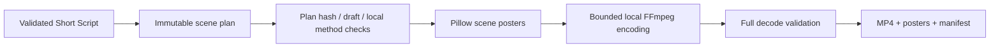

# Local preview renderer (Step 13)

The renderer is a separate CLI module; the agent manager, workflow state machine and OpenAI/Anthropic adapters remain unchanged. It consumes Step 12 plans without modifying them. Only text_card and motion_graphics are supported. The latter adds fades to text cards, not externally generated animation. Fixed beat boundaries remain 0-3, 3-7, 7-12 and 12-15 seconds.

Dependencies are optional and lazy-loaded from requirements-render.txt. Each FFmpeg subprocess uses an argument list, no shell, a 90-second timeout, suppressed diagnostics and an allowlisted environment that excludes provider keys. Four bounded scene encodes, one concat and one decode run sequentially. There are no automatic retries or provider calls.

A unique exclusive reservation prevents cooperating writers from reusing an output name. Work is staged in a temporary directory under runtime/previews. Video and manifest are flushed before the completed directory is renamed into place on the same filesystem. Ordinary failures clean up staging and release the reservation; crashes may leave hidden .render-* directories or .lock files. These are never resumed or consumed automatically. After confirming no renderer is running, users may remove those abandoned artifacts. This reduces partial-publication risk, but is not a guarantee against power loss or filesystem failure.

The manifest records plan/source identity, video hash, scene timing, selected methods and explicit limitations. It never marks output publishable. Draft source blocks are retained, and draft rendering requires explicit consent. No command verifies facts, copyright or source claims. Poster/video content may contain sensitive user text; storage is ignored by Git and unencrypted. No environment snapshots or raw encoder exceptions are recorded.

The layout displays narration text, not synchronized subtitles. There is no audio, voice, word highlighting, lip sync, external asset sourcing, publishing or background execution. Font support is intentionally limited to English printable ASCII with common smart-punctuation normalization; overflow and unsupported characters fail before publication.

Core tests mock encoding, while optional integration tests encode/decode a real MP4 and verify 360 frames, 15 seconds, 1080x1920 dimensions, 24 fps and all four posters. Dedicated Windows/Linux CI jobs install rendering extras and enable that integration test.
