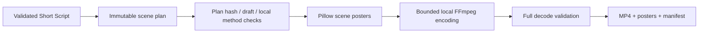
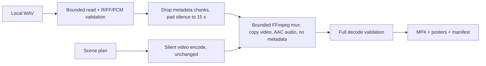

# Local preview renderer (Step 13)



The renderer is a separate CLI module; the agent manager, workflow state machine and OpenAI/Anthropic adapters remain unchanged. It consumes Step 12 plans without modifying them. Only text_card and motion_graphics are supported. The latter adds fades to text cards, not externally generated animation. Fixed beat boundaries remain 0-3, 3-7, 7-12 and 12-15 seconds.

Dependencies are optional and lazy-loaded from requirements-render.txt. Each FFmpeg subprocess uses an argument list, no shell, a 90-second timeout, suppressed diagnostics and an allowlisted environment that excludes provider keys. Four bounded scene encodes, one concat and one decode run sequentially. There are no automatic retries or provider calls.

A unique exclusive reservation prevents cooperating writers from reusing an output name. Work is staged in a temporary directory under runtime/previews. Video and manifest are flushed before the completed directory is renamed into place on the same filesystem. Ordinary failures clean up staging and release the reservation; crashes may leave hidden .render-* directories or .lock files. These are never resumed or consumed automatically. After confirming no renderer is running, users may remove those abandoned artifacts. This reduces partial-publication risk, but is not a guarantee against power loss or filesystem failure.

The manifest records plan/source identity, video hash, scene timing, selected methods and explicit limitations. It never marks output publishable. Draft source blocks are retained, and draft rendering requires explicit consent. No command verifies facts, copyright or source claims. Poster/video content may contain sensitive user text; storage is ignored by Git and unencrypted. No environment snapshots or raw encoder exceptions are recorded.

The layout displays narration text, not synchronized subtitles. There is no audio, voice, word highlighting, lip sync, external asset sourcing, publishing or background execution. Font support is intentionally limited to English printable ASCII with common smart-punctuation normalization; overflow and unsupported characters fail before publication.

Core tests mock encoding, while optional integration tests encode/decode a real MP4 and verify 360 frames, 15 seconds, 1080x1920 dimensions, 24 fps and all four posters. Dedicated Windows/Linux CI jobs install rendering extras and enable that integration test.

## Step 14: optional local narration



Commands:

```
python -m vicekrack render-preview PLAN_FILE
python -m vicekrack render-preview PLAN_FILE --narration recording.wav
```

Silent rendering remains the default and runs the unchanged Step 13 pipeline: same six encoder calls, same manifest fields and `audio_present: false`. The command's JSON output gains one field, `audio_present`. Narration is validated by `vicekrack/narration.py` before dependencies load, folders are created or any encoder starts, so a bad file leaves nothing behind.

Validation rules: the file must be a regular local file of 1 byte to 12 MB (checked on the open handle before parsing, and the read itself is capped). A small RIFF reader requires exactly one `fmt ` and one `data` chunk, PCM (or WAVE_FORMAT_EXTENSIBLE with the PCM subformat), 16-bit samples, 1 or 2 channels, 8000–48000 Hz, consistent block-align/byte-rate fields, whole sample frames and at least one frame. Duration is computed from the sample count; more than 15 seconds is rejected (`narration_too_long`) rather than truncated. Error codes: `narration_not_found`, `narration_unreadable`, `narration_empty`, `narration_too_large`, `narration_unsupported_format`, `narration_corrupt`, `narration_too_long`. Messages are fixed text without paths, bytes or parser exceptions.

Normalization keeps only the sample data, pads it with digital silence to exactly 15 seconds and writes a canonical 44-byte-header WAV, so LIST/INFO, bext, iXML, ID3, cue and other chunks never reach FFmpeg. The hash in the manifest is of this normalized WAV, so identical audio gives the same hash regardless of input metadata.

Muxing is one extra call through the existing `invoke()` wrapper (argument list, no shell, 90-second timeout, suppressed diagnostics, provider keys excluded from the environment). It maps only the concatenated video and the normalized audio, copies the video stream, encodes AAC at 48 kHz, and passes `-map_metadata -1 -map_chapters -1`. No `-shortest`, `-t` or audio filters are used. The existing full decode check then covers both streams. The staged `silent.mp4` and `narration.wav` are deleted before publication; on any failure the whole staging directory is removed and nothing is published. AAC encoder padding can make the decoded audio a few milliseconds longer than 15 seconds; no samples are removed.

Posters keep the same watermark band; only the subtitle changes from "SILENT STORYBOARD" to "LOCAL NARRATION STORYBOARD". The manifest stays `preview_only: true` and `publishable: false`, and adds `audio` metadata plus limitations noting that narration is user-supplied and its rights, consent and content are not verified. There is still no voice generation, captions synced to speech, word timing, lip sync, music, provider call or publishing.
