# Controlled production pipeline (Step 21)

```mermaid
flowchart LR
    Sel[Selection Report + select entry] --> Pre[Pre-checks: configs, consent, narration, report and evidence freshness, eligibility]
    Pre --> State[(runtime/productions/ID/state.json)]
    State --> B[1 brief: select_brief + history reservation]
    B --> C[2 creator: Step 15, mock by default]
    C --> V[3 validate: Short Script + same claims as brief]
    V --> P[4 plan: Step 12 planner]
    P --> R[5 preview: Step 13/14 renderer, watermark, publishable false]
    R --> H[History entry: reserved -> produced]
```



One explicit command turns **one selected story** into a local, watermarked preview. It
runs a fixed sequence of existing stages, saves its state after every stage, and stops
at the first failure. Nothing is published.

## Commands

From the repository root (`.\.venv\Scripts\python.exe` on Windows, `.venv/bin/python` on
Linux/macOS). Offline example with the fixture data:

```
python -m vicekrack scout
python -m vicekrack verify --all
python -m vicekrack select-stories --all                      # note selection_run_id and a select record_id
python -m vicekrack produce SELECTION_RUN_ID RECORD_ID
python -m vicekrack production-list
python -m vicekrack production-inspect PRODUCTION_ID
python -m vicekrack production-resume PRODUCTION_ID
```

`produce` options:

| Option | Default | Meaning |
| --- | --- | --- |
| `--policy` | `config/verification.mock.json` | Verification policy (use `config/verification.gta.json` for GTA VI) |
| `--profile` | `config/editorial.mock.json` | Editorial profile (use `config/editorial.gta.json`) |
| `--creator-config` | `config/creator.json` (offline mock) | `config/creator.openai.json` / `config/creator.anthropic.json` make **one paid request** |
| `--capabilities` | `config/visual-capabilities.json` | Local visual methods for the planner |
| `--allow-paid` | off | Required when the Creator configuration is paid |
| `--narration WAV` | none | Optional local 16-bit PCM WAV (Step 14 rules); its hash is saved |
| `--allow-draft-preview` | off | Needed only if the script is a draft (unverified claims) |

`production-resume` options:
- `--allow-paid`: needed whenever the next stage is a paid Creator call.
- `--retry-uncertain`: needed when a paid request may already have completed.

**Exit codes.** `produce` and `production-resume` exit 0 only when the production
completes. A stopped production prints its state and exits 1. Errors print
`{"error": {"code": …}}`.

## Stages

| # | Stage | Reuses | Checks and output |
| --- | --- | --- | --- |
| 1 | `brief` | Step 18 `select_brief`, Step 17 builder | Report ≤ 1 day old, same profile/policy hashes, record replay-valid and ≤ `max_record_age_days`, still `select` against current history. Writes the brief and a `reserved` history entry |
| 2 | `creator` | Step 15 `draft_short_script` | Mock by default; paid adapters need consent. Writes the script |
| 3 | `validate` | Step 11 validator | Script valid; claims and sources identical to the brief (the Creator cannot change facts); records whether it is a draft |
| 4 | `plan` | Step 12 planner | Production mode unless the script has unverified claims (then a blocked draft) |
| 5 | `preview` | Steps 13/14 renderer | Watermarked MP4 + posters + manifest inside the production folder; `preview_only: true`, `publishable: false` |

After the preview is saved, the history entry becomes `produced` and the production is
`completed`. Selection only ever passes verified claims, so in practice plans are in
production mode. The draft path and `--allow-draft-preview` are kept for scripts with
unverified claims.

## Saved state

`runtime/productions/<production_id>/state.json` (ignored by Git;
`schemas/production-state.schema.json`). Artifacts live in the same folder.

- **`config`:** profile, selection run, record and candidate IDs. Each configuration file
  is stored as a **relative path plus SHA-256** (policy, editorial profile, Creator,
  capabilities). Also the Creator adapter/model and whether it is paid, the narration path
  and hash, and the draft-preview choice. Credentials are never stored: Creator keys come
  from the environment at call time.
- **`stages[5]`:** status (`pending`, `running`, `completed`, `failed`, `uncertain`),
  attempts (max 3), started/finished timestamps, a fixed error code, and artifact
  paths/hashes/IDs.
- **`trace`:** at most 100 rows of stage, event, timestamp and error code.
- **`result`:** preview and manifest paths, `publishable: false`.

No prompts, script text, environment snapshots or raw exceptions are stored. Unexpected
failures are recorded as `stage_error`. State is written atomically
(temporary file + `os.replace`) and validated on every read.

## Duplicates, concurrency and story history

- **One production per story.** `production_id` is `prod-` + hash(profile, candidate). The
  folder is created exclusively, so a second `produce` for the same story returns
  `production_exists`: inspect or resume the existing one instead.
- **One process at a time.** An OS lock (`runtime/productions/<id>.lock`) prevents two
  processes from running or inspecting the same production (`production_locked`).
- **History reservation.** The brief stage adds a history entry with `state: reserved` and
  this `production_id`.
  - Other productions, and Story Selection, treat it like any made story, so the same
    story cannot be produced twice.
  - This production's own resume ignores its own reservation, so recovery is never
    blocked.
  - The entry changes to `state: produced` only after the preview is saved. A failed
    production is therefore never recorded as a finished video.
  - `selection-history` shows `briefed` for entries made by `brief-from-selection`
    (unchanged Step 18 behavior).
- **Schema change.** The history entries gain optional `state` and `production_id` fields
  (both or neither). Existing history files stay valid.

## Failure, resume and uncertain requests

Any stage failure stops the production (`failed`). `production-resume`:

1. Takes the lock and validates the saved state.
2. Re-hashes every configuration file and the narration file (`configuration_mismatch`,
   `narration_changed`).
3. Re-checks every completed artifact: file hash, schema/semantic validity and the chain
   brief → script → plan → preview (`artifact_tampered`, `artifact_missing`). Artifact
   paths must stay inside the production folder.
4. When the brief already exists: the verification record must still replay and be within
   `max_record_age_days` (`stale_evidence`).
5. Continues at the **first incomplete stage**. Completed stages are never repeated.

**Paid Creator requests.**
- Consent: `--allow-paid` is required on every invocation that may make one.
- Intent checkpoint: the stage is saved as `running` **before** the request.
- Safe failures: known pre-request failures (`missing_credentials`, `missing_model`, …)
  are `failed`, and resume normally (with `--allow-paid`).
- Uncertain failures: any other failure is `uncertain`, and so is a crash that leaves the
  stage `running`, because the request may have completed and been billed. Resume then
  refuses with `uncertain_stage` unless you pass **both** `--retry-uncertain` and
  `--allow-paid`.

**Local stages** that were interrupted are simply rerun; no consent is needed. Each stage
allows 3 attempts (`retry_exhausted`). If only the final history update failed, resume
retries just that step.

### Recovery example

The preview fails because the encoder is missing:

```
python -m vicekrack produce sel-6a03…  ver-5cab…
# → {"status": "failed", "error": {"stage": "preview", "code": "renderer_unavailable"}, ...}
python -m vicekrack production-inspect prod-ab21…    # brief/creator/validate/plan completed
python -m pip install -r requirements-render.txt
python -m vicekrack production-resume prod-ab21…
# → only the preview stage runs; {"status": "completed", "result": {"publishable": false, ...}}
```

A paid Creator request times out:

```
python -m vicekrack produce sel-… ver-… --creator-config config/creator.anthropic.json --allow-paid
# → {"status": "uncertain", "error": {"stage": "creator", "code": "provider_timeout"}}
python -m vicekrack production-resume prod-… --allow-paid
# → {"error": {"code": "uncertain_stage"}}   (no request made)
python -m vicekrack production-resume prod-… --allow-paid --retry-uncertain
# → explicitly authorizes one more paid request, then continues
```

## Not included

Publishing, uploading, scheduling, background agents, new providers, voice generation,
automatic retries, and deletion or cleanup commands. Remove abandoned production folders
manually; their `reserved` history entries expire with the history window (60 days by
default).

## Limitations

- **One production per story.** A failed production whose retries are exhausted cannot be
  restarted; it keeps its reservation until the history window passes.
- **Report freshness is checked once.** It is checked only until the brief exists.
  Evidence freshness is rechecked on every resume, so a resume more than 7 days after
  verification is refused.
- **Uncertainty is conservative.** It cannot tell whether a provider actually billed a
  timed-out request.
- **Local storage only.** Locks and atomic writes protect one local filesystem, not
  multiple machines or network/cloud-synced folders. Preview output is the Step 13/14
  storyboard (text cards, optional user narration), not a finished video.

## Quality report (Step 22)

After a production completes, run `python -m vicekrack quality-report PRODUCTION_ID` to
check its artifacts, provenance, evidence freshness, timing and actual media. The report
never changes the production and never makes it publishable. See [Quality report](quality.md).

To view a saved production in the Living HQ, see the [content results desk](hq.md#content-results-desk-step-35) (Step 35). It is read-only: it
never resumes, renders or checks anything.
