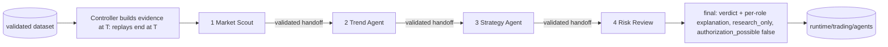

# Research-agent workflow (Step 28)

> **Research only.** Four deterministic local handlers review historical data at a
> simulated time and explain what they found. The output says `research_only: true` and
> `authorization_possible: false`. It is not advice, a prediction, a profitability claim
> or an order authorization. Nothing calls the paper-account risk engine, creates intents,
> reads or changes accounts, contacts a broker or calls an AI provider.

## Commands

```powershell
.\.venv\Scripts\python.exe -m vicekrack market-import --adapter synthetic --fixture synth1-5m-reclaim
.\.venv\Scripts\python.exe -m vicekrack market-list
.\.venv\Scripts\python.exe -m vicekrack agent-run DATASET_ID
.\.venv\Scripts\python.exe -m vicekrack agent-run DATASET_ID --as-of 2026-01-20T15:00:00Z --save
.\.venv\Scripts\python.exe -m vicekrack agent-run DATASET_ID --strategy breakout-3 --strategy ema-cross-3-5
.\.venv\Scripts\python.exe -m vicekrack agent-list
.\.venv\Scripts\python.exe -m vicekrack agent-inspect RUN_ID --role strategy_agent
```

On Linux/macOS use `.venv/bin/python`.
- **`--as-of`** is the simulated time T, in UTC. The default is the dataset's last bar
  close.
- **`--strategy`** overrides the strategy list in `config/research-agents.json` (needed
  for daily data, because VWAP reclaim needs intraday bars).

Expected results:
- `synth1-5m-reclaim` with no `--as-of` gives a verdict of
  `sufficient_for_future_paper_evaluation`: all three research rules trigger on the last
  bar, the trend is up, and RSI is neutral.
- `--as-of 2026-01-20T15:00:00Z` gives `insufficient_…`, because no research signal is
  active yet.
- The `synth1-5m` fixture gives `insufficient_…` because of its gap and expired or
  conflicting signals.

## Flow



1. **The controller builds the evidence.** Before any agent runs, it builds a frozen
   evidence package from bounded Step 25, 26 and 27 replays that **end at T**:
   - the last ≤ 50 closed bars, with gaps;
   - the latest indicator points;
   - the research signals detected by T (≤ 200) and each strategy's latest evaluation.

   Agents never receive the dataset, so bars after T are not counted, summarized or
   exposed.
2. **Each stage gets only what it needs.** That is its own evidence slice plus read-only
   copies of the earlier handoffs. Handlers have no reference to the controller.
3. **Every output is validated** against `research_agent_output` 1.0: version, conclusion,
   summary, findings, reason codes and limitations. There is **no field** for a next
   stage, a task or a retry, and extra fields fail validation. Each output is also
   size-limited (`max_handoff_bytes`) and credential-checked.
4. **Failures stop the run.** A stage fails if:
   - it raises any error (recorded only as `stage_error`; messages are never stored);
   - its output is invalid (`invalid_handoff`) or too large (`handoff_too_large`);
   - it runs over `stage_timeout_seconds` (`stage_timeout`). The time is checked after the
     handler returns, and its output is discarded.

   Later stages are then recorded as `not_run`, the run as `failed`, and the verdict as
   `workflow_failed`. **Nothing retries automatically.**
5. **At most four stages, in a fixed order.** Any other handler list is rejected
   (`invalid_transition` or `too_many_stages`).

## Roles

| Role | Reads | Conclusions | Rules |
|---|---|---|---|
| Market Scout | window bars, provenance, verification, gaps, session | `data_available`, `insufficient_data`, `stale_data` | fewer than `min_bars` closed bars means insufficient. Age = T − last bar close; more than `freshness_max_intervals` intervals means stale. It also reports the data label (`data_label_*`), verification status (`data_not_verified`), gaps in the window, and whether the last bar was inside the session window (no exchange calendar) |
| Trend Agent | the latest indicator points at T, for the **last closed bar only** | `trend_assessed`, `insufficient_indicators` | EMA fast > slow: uptrend; < slow: downtrend; equal: flat. RSI ≥ 70: overbought zone; ≤ 30: oversold zone (inclusive); otherwise neutral. Close vs VWAP: above, below or at. Volume ≥ 1.5 × average: elevated. Inputs that aren't ready, or are missing, give `undetermined` with reasons; nothing is guessed |
| Strategy Agent | research signals detected by T and the latest evaluations | `active_research_signal`, `conflicting_signals`, `no_active_signal` | active means `expires_at_utc > T` and not `expired_when_detected`. Expired signals are counted as history only (`expired_signals_not_actionable`). Conflicts: an active signal while the EMA trend is down (`signal_against_trend`) or RSI is overbought (`signal_in_overbought_zone`). Several active signals on one bar are corroborating |
| Risk Review | the three earlier handoffs | `sufficient_for_future_paper_evaluation`, `insufficient_for_future_paper_evaluation` | sufficient only when data is available and fresh, there are no gaps in the window, the trend is assessed, and there is an active, non-conflicting research signal. **This is a research completeness review, not a risk decision**: `authorization_performed: false`, and the paper risk engine is never called |

Thresholds and periods live in `config/research-agents.json`. The defaults (EMA 3/5,
RSI 3, volume average 3, five bars minimum) are deliberately short so the small synthetic
fixtures show every outcome.

## Run record (`research_agent_run` 1.0)

- **Identity and flags:** `run_id` (`rar-…`, from the dataset, bars hash, effective config
  hash, T and the handler identities), `research_only: true`,
  `authorization_possible: false` and `account_access: false`.
- **Simulated time:** `sim_time_utc`.
- **Provenance:** the dataset ID, bars hash, source file hash, symbol, interval, timezone
  and label.
- **Hashes:** the workflow config, the indicator settings, the Step 27 signal-run results,
  each strategy's config, and the evidence package.
- **Stages:** four handoffs. Each has a position, role, `handler@version`, status
  (`completed`, `failed` or `not_run`), conclusion, summary, findings, reason codes,
  limitations, input and output hashes, and simulated time.
- **Outcome:** `status`, `failure` (role and code), and `final` (the verdict plus each
  role's conclusion, summary and limitations).
- **Integrity:** `results_sha256`. `created_at` is excluded from the hashes, so runs are
  deterministic.

Runs are written atomically and never overwritten (`agent_run_exists`) in ignored
`runtime/trading/agents/`. They are re-validated on read, so a tampered run gives
`agent_run_corrupt`. Tampered input datasets are rejected before evidence is built
(`dataset_corrupt`). Records contain no prompts, credentials, environment data or raw
exceptions.

## Future AI analysis layer (interface only)

`vicekrack/trading/agents/analysis.py` defines `AnalysisLayer.commentary(role,
evidence_slice, deterministic_output) -> str | None`. Any future layer:
- may add advisory commentary only;
- can never change a status, conclusion, finding, reason code, verdict, `research_only` or
  `authorization_possible`;
- must take credentials from environment variables and require consent before paid calls;
- must keep prompts and credentials out of run records.

Today only `NoAnalysisLayer` (`name: "none"`) exists. Any other layer is refused with
`analysis_layer_unavailable`, and no provider is called.

## Execution events (Step 31)

`agent-run DATASET_ID --record-events` records the controller's and each stage's start,
completion, failure, and `stage_blocked` for stages not run after a failure, under ignored
`runtime/events/trading/`. A saved run can also be shown as a reconstructed timeline:
`events-inspect RUN_ID`. Recording never changes the run or its hashes. See
[Execution events](events.md).

## Limitations

- **Fixed rules:** deterministic local rules on stored historical data at a simulated
  time. There are no live feeds, no AI and no learning.
- **Approximations:** the session check uses clock times without an exchange calendar,
  and overnight breaks count as gaps.
- **Not a risk check:** "sufficient" means only that the research inputs are complete. A
  future paper evaluation would still need fresh data and every paper-account risk check.
  It grants no trade permission, and the Step 29 simulator never reads it.
- **Bounded inputs:** windows are bounded (`max_window_bars`, `max_signals`). Older bars
  and signals are not reviewed.
- **The time budget doesn't interrupt:** it is measured after a handler returns, so a
  handler that never returns is not cut off. The handlers are pure functions over bounded
  inputs.
