# Scout: research intake (Step 16)

```mermaid
flowchart LR
    List[Approved source list] --> Gate{fetch_mode}
    Gate -->|fixture, default| Fix[Local synthetic feeds]
    Gate -->|http + --live only| Net[One bounded HTTPS GET per feed]
    Fix --> Parse[Safe RSS/Atom parse: no DTDs, byte cap, item cap]
    Net --> Parse
    Parse --> Filter[https link on approved host + keyword match]
    Filter --> Dedup[URL fingerprint + per-source headline fingerprint]
    Dedup --> Cand[Story Candidates: always unverified]
    Cand --> Store[runtime/scout/candidates + run report]
    Store -. Step 17 .-> Verify[Verification]
    Verify -. verified claims .-> Brief[Story Brief] --> Creator[Creator, Step 15]
```



The Scout is the first stage of the content pipeline. It gathers *possible* stories with
full provenance. It never decides what is true: that is the future Verification stage.
Story Candidates are a separate contract from Story Briefs, so unverified internet text
cannot flow into the Creator or production by accident.

## Source lists

Schema: `schemas/scout-sources.schema.json`. Each list names one `profile`, a `fetch_mode`
(`fixture` or `http`), the `keywords` that make an item relevant, hard-capped `limits`,
and up to 20 `sources`. Each source has:

| Field | Meaning |
| --- | --- |
| `source_id`, `name`, `publisher` | Identity, copied into every candidate |
| `kind` | `official`, `press`, `community`, `other` (same values as Story Brief sources) |
| `category` | `official_publisher`, `official_parent_company`, `press`, `community`, `other` |
| `enabled` | Disabled sources are listed for audit but never read |
| `feed_url` | Public https URL: no login, no custom port, no IP address, no localhost |
| `link_hosts` | Exact hostnames that story links may use (no wildcards). Others are skipped |
| `fixture` | Local feed file inside the project (required for enabled sources in fixture mode) |
| `note` | Free text for reviewers, for example when a feed was confirmed |

Included lists:

- `config/scout-sources.mock.json` (default): two synthetic feeds on example.com/example.org
  and one disabled source. Not real news.
- `config/scout-sources.gta.json`: the GTA VI profile, http mode.

| Source | Category | Status |
| --- | --- | --- |
| Rockstar Newswire | official_publisher | **Disabled**: no public RSS/Atom feed confirmed (checked 2026-10-04) |
| Take-Two Interactive News Releases | official_parent_company | Enabled, RSS confirmed 2026-10-04 |
| GameSpot – All News | press | Enabled, RSS confirmed 2026-10-04 |
| IGN Video Games | press | Enabled, RSS confirmed 2026-10-04 |

Keywords: GTA VI, GTA 6, GTA6, Grand Theft Auto VI, Grand Theft Auto 6, Vice City, Leonida
(case-insensitive, whole-word). To add a source, add an entry to the list and review the
change like code. Feed URLs can change; re-check them if a source starts failing.

## Story Candidate contract (version 1.0)

Schema: `schemas/story-candidate.schema.json`; validator `validate_candidate`.

| Field | Meaning |
| --- | --- |
| `candidate_id` | `cand-` + 24 hex of SHA-256(profile + cleaned URL). Same story URL → same ID |
| `source` | source_id, name, publisher, kind, category |
| `url` | Cleaned https link: lowercase host, no fragment, no `utm_*`/click-tracking parameters, no trailing slash |
| `title` | Headline as plain text, max 200 characters |
| `published_at` | Feed date converted to UTC, or `null` if missing/unreadable |
| `retrieved_at` | When the Scout read the feed (UTC) |
| `excerpt` | Feed summary as plain text (HTML, scripts and control characters removed), max 600 characters |
| `candidate_claims` | 1–3 sentences quoted from the summary that mention a keyword (basis `excerpt`), or the headline (basis `headline`). Each is `unverified` |
| `matched_keywords` | Which configured keywords matched |
| `fingerprints` | SHA-256 of the cleaned URL and of the normalized headline |
| `verification` | Always `{"status": "unverified", "required_before": "story_brief"}` |
| `provenance` | `created_by: scout`, fetch mode, SHA-256 of the source list used |

The schema allows only `unverified`. The validator also recomputes the ID and fingerprints,
so edited files are rejected. Candidate claims are verbatim source text, not facts. A
headline claim is especially weak evidence.

## Deduplication

- **Same URL:** the ID is derived from the cleaned URL, so tracking parameters, fragments,
  host case and trailing slashes don't create duplicates.
- **Same headline within a source:** catches syndicated/AMP copies at different URLs.
- **Across runs:** stored candidate files are checked first. A candidate file is never
  overwritten; even an unreadable stored file keeps its ID reserved.

Not caught: the same story told by different publishers (that is a later selection or
clustering job; `title_sha256` is stored to help), and an article updated in place at the
same URL (the first version is kept).

## Bounds and failure handling

| Limit | Hard cap | GTA default |
| --- | --- | --- |
| Sources per list | 20 | 4 (3 enabled) |
| Bytes per feed | 2,000,000 | 1,000,000 |
| Items read per feed | 50 | 20 |
| Candidates per run | 100 | 50 |
| Network timeout | 30 s per operation | 10 s; whole body must arrive within 2× the timeout |

Live fetching is one HTTPS GET per enabled feed, sequential. It has no redirects (blocked,
not followed), no cookies, no authentication headers, and no retries. Feeds containing a
DOCTYPE or entity declaration are rejected before parsing, which blocks XML entity-expansion
and external-entity attacks. Only RSS 2.0 and Atom are accepted.

Per-source error codes: `source_unavailable`, `source_timeout`, `source_http_error`,
`source_redirect_blocked`, `source_too_large`, `source_malformed`, `source_unsafe_url`,
`source_error` (unexpected). Per-item skip reasons: `not_relevant`, `unsafe_link`,
`unapproved_link_host`, `missing_title`, `duplicate`, `sensitive_content`, `invalid_item`,
`run_limit`. A failing source is recorded and the run continues.

Raw exceptions, response bodies, request headers and environment values never appear in
errors, reports or candidates. Source lists, candidates and reports go through the
existing credential checks. A candidate containing a credential-shaped string or an active
API key value is skipped as `sensitive_content`. That check is pattern-based, so it can
occasionally skip a harmless article whose URL or text happens to look key-shaped.

## Commands

Run from the repository root (`.\.venv\Scripts\python.exe` on Windows, `.venv/bin/python`
on Linux/macOS):

```
python -m vicekrack scout-sources                                  # check the default list
python -m vicekrack scout-sources --sources config/scout-sources.gta.json
python -m vicekrack scout                                          # offline fixtures
python -m vicekrack scout-list
python -m vicekrack scout --sources config/scout-sources.gta.json --live
```

- `scout-sources`: validates a list and shows its sources, keywords, limits, and whether it
  needs `--live`.
- `scout`: prints the run file, counts, failed sources by code, `verified: false` and
  `published: false`. It never prints headlines or excerpts. Without `--live`, an http-mode
  list fails with `live_fetch_not_enabled` and makes no request.
- `scout-list [--limit N]`: newest candidates first, with ID, source, dates, headline,
  claim count and verification status. Invalid stored files appear as `invalid_candidate`.

Exit codes: 0 success (a run where some sources failed still exits 0; see
`failed_sources`); 1 configuration, input or storage error; 2 usage error.

## Storage

`runtime/scout/candidates/<candidate_id>.json` and `runtime/scout/runs/<run_id>.json`
(ignored by Git). Files are written to a temporary file, flushed, then published with an
exclusive hard link, so they are never partial or overwritten. Candidates contain public
article text; nothing is encrypted. There is no deletion command: remove old files manually.

## Not included

Verification, Story Brief creation, story ranking or selection, cross-publisher clustering,
model calls, article-page fetching, crawling, search, background or scheduled monitoring,
and publishing.
