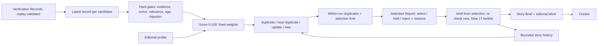

# Story Selection (Step 18)



Pipeline: Scout → Verification → **Story Selection** → Story Brief → Creator → Short Script
→ Scene Plan → Preview. Verification decides what is supported; Selection decides what is
worth making. Selection never changes a verification decision or adds a fact.

## Editorial profile

Schema `schemas/editorial-profile.schema.json`; GTA VI profile `config/editorial.gta.json`
(the offline profile `config/editorial.mock.json` matches the Scout fixtures). Nothing in
the engine is GTA-specific: another subject is another profile.

| Section | GTA VI profile |
| --- | --- |
| `relevance.core_terms` | gta vi, gta 6, gta6, grand theft auto vi/6 |
| `relevance.related_terms` | vice city, leonida, rockstar, take two, lucia, jason |
| `topics` (priority 1–5) | release_date 5, official_announcement 5, trailer_media 4, gameplay_features 4, map_world 3, characters_story 3, corporate 2, development_news 2 |
| `rumor_terms` | rumor, leak, leaked, insider, reportedly, speculation, … |
| `weights` (sum 100) | confidence 35, authority 20, corroboration 10, recency 15, relevance 10, significance 10 |
| `thresholds` | select ≥ 60, hold ≥ 30, select only if ≤ 7 days old, stale after 30 days, ≤ 3 selections per run |
| `history` | ≤ 200 entries, 60-day window, duplicate ≥ 0.9 similarity, similar ≥ 0.6 |

Each topic has a fixed `angle` sentence used as the brief's angle (no new facts). The schema
requires confidence to weigh at least 20 and has **no audience or popularity weight**.

## Gates (applied before any score matters)

| Reason | Disposition |
| --- | --- |
| `instruction_like_text` in the title or claims | reject |
| `no_verified_claims` (nothing verified or corroborated) | reject |
| `corroborated_only` (no primary confirmation) | hold |
| `contradicted_claims` / `disputed_claims` among the story's claims | hold |
| `unconfirmed_rumor` (rumor terms, no primary support) | hold |
| `not_relevant` (no core or related term) | reject |
| `future_date` / `stale` (> 30 days) | reject |
| `not_recent` (> 7 days) / `publish_date_unknown` | hold |
| `duplicate_of_previous` / `near_duplicate_of_previous` | reject / hold |
| `below_hold_score` / `below_select_score` | reject / hold |
| `similar_to_higher_ranked` / `duplicate_in_batch` / `selection_limit` (within one run) | hold / reject / hold |

Any reject reason → `reject`; otherwise any hold reason → `hold`; otherwise `select`.
Positive reasons are recorded too: `primary_verified`, `independent_corroboration`,
`recent`, `high_priority_topic`, `new_story`, `update_to_previous`.

## Score

Each component is 0–1, multiplied by its weight and summed (0–100):

- **confidence:** (verified + 0.5 × corroborated) / all claims
- **authority:** 1 when verified by a first-hand primary source, 0.5 when only corroborated
- **corroboration:** independent origins / 3, capped at 1
- **recency:** 1 within a day of publication, falling linearly to 0 at the stale limit
  (retrieval time is used when the publication date is unknown)
- **relevance:** 1 for a core term, 0.5 for related terms only
- **significance:** highest matched topic priority / 5 (0.2 when none matches)

Ranking order is disposition first, then score, then newest publication, then record ID.
A sensational unverified story can therefore never outrank a verified one. In the tests, a
"release date LEAKED" rumor has maximum significance yet scores 35 and is rejected, below a
verified map story scoring 89.

**Audience interest:** no trend or engagement data source exists, so every report and
entry carries `{"status": "unavailable", "used_in_score": false}`, enforced by the schema.
No numbers are invented.

## Duplicates, near-duplicates and updates

Each story gets a fingerprint:
- verified-claim fingerprints (normalized word sets)
- story words (headline + verified claims, ≤ 80)
- fact tokens (dates/numbers, ≤ 40)
- candidate ID and URL hash

Compared with each history entry inside the window:

| Class | Rule | Effect |
| --- | --- | --- |
| `duplicate` | same candidate/URL with no new claim, all verified claims already made, or ≥ 0.9 similarity | reject |
| `near_duplicate` | ≥ 0.6 similarity (or same URL) without a new verified claim carrying new facts | hold |
| `update` | ≥ 0.6 similarity, plus a new verified claim with new dates/numbers | allowed (`update_to_previous`) |
| `new` | otherwise | allowed |

Inside one run, a story whose claims or words match a higher-ranked selected story is
rejected or held. When a candidate has several records, only the newest is ranked.

**History** (`schemas/story-history.schema.json`, `runtime/selection/history-<profile>.json`):
- Holds fingerprints and IDs only, no article text.
- Written **only** when `brief-from-selection` makes a brief, so re-ranking never collides
  with itself.
- Capped at 200 entries and 60 days; older entries are pruned.
- Replaced atomically after checking nobody changed it meanwhile (`history_conflict`).
- A corrupt history stops selection (`invalid_story_history`) instead of risking duplicates.

## Selection Report (`schemas/selection-report.schema.json`)

| Field | Meaning |
| --- | --- |
| `selection_run_id` | `sel-` + hash of profile, policy, history, time and record IDs |
| `audience_signals` | Always unavailable |
| `entries[]` | rank, record/candidate IDs, source, title, URL, publication date, `disposition`, `score`, `components`, `audience_interest`, `topics`, `novelty`, copied verification counts and verified claim IDs, `reasons`, `rationale` |
| `summary`, `skipped` | Counts per disposition; superseded, invalid and over-limit records |

## Brief handoff

`brief-from-selection SELECTION_RUN_ID [--record RECORD_ID]`:
1. Requires the report to be at most one day old and made with the current profile and
   policy (`stale_selection`, `configuration_mismatch`).
2. **Re-scores the record now, against the current history.** The report is only an index,
   so an edited report cannot force a weak story through (`selection_changed`), and the same
   story cannot be made twice from one report.
3. Builds the brief with the unchanged Step 17 builder, so only verified claims appear,
   with their supporting sources and verification links. The topic is the record headline;
   the angle is the topic's fixed angle.
4. Adds the optional Story Brief **`editorial`** block: selection ID, run ID, record ID,
   profile hash, score, topics, novelty (`new`/`update`) and reasons. The brief validator
   requires the verification block alongside it, the record to be one of the verification
   records, and at least one verified claim. Existing briefs are unaffected.
5. Saves the brief to `runtime/briefs/`, then adds the story to history.

## Commands

```
python -m vicekrack select-stories --all                 # or RECORD_ID ...
python -m vicekrack brief-from-selection SELECTION_RUN_ID [--record RECORD_ID]
python -m vicekrack selection-history
```

Defaults are the offline `config/verification.mock.json` and `config/editorial.mock.json`.
For GTA VI pass `--policy config/verification.gta.json --profile config/editorial.gta.json`.
Reports go to `runtime/selection/reports/`. Same inputs give the same report ID, and files
are never overwritten.

## Limits and safety

≤ 1000 record files read, ≤ 500 (profile: 200) ranked, ≤ 10 selections per run, ≤ 500
history entries. Records, profiles, reports and history are schema-checked and pass the
existing credential checks. IDs are pattern-checked before any file path is built (no
traversal). History is never a symlink. Research text is only compared and stored, never
executed.

## Known limitations

- Similarity is lexical (word sets), like Verification. Heavily reworded stories may look
  new; two stories sharing many generic words may look similar.
- Significance comes from keyword topics, not real-world impact.
- Audience interest is unavailable by design until a real, auditable data source exists.
- An official date change currently verifies as `disputed` when the old official statement
  is still in the evidence pool (Verification has no notion of a newer statement
  superseding an older one), so a genuine delay may be held until that is added.
