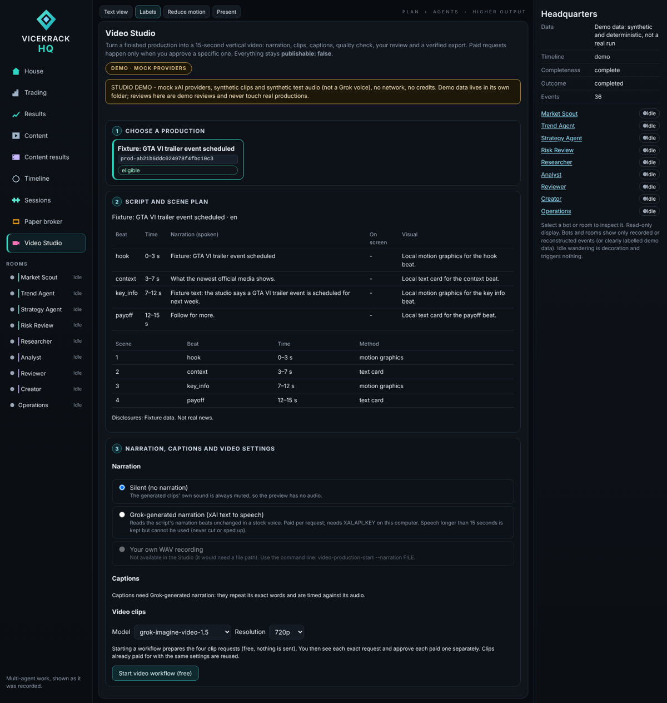
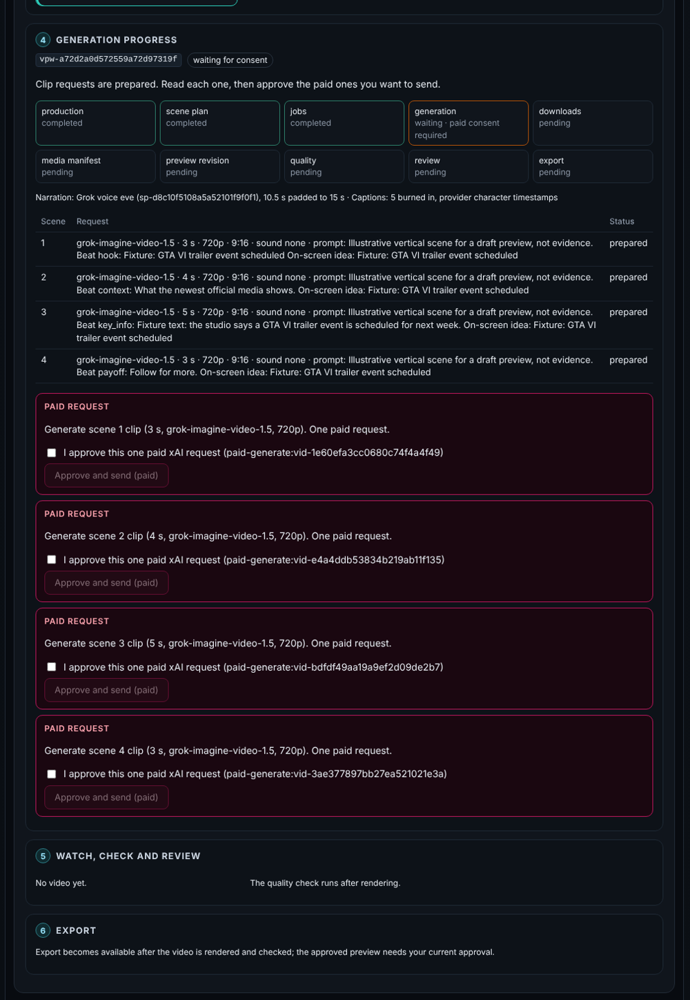
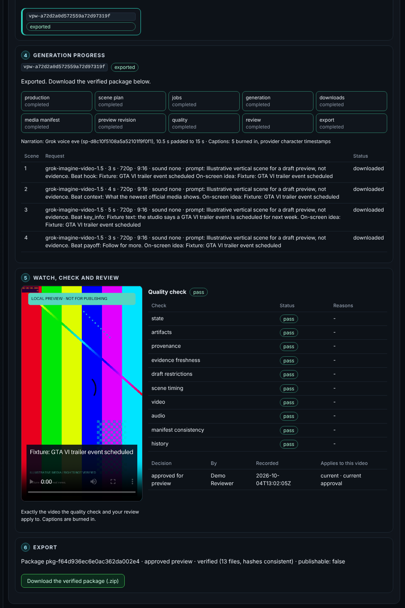
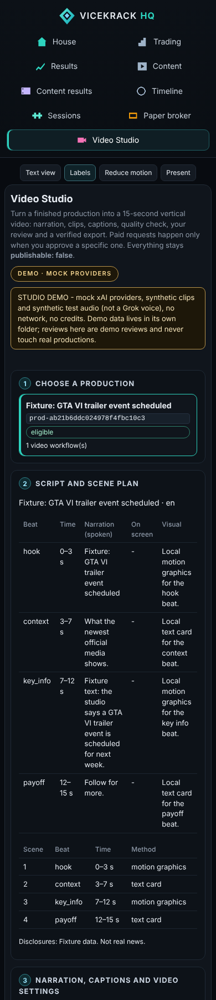

# Step 48: Video Studio in the Living HQ

> **Numbering.** "Step 48" is the development step in [the roadmap](roadmap.md), not a GitHub
> pull-request number. PR #48 delivered Step 47.

The Video Studio is a screen in the Living HQ for running the video-production workflow from
Steps 44–47 without terminal commands. You can:

- pick a finished production;
- choose narration and captions;
- read each paid request and approve it explicitly;
- follow the saved progress;
- watch the video and check the quality findings;
- approve or reject the video;
- download the verified export.



## Try it (offline demo: no network, no credits)

Needs the render requirements (`python -m pip install -r requirements-render.txt`).

```powershell
python -m vicekrack hq-serve --studio-demo
```

Open the printed address (for example `http://127.0.0.1:8765/`) and click **Video Studio**.

What the demo does:

- It uses a fresh folder, `runtime/studio-demo/run-<time>-<id>/`, and produces one mock story in it.
  Demo productions, reviews and exports never mix with real ones.
- Every outbound network connection is blocked while it runs, and `XAI_API_KEY` is replaced by a
  placeholder.
- The xAI video and speech services are **mocks**. The clips are synthetic colour bars, and the
  "voice" is **synthetic test audio (tone bursts), not a Grok voice**.
- In the demo, the scene 3 clip is still "generating" the first time you check, so you see the
  waiting step.
- Rendering, quality checks, review gates and the export are the real ones.

A walkthrough:

1. **Choose a production.** The demo selects it for you. Read the script and scene plan.
2. **Narration.** Choose *Grok-generated narration*, then **Prepare narration request**. This is
   free and sends nothing. Read the exact spoken text, tick the approval box and **Approve and send
   (paid)**.
3. **Captions.** Choose *Captions timed by xAI character timestamps*, then **Prepare captions**.
4. **Start video workflow.** This is free: it prepares the four clip requests.
5. **Approve each clip.** Read each request, then approve it (four paid requests).
6. **Check the provider.** Click **Check the provider and download finished clips** (twice in the
   demo).
7. **Review.** Watch the video, read the quality findings, enter your name and **Approve this video
   (preview only)**.
8. **Export.** Click **Export approved preview**, then **Download the verified package (.zip)**.

## Real use

```powershell
$env:XAI_API_KEY = "…"            # set it in this terminal only; never in the page, files or chat
python -m vicekrack hq-serve --studio
```

Without `--studio`, `hq-serve` is exactly the read-only HQ, and the Studio shows how to turn it on.
With it, paid xAI requests happen **only** when you approve a specific request on screen. The Studio
shows whether a key is configured (yes or no). It never shows the key.

| Studio choice | What it uses |
|---|---|
| Narration: silent | Step 44 (generated clip audio muted) |
| Narration: Grok-generated | Step 46 speech jobs (stock voices; paid per request; more than 15 s is kept but unusable) |
| Narration: your own WAV | Not offered here, because it would need a file path. Use `video-production-start --narration FILE`. |
| Captions: provider timing | Step 47 with a speech job prepared **with timestamps** |
| Captions: estimated timing | Step 47. Labelled as estimated; the quality result is `needs_review` and approval requires that acknowledgment |

## What the screen guarantees

- **Ineligible productions are explained.** Examples: not completed, a saved file changed, a scene
  outside Grok's 1–15 s range, or narration with characters the voice or captions cannot use.
- **Paid requests are explicit.** Each paid request shows exactly what will be sent:
  - the spoken text, voice and output settings;
  - or, for each clip, the model, duration, resolution, aspect ratio and prompt.

  Its **Approve and send (paid)** button stays disabled until you tick the approval for that exact
  request (its consent phrase). The server checks the phrase again, using the existing Step 43/46
  safeguards.
- **Nothing is retried automatically.** There is no timer, polling or background work. If an outcome
  is unclear, the Studio says it may have been billed. Retrying needs a second box acknowledging
  possible duplicate billing.
- **Duplicate clicks do nothing.** While an action runs, every action button is disabled. Each click
  carries a request ID, so a repeated request returns the first answer instead of acting twice. A
  second action while one runs is refused (`studio_busy`), and the workflow's own locks still apply.
- **Progress is the saved progress.** Each stage shows its status and error code. Only the recovery
  actions the workflow allows are offered: check the provider again, replace a failed clip with a
  new request (which needs its own approval), retry a failed stage, or re-check the review.
  Already-paid clips and narration are reused.
- **Review stays honest.** You watch exactly the video the quality report checked.
  - Approval needs your name, the report's binding and the required acknowledgments.
  - If a newer version of the production's video is rendered, the older workflow says its video was
    superseded, and its export is refused.
- **The download is the verified package.** It is a zip of exactly the files of a package that
  passes `export-verify`, checked again after zipping. Everything stays `publishable: false`.




## Security

The Studio adds the HQ's only action routes, `POST /api/studio/...`. They exist only when the server
runs with `--studio` or `--studio-demo`. All other routes are unchanged, and POST to them still
answers 405.

Every action must pass:

| Check | Detail |
|---|---|
| Address | Loopback serving only, with the Host checked |
| Origin | Exactly this server, and `Sec-Fetch-Site: same-origin` when sent |
| Session and CSRF | An HttpOnly SameSite=Strict session cookie plus a per-server CSRF header token. Both are new on every server start |
| Body | JSON only, at most 16 KB, exact field names, every value pattern-checked. IDs only: no paths, commands or free-form options |

Errors use fixed codes and the services' own messages, never exception text, paths or provider
errors. A final guard withholds any response that would contain the `XAI_API_KEY` value. The page
stores nothing in browser storage.

The Studio's page code is a separate file, `studio.js`. The read-only `app.js` still contains no
write request.



## Limitations

- Actions run while you wait, up to about a minute for a render. There is no progress percentage.
- The headless browser used by the tests may not play H.264. Chrome, Edge and Safari do.
- Local WAV narration is available from the command line only.
- One person at a time: one action runs per server.
- There is no sign-in. Anyone who can reach the computer's loopback address and open the page can
  act, so keep the HQ local.
- There is no music, social publishing, farmhouse redesign or trading change.
