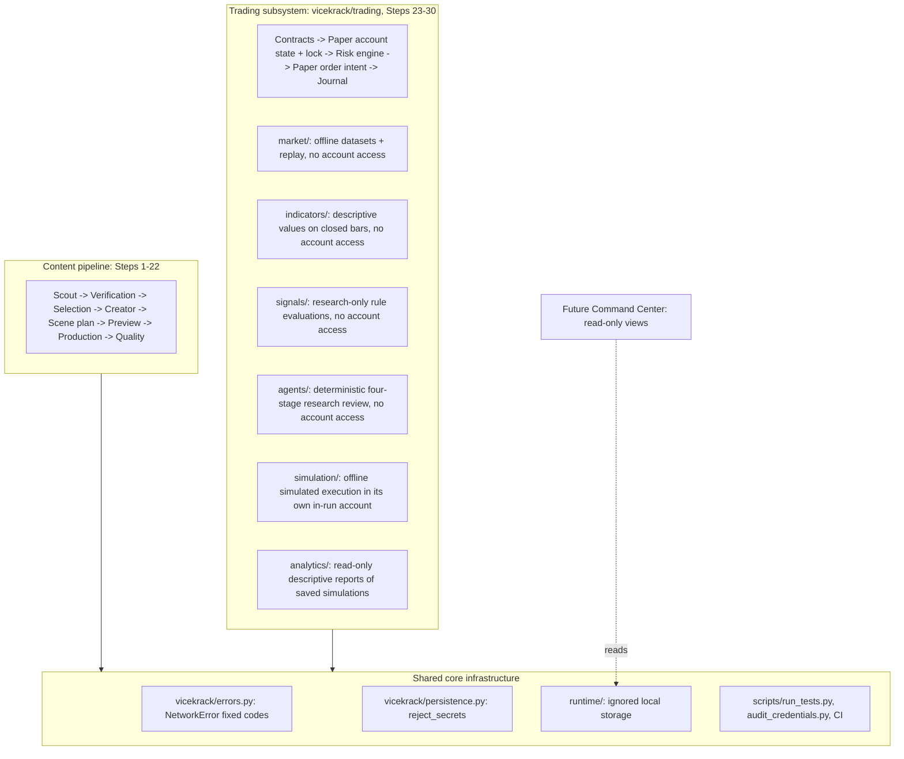

# Subsystem boundaries

ViceKrack now has two independent subsystems that share a small core. This page records
what belongs where, so new work lands in the right place without a large migration.

## Content pipeline (existing)

- **Code:** `vicekrack/*.py` outside `vicekrack/trading/`, `schemas/*.schema.json`,
  `config/` content files, `examples/` content fixtures.
- **Storage:** `runtime/scout`, `runtime/verification`, `runtime/selection`,
  `runtime/productions`, `runtime/quality` and others.
- **Rule:** it never imports `vicekrack.trading`.

## Trading subsystem (new, paper only)

- **Code:** `vicekrack/trading/` only. Schemas live in `schemas/trading/`, config in
  `config/trading.paper.json` and fixtures in `examples/trading/`.
- **Storage:** `runtime/trading/` only: the journal, the kill-switch file, the paper
  accounts (`runtime/trading/accounts/`), market data (`runtime/trading/market/`),
  indicator results (`runtime/trading/indicators/`), research signals
  (`runtime/trading/signals/`), research-agent runs (`runtime/trading/agents/`) and
  simulation runs (`runtime/trading/simulation/`) and analytics reports
  (`runtime/trading/analytics/`).
- **Market-data boundary:** `vicekrack/trading/market/` (Step 25) never imports the
  account state, risk engine, order or journal modules. Replay can't authorize anything
  or change an account.
- **Indicator boundary:** `vicekrack/trading/indicators/` (Step 26) uses only the market
  package and shared money/contract helpers. Results are descriptive and are not wired
  into risk checks or accounts.
- **Research-signal boundary:** `vicekrack/trading/signals/` (Step 27) uses market data and
  indicators only. A research signal (`rsig-…`, `authorization_possible: false`) is a
  different contract from the order-type `trading_signal`, and it never reaches risk
  checks, accounts or intents.
- **Research-agent boundary:** `vicekrack/trading/agents/` (Step 28) reads only evidence
  built from market data, indicators and research signals at a simulated time. Its Risk
  Review is a research completeness check, not the paper risk engine. It has no account,
  intent, broker or AI-provider access.
- **Simulation boundary:** `vicekrack/trading/simulation/` (Step 29) is the only place where
  research signals may become orders, and only *simulated* ones, under its explicit
  policy. It keeps its own in-run account, storage and kill switch, never uses Step 24
  paper accounts or the paper risk engine, and never reads Step 28 verdicts.
- **Analytics boundary:** `vicekrack/trading/analytics/` (Step 30) only reads saved
  simulation runs and their datasets, and writes only its own reports. It never runs a
  simulation or touches paper accounts, kill switches or intents.
- **Imports:** only the shared core: `vicekrack.errors` and `vicekrack.persistence`. It
  never imports content modules, and content modules never import it.
- **CLI:** only the `trading-*`, `market-*`, `indicator-*`, `signal-*`, `agent-*`, `sim-*` and `analytics-*` commands, routed
  by `vicekrack/__main__.py` to the matching `cli` module in `vicekrack.trading`.
- **Scope today:** paper only, with offline market data. There are no live market feeds, broker connections, live
  orders, AI trading decisions or background loops.

## Shared core infrastructure

- `vicekrack/errors.py`: one error type with fixed, sanitized codes. `TradingError`
  subclasses it.
- `vicekrack/persistence.py` `reject_secrets`: credential rejection. Trading adds a
  stricter layer on top (broker-style field names, key shapes, active `*_KEY`, `*_TOKEN`,
  `*_SECRET` and `*_PASSWORD` environment values) without changing the shared function.
- The `runtime/` convention: ignored by git, written atomically, and inspected only by
  explicit CLI commands.
- Test harness and checks: `scripts/run_tests.py` (network blocked),
  `scripts/audit_credentials.py` and CI.

Changes to the shared core must keep both subsystems' tests passing.

## Future Command Center (not built)

A future dashboard should be a **read-only** consumer.

- **Trading:** the journal events (`trading_journal_event` 1.1), the account state
  (`trading-state show`), the research-signal evaluations (`signal-inspect`) and the
  research-agent handoffs (`agent-inspect`) are designed for it. Each event says which `agent` acted, what
  `document` it saw or produced (with a hash), the key `observed` figures and its
  `reason_codes`. Each `risk_check` event carries every
  check with its limit and observed value. `python -m vicekrack trading-journal RUN_ID`
  already prints that timeline.
- **Content:** the production states and quality reports are its data source.
- **Rule:** the Command Center must not authorize orders, change limits or release the
  kill switch without a separate, explicit design step.

See also the [Roadmap](roadmap.md).
