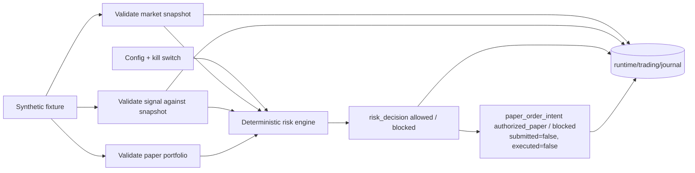

# Trading subsystem foundation (Step 23): paper only

> **SIMULATED.** Nothing in this subsystem connects to a broker, sends an order or
> executes a trade. An `authorized_paper` intent only means the risk rules would have
> allowed it on paper. All market data in the demo is a labelled synthetic fixture.

## Commands

```powershell
.\.venv\Scripts\python.exe -m vicekrack trading-config-check
.\.venv\Scripts\python.exe -m vicekrack trading-demo --scenario allowed
.\.venv\Scripts\python.exe -m vicekrack trading-demo --scenario exposure-breach
.\.venv\Scripts\python.exe -m vicekrack trading-demo --scenario daily-loss
.\.venv\Scripts\python.exe -m vicekrack trading-demo --scenario stale-data
.\.venv\Scripts\python.exe -m vicekrack trading-demo --scenario invalid-money
.\.venv\Scripts\python.exe -m vicekrack trading-demo --scenario duplicate-signal
.\.venv\Scripts\python.exe -m vicekrack trading-journal
.\.venv\Scripts\python.exe -m vicekrack trading-journal RUN_ID
.\.venv\Scripts\python.exe -m vicekrack trading-journal RUN_ID --full
.\.venv\Scripts\python.exe -m vicekrack trading-kill-switch status
.\.venv\Scripts\python.exe -m vicekrack trading-kill-switch engage
.\.venv\Scripts\python.exe -m vicekrack trading-kill-switch release
```

On Linux/macOS use `.venv/bin/python`. Commands print JSON. Errors print
`{"error": {"code": ...}}` and exit with 1.

## Flow



## Contracts (version 1.0, `schemas/trading/`)

| Contract | Key fields |
|---|---|
| `market_snapshot` | `snapshot_id`, `symbol`, `observed_at`, `price{last,bid,ask}`, `volume`, `source{name,kind}`, `freshness.max_age_seconds`, `synthetic` |
| `trading_signal` | `signal_id`, `strategy{strategy_id,version}`, `observations[]` (snapshot field values), `rationale{codes,summary}`, `proposal`, `created_at`, `expires_at` |
| `paper_portfolio_state` | `equity`, `positions[]`, `day{trading_date,pnl}` |
| `risk_decision` | `decision_id`, `outcome`, `reason_codes`, `checks[]{check,status,limit,observed}`, `inputs` (SHA-256 of config, signal, snapshot, portfolio) |
| `paper_order_intent` | `symbol`, `side`, `quantity`, `order_type`, `limit_price`, originating `signal_id` and `decision_id`, `execution{submitted:false,executed:false,broker:null}` |
| `trading_journal_event` | `event_id`, `correlation_id` (run), `causation_id`, `sequence`, `recorded_at`, `stage`, `status`, `agent`, `subject`, `observed`, `reason_codes`, `document` + hash |

Semantic rules on top of the schemas:
- **Snapshot:** prices are above zero, bid ≤ ask, synthetic fixtures are labelled.
- **Signal:** expiry is after creation; quantity is above zero; a limit price is given
  only for limit orders; every observation must exactly equal the referenced snapshot
  value.
- **Risk decision:** it can be `allowed` only if every check passed.
- **Journal event:** its document hash must match, and its document must validate for its
  stage.

## Exact decimals

Prices, quantities and money are JSON **strings** parsed with `Decimal`.
- Prices and quantities allow up to 8 decimal places; money allows up to 2.
- Floats, exponents (`1e3`), `NaN`, `Infinity`, leading zeros, signs where not allowed,
  and excess precision are all rejected.
- Results are exact, for example 10 × 50.00 = 500. They are written as plain strings, with
  banker's rounding to 8 places.

## Paper configuration (`config/trading.paper.json`)

- **Fixed values:** `mode` is always `paper` and `allow_short` is always `false`.
- **Limits:** `max_order_notional`, `max_position_notional`, `max_position_fraction` (of
  equity), `max_daily_loss`, `max_orders_per_day`, `max_quantity`,
  `max_snapshot_age_seconds`, `max_signal_lifetime_seconds`.
- **Validation:** an order limit above the position limit, a fraction outside (0, 1], a
  float or a negative value are all rejected. An invalid config blocks every intent.
- **Kill switch:** it is engaged by `kill_switch.engaged: true` in the config, or by
  `trading-kill-switch engage` (which writes ignored `runtime/trading/kill-switch.json`
  atomically).
  - Config engagement cannot be released by the file.
  - An unreadable switch file counts as engaged.

## Risk checks (in order)

1. `kill_switch`
2. `inputs_valid`: a missing or invalid config, snapshot, signal or portfolio blocks.
3. `snapshot_fresh`: the stricter of the snapshot's and the config's max age; future data
   is blocked.
4. `signal_active`: blocks if expired, created in the future, or with a lifetime above
   the limit.
5. `symbol_allowed`
6. `symbol_consistent`
7. `order_type_allowed`
8. `quantity_limit`
9. `order_notional_limit`: quantity × last price for market orders, or × limit price for
   limit orders.
10. `position_notional_limit`
11. `position_fraction_limit`
12. `no_short_position`
13. `daily_loss_limit`: blocks once the loss reaches the limit, or if the portfolio
    belongs to another day.
14. `orders_per_day_limit`
15. `signal_not_reused`

If inputs are missing, the later checks are `skipped` and the outcome is `blocked`. The
same inputs always give the same decision and `decision_id`.

## Journal

- **Location:** `runtime/trading/journal/<run_id>/<sequence>-<event_id>.json`, which git
  ignores.
- **Writes:** each event is validated, credential-checked, fsynced and published with an
  exclusive hard link. Partial events never appear and no event is overwritten.
- **Rejected:**
  - duplicate event IDs, runs or sequence numbers;
  - recognized credentials, such as broker-style key/secret/token/password/account fields,
    `sk-`/`AKIA` key shapes and active secret environment values;
  - documents that don't match their hash.
- **Failures:** a write failure stops the run with `journal_write_failed`, and errors never
  include paths, input values or raw exceptions.
- **Reading:** `trading-journal RUN_ID` re-validates every event and shows a timeline of
  which agent saw what, why it acted, and which risk checks passed or failed with their
  limits.

## Demo scenarios (`examples/trading/`, all `SYNTHETIC FIXTURE`, symbol `SYNTH1`)

| Scenario | Expected result |
|---|---|
| `allowed` | `authorized_paper` (not executed) |
| `exposure-breach` | blocked: `position_exposure_exceeded` |
| `daily-loss` | blocked: `daily_loss_limit_reached` |
| `stale-data` | blocked: `snapshot_stale` |
| `invalid-money` | blocked: `invalid_or_missing_inputs`, `invalid_market_snapshot` (float price) |
| `duplicate-signal` | first `authorized_paper`, second blocked: `duplicate_signal` |

Decisions use each scenario's simulated clock (`as_of`), so results are repeatable.
Journal `recorded_at` uses the real clock.

## Limitations

- **Synthetic data only.** There are no market feeds, indicators, strategies or AI
  trading decisions; the signal is hard-coded in the fixture.
- **Nothing is executed.** There is no broker, no order submission, no fills and no
  position or P&L updates. Each demo run starts from its fixture portfolio, and
  `orders_today` and duplicate-signal tracking are per run (there is no persistent paper
  ledger yet).
- **Limited scope.** Only USD, long-only, with market and limit order types.
- **Single process.** The journal has no cross-process lock, and the demo is one
  foreground pass.
- **No dashboard yet.** The journal format is ready for one.
