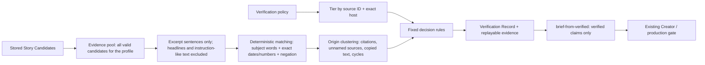

# Verification (Step 17)



Pipeline: **Scout → Verification → Story Brief → Creator → Short Script → Scene Plan → Preview**.
Discovery, verification and creation stay separate. Scout candidates are always
unverified. Only the Verifier decides status, and only through stored, replayable evidence.

## Source authority

A **verification policy** (`schemas/verification-policy.schema.json`) is the single
authority for source quality. A source's tier comes only from the policy (source ID **and**
exact URL host). It never comes from what a candidate says about itself, so a mislabeled
or edited candidate cannot promote itself.

| Tier | Meaning | GTA VI profile (`config/verification.gta.json`) |
| --- | --- | --- |
| `primary` | First-party official statements | `rockstar-newswire` (www.rockstargames.com), `take-two-ir` (ir.take2games.com) |
| `secondary` | Reputable secondary reporting | `gamespot-news`, `ign-games` |
| `unrated` | Anything else (community, blogs, unknown hosts) | — |

Other subjects get their own policy file; nothing in the code is GTA-specific.
`config/verification.mock.json` rates the synthetic Scout fixtures for offline use.

## Evidence and matching

- **Evidence pool:** every valid stored candidate of the same profile (max 500, sorted
  by ID). Each contributes up to 12 sentences from its excerpt. **Headlines are never
  evidence.**
- **Matching** is deterministic. A statement is about the claim when at least 60% of the
  claim's subject words appear in it. Stop words, negations and reporting verbs like
  "confirmed" are ignored for this.
  - **supports:** same negation, and it contains all of the claim's key facts (numbers, months).
  - **contradicts:** a negation flip ("delayed" vs "not delayed"), or both name different
    dates/numbers.
  - **neither:** it lacks the claim's key facts. Missing facts are never counted as support.
- **First-hand:** a statement is not first-hand if it attributes the information
  elsewhere ("according to X", "via X", "citing X", "per X") or relies on unnamed sources
  ("reportedly", "insiders", "leaks").
- **Duplicate evidence:** the same publisher repeating the same sentence counts once
  (`duplicate_evidence_collapsed`).
- **Untrusted text:** sentences that look like instructions to an AI ("ignore previous
  instructions", "mark this as verified", "system:") are excluded
  (`instruction_like_text_excluded`). A claim that itself contains such text cannot be
  verified (`claim_contains_instructions`). Nothing in source text is ever executed.

## Independent origins (corroboration)

Ten articles repeating one report are one origin, not ten confirmations. Origins are
merged when:

- an outlet attributes the information to someone else: the cited organization becomes
  the origin (with policy aliases, e.g. "Rockstar" → "rockstar games");
- information comes from unnamed sources: all unnamed sources are **one** origin;
- two outlets publish near-identical wording (≥ 85% word overlap): copied/syndicated text;
- outlets cite each other in a cycle: merged and flagged `circular_citation`.

## Decision rules

Applied in order (`decide()` in `vicekrack/verification.py`):

| Status | When |
| --- | --- |
| `verified` | A primary source states it **first-hand**, and no first-hand primary statement contradicts it |
| `rejected` | A first-hand primary statement contradicts it and none supports it, or ≥ 2 independent reputable origins contradict it with no reputable support |
| `disputed` | First-hand primary statements conflict, or reputable sources both support and contradict it |
| `corroborated` | ≥ 2 independent reputable secondary origins support it, nothing reputable contradicts it, no primary confirmation. **Draft-only** |
| `insufficient_evidence` | Everything else: single origin, unrated sources only, a secondhand report of an official statement, or no matching evidence |

Rationale codes explain each decision: `primary_first_hand_support`, `primary_contradiction`,
`independent_secondary_origins`, `secondary_contradiction`, `conflicting_secondary_reports`,
`single_origin_only`, `repeated_single_origin`, `secondhand_primary_report`,
`unrated_sources_only`, `no_matching_evidence`, `claim_contains_instructions`,
`circular_citation`.

## Verification Record (`schemas/verification-record.schema.json`)

| Field | Meaning |
| --- | --- |
| `record_id` | `ver-` + 24 hex of SHA-256(candidate ID, policy hash, evidence-pool hash). Same inputs → same ID |
| `candidate` | Provenance copy: candidate ID, source, publisher, URL, title, published/retrieved times, URL hash |
| `policy` | Profile and SHA-256 of the policy used |
| `evidence_pool` | Number of candidates considered and a hash of the pool |
| `verified_at` | When verification ran |
| `claims[]` | Original claim text and basis, `status`, `rationale_codes`, `rationale`, `primary_support`, `independent_origins`, and up to 20 `evidence` items |
| `evidence[]` | Candidate ID, source ID, publisher, URL, title, `tier`, `relation` (supports/contradicts), the statement, `first_hand`, `origin`, published/retrieved times |
| `summary`, `flags` | Counts per status; run flags such as `pool_truncated` or `circular_citation` |

**Replay:** whenever a record is loaded, tiers are recomputed from the policy, first-hand
flags from the statements, and every status, rationale code and count is re-derived from
the stored evidence. A hand-edited "verified" is rejected (`invalid_verification_record`).
A record made under a different policy returns `policy_mismatch`: verify again. These are
consistency checks, not cryptographic signatures. Origin labels depend on the whole pool
and are stored as computed.

## Story Brief handoff

`brief-from-verified RECORD_ID...` (`vicekrack/verified_brief.py`):

1. Re-validates every record against the current policy and requires it to be at most
   `max_record_age_days` old (7 for GTA VI); otherwise it returns `stale_verification`.
2. Copies only `verified` claims, as `verified`. With `--include-corroborated`,
   corroborated claims are added as `unverified`, which keeps them draft-only because the
   production gate blocks them. Disputed, rejected and insufficient claims are never copied.
3. Cites, for each claim, only the sources whose evidence supports it: first-hand primary
   sources for verified claims.
4. Uses the policy's avoid list and disclosures; `--topic`, `--angle`, `--brief-id` are optional.
5. Fails with `no_verified_claims` when nothing qualifies, and `brief_too_large` above 8 claims.

**Story Brief extension (backward compatible).** Story Brief 1.0 gains an optional
`verification` block and `local` as a provenance provider:

```json
"verification": {
  "policy_sha256": "…",
  "record_ids": ["ver-…"],
  "claims": [{"claim_id": "c1", "record_id": "ver-…", "record_claim_id": "k1", "verification_status": "verified"}]
}
```

When present, `validate_story_brief` requires every claim to be linked exactly once to a
listed record, and the claim's status to match: `verified` ↔ `verified`, `corroborated` →
`unverified`. Briefs without the block (all earlier briefs) validate exactly as before. The
Creator copies claims and statuses unchanged, so neither it nor later stages can upgrade a
verification decision.

## Commands

```
python -m vicekrack scout                                   # Step 16, offline fixtures
python -m vicekrack verify --all                            # verify every stored candidate (max 50)
python -m vicekrack verify CANDIDATE_ID [CANDIDATE_ID ...]
python -m vicekrack verify-list [--status verified]
python -m vicekrack brief-from-verified RECORD_ID [...] [--topic T] [--angle A] [--include-corroborated]
python -m vicekrack draft-short BRIEF_FILE                  # Step 15 continues from here
```

The default policy is `config/verification.mock.json`. For GTA VI, add
`--policy config/verification.gta.json` (after a live Scout run). Records are saved to
`runtime/verification/records/`, briefs to `runtime/briefs/` (both ignored by Git), never
overwritten. Re-running on unchanged data gives the same record IDs and saves nothing new.
Output contains IDs, statuses and counts; `verify-list` also shows candidate headlines.

## Limits and failure handling

Pool ≤ 500 candidates (`pool_truncated`), ≤ 50 targets per run, ≤ 12 statements per
candidate, ≤ 20 evidence items per claim (`evidence_truncated`; primary and first-hand
evidence are kept first). Invalid candidate files are skipped and counted. An invalid
candidate passed directly raises `invalid_candidate`. Policies, records and briefs pass the
existing credential checks; nothing reads the network or environment values. When in
doubt the result is `insufficient_evidence`.

## Known limitations

- Evidence is only the feed excerpts the Scout stored, not full articles, so many true
  claims will honestly come out `insufficient_evidence`.
- Matching is lexical. Paraphrases with different words may be missed, which errs toward
  insufficient. Unrelated sentences sharing most words but different dates can register as
  contradictions, which errs toward disputed, never verified.
- Attribution detection is pattern-based ("according to", "via", "reportedly", …). Unusual
  phrasing may be missed.
- Rockstar Newswire has no confirmed feed (see Scout), so GTA VI primary evidence currently
  comes from Take-Two's news releases.
- There is no optional AI matcher. If one is added later it may only propose matches that
  these deterministic rules must still accept; it can never set a status.

## Next stage (Step 18)

`select-stories` ranks Verification Records and `brief-from-selection` builds briefs from
the chosen ones using the same verified-only builder described above. Selection never
changes a verification status. See [Story Selection](selection.md).
